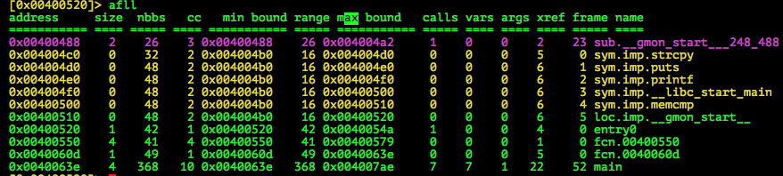
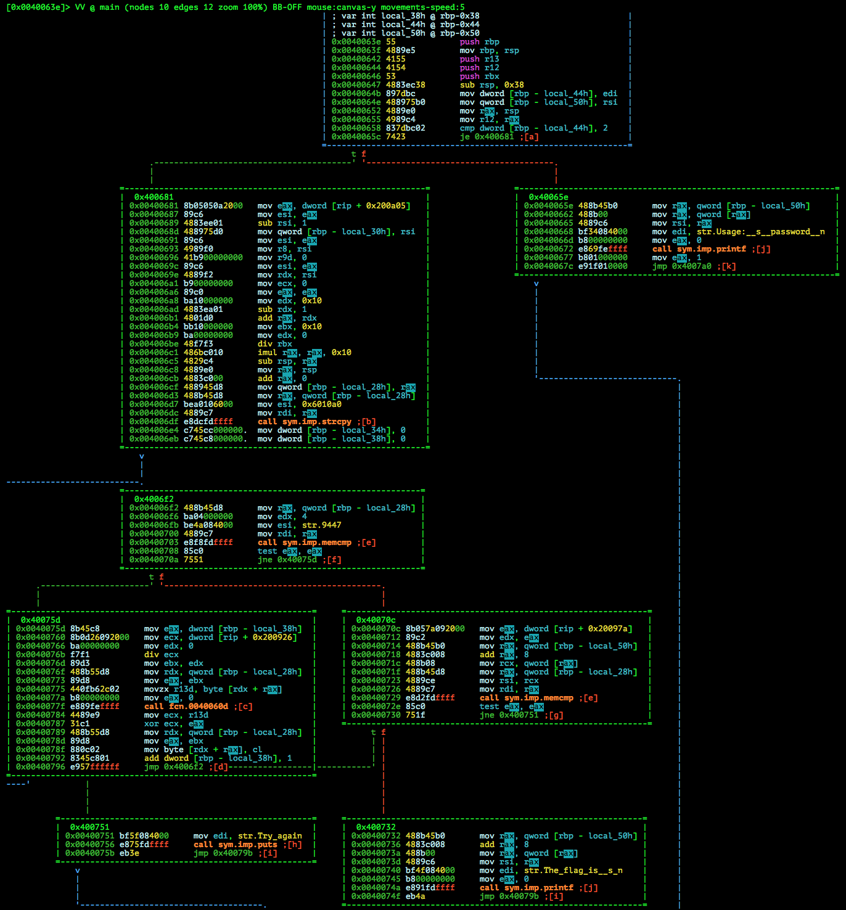
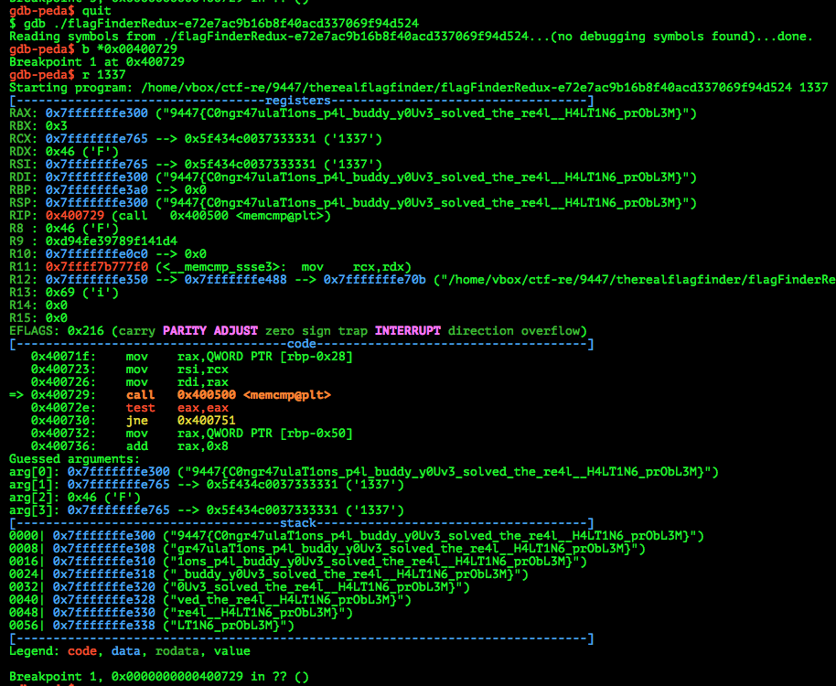

# 9447 CTF 2015: The *real* flag finder

**Category:** Reversing
**Points:** 70
**Solves:** 233
**Description:**

>  I've forgotten my flag. I remember it has the format "9447{<some string>}", but what could it be?
>
>  Unfortunately the program no longer just prints the flag.
>
> [flagFinderRedux](./flagFinderRedux-e72e7ac9b16b8f40acd337069f94d524)  e72e7ac9b16b8f40acd337069f94d524


## Write-up

by [polym](https://github.com/abpolym)

Keywords:

* `xor`
* `x86-64`
* `anti-debug`
* `input=flag`

We are given a x86-64 Binary for Linux:

```bash
flagFinderRedux-e72e7ac9b16b8f40acd337069f94d524: ELF 64-bit LSB  executable, x86-64, version 1 (SYSV), dynamically linked (uses shared libs), for GNU/Linux 2.6.24, BuildID[sha1]=8c0c9c0d5c39ff0cc1954fa8682288b6169b8fff, stripped
```

Running the binary:

```
$ ./flagFinderRedux-e72e7ac9b16b8f40acd337069f94d524 
Usage: ./flagFinderRedux-e72e7ac9b16b8f40acd337069f94d524 <password>
$ ./flagFinderRedux-e72e7ac9b16b8f40acd337069f94d524 password
Try again
```

First, we list all functions using radare2:



We see our main at address `0x0040063e` and two other functions.

Displaying the graph for our main with `VV @ main` shows us several calls to `memcmp`, `puts`, `printf` and `strcpy`:



We also can see a xor at address `0x00400787` with two different operands, hinting at the use of xor-encryption.

Our last result when running the binary was ''Try again'', which is printed in node `0x400751`.
Instead of landing in this node, we want to our program to step into the node `0x400732`, which depends on the `memcmp` call at address `0x00400729`.

Setting a breakpoint at this address with `gdb-peda` yields the flag:



Looks like our flag was the input/password: `9447{C0ngr47ulaT1ons_p4l_buddy_y0Uv3_solved_the_re4l__H4LT1N6_prObL3M}`

Notes:

* Some anti-debug stuff is going on in nodes `0x4006f2` and `0x40075d` as explained [here](https://b01lers.net/challenges/9447%20CTF%202015/FlagFinder/77/)
* IDA Pro can decompile this binary to readable C-Code as done [here](https://github.com/ByteBandits/writeups/tree/master/9447-2015/reversing/The%20*real*%20flag%20finder/sudhackar)

## Other write-ups and resources

* <http://rotiples.tistory.com/44>
* <https://gist.github.com/xyzz/9a5511ffa1ade17e7359#file-01-re-02-real-flag-finder-md>
* <https://github.com/ByteBandits/writeups/tree/master/9447-2015/reversing/The%20*real*%20flag%20finder/sudhackar>
* [b01lers](https://b01lers.net/challenges/9447%20CTF%202015/FlagFinder/77/)
* <https://github.com/ubuntor/misc_writeups/tree/master/9447ctf2015>
