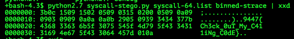

# 9447 CTF 2015: binned

**Category:** Steganography
**Points:** 100
**Solves:** 12
**Description:**

>  We noticed this binary running in prod. Can you find out what it is hiding?
> 
> [binned.tar.gz](./binned-c442ae4618641dec71eecfa241c1d7d6.tar.gz)  c442ae4618641dec71eecfa241c1d7d6

## Write-up

by [polym](https://github.com/abpolym)

After extracting the file using `tar xvf <binned>`, we have a look at what kind of file we are dealing with using `file`:

	+bash-4.3$ file binned
	binned: ELF 64-bit LSB executable, x86-64, version 1 (SYSV), dynamically linked (uses shared libs), for GNU/Linux 2.6.24, not stripped

After that, we run it in a VM and get following:

	+bash-4.3$ cat ~/vboxshare/output 
	vbox@vbox:/tmp$ ./binned 
	Begin working out flag...
	Flag worked out!

Hmm, looks like everything worked so far. Let's throw in `strace` and `ltrace` to see what it is doing. Output is in [binned-strace](./binned-strace) and [binned-ltrace](./binned-ltrace).

It looks like the program calls unrelated functions like `shutdown`, `rmdir`, `capget` etc.

The clue here is that the author encoded a message using the 64-bit syscall numbers of each syscall.
We can get a list looking at a [syscall table](http://lxr.free-electrons.com/source/arch/x86/syscalls/syscall_64.tbl?v=3.14).
A parseable table is [here](./syscall-64.list).

Using [this program](./syscall-stego.py), we finally get the flag:

## Other write-ups and resources

* <https://github.com/pwning/public-writeup/tree/master/9447ctf2015/steg100-binned>
* <https://github.com/ubuntor/misc_writeups/tree/master/9447ctf2015/binned>
