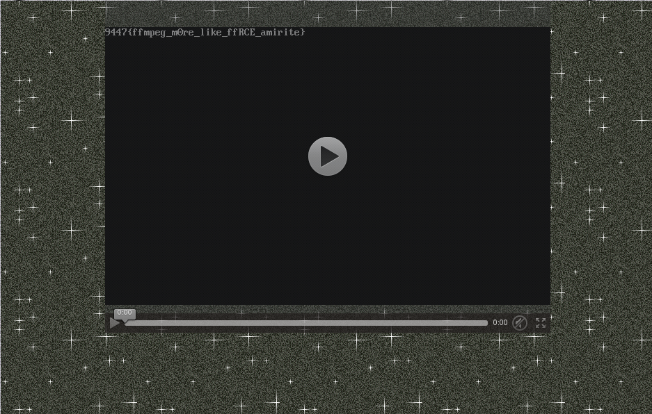

# 9447 CTF 2015: Super Turbo Atomic GIF Converter

**Category:** Web
**Points:** 180
**Solves:** 9
**Description:**

>  Kids these days like fancy web video instead of gifs, so I made a converter.
> 
>  Flag is /home/ctf/flag.txt
> 
>  Find it at <http://superturboatomicgifconverter.9447.plumbing:9447>
> 
>  08:00 UTC: The source code has been released.
> 
>  Hint! The source code has been released for this task.
> 
> [srv.py](./srv-626b48e5cf41be2ffb02f89b823c2c5f.py)  626b48e5cf41be2ffb02f89b823c2c5f


## Write-up

by [f0rki](https://github.com/f0rki)

When I started working on the challenge, the source was already released and we were
give the hint that the flag is in `/home/ctf/flag.txt`. 

The first   thing I did was take a look at the source code. It's a pretty small web 
service written in python using flask. It converts a .gif file you send it to a webm 
file and sends it back to the client. The converted file is removed after the client 
received it. Actually you can upload any file that ffmpeg can read and ends with `.gif` 
and ffmpeg will happily convert it for you. ffmpeg probes the files for certain magic 
values to detect the filetype.

The first thing I noticed was that they use a custom compiled version of ffmpeg:
```
FFMPEG = "ffmpeg-2.8.2-64bit-static/ffmpeg"
```
Why did they compile it themselves? Do we need to do RCE? So I searched for a known 
vulnerabilities. According to the [ffmpeg security page](https://ffmpeg.org/security.html)
version 2.8.2 is vulnerable to three different CVEs. I couldn't find any details on
the vulnerabilities or ready exploits. Also it's a web challenge so it seemed
unlikely that we have to write an exploit for ffmpeg. 

So I turned back to the flask part. The execution of shell commands seemed safe and
after spending soeme time playing around with path traversal attempts in the filenames
I decided that's a dead end. The problem must be with ffmpeg.

A colleague reminded me that in svg files you can include other files, so I started poking
in that direction. Unfortunately ffmpeg doesn't support reading svg files, so I took a look
at all the [supported input files of ffmpeg](https://ffmpeg.org/ffmpeg-formats.html#Demuxers).

So I noticed the `concat` demuxer at first. It takes a textfile as input. This file contains
script like instructions for concatenating multiple files: e.g.
```
ffconcat version 1.0
file '/home/ctf/flag.txt'
```
Unfortunately the concat demuxer doesn't allow 'unsafe' files in the input file. Files are
considered unsafe if they contain a `/` at the start or if they contain anything other than
`[A-Za-z0-9-_]`. I started trying different inputs, putting `NULL` bytes in the path, etc.
But the [filename checker](https://github.com/FFmpeg/FFmpeg/blob/n2.8.2/libavformat/concatdec.c#L84) 
seems rather safe. Dead end again. But fortunately more file formats :)
I started looking at the `matroska` format and if there is a way to embed subtitles from
text files or something like that, but then another demuxer hit my eye.

The [applehttp or hls](http://www.ffmpeg.org/ffmpeg-formats.html#applehttp) demuxer for 
HTTP Live Streaming playlists. I searched for an example of this file format and copy 
pasted [this example from apple](https://developer.apple.com/library/ios/technotes/tn2288/_index.html).
Maybe ffmpeg can also open `file://` URLs. So I just gave it a try, with the following content
for my `wat.gif`:
```
#EXTM3U
#EXT-X-PLAYLIST-TYPE:VOD
#EXT-X-TARGETDURATION:1
#EXT-X-VERSION:3
#EXT-X-MEDIA-SEQUENCE:0
#EXTINF:10.0,
file:///home/ctf/flag.txt
#EXT-X-ENDLIST
```

I uploaded it and got the following result:

yay got it! Although given the flag I wonder if this really is the intended solution.


## Other write-ups and resources

* <http://www.kernelpicnic.net/2015/11/29/9447CTF-Super-Turbo-Atomic-GIF-Converter-Write-Up.html>
* <https://github.com/pwning/public-writeup/tree/master/9447ctf2015/web180-gif-converter>
* <http://pastebin.com/FrsQinQz>
* <https://gist.github.com/Invizory/e45e1ee54cf0687f2002>
