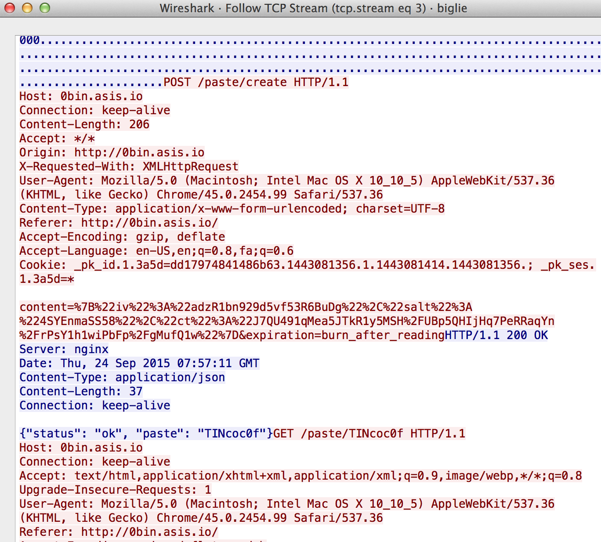

# ASIS Cyber Security Contest 2015: big-lie

**Category:** forensic
**Points:** 100
**Solves:** 101
**Description:**

> Find the flag.

## Write-up

by [polym](https://github.com/abpolym)

This writeup is based on following writeups (You should have a look at them to see the now deleted paste links):

* <https://github.com/bl4de/ctf/blob/master/ASIS_CTF_2015/Biglie_Forensic_100_writeup.md>
* <http://www.nusgreyhats.org/write-ups/ASISCTF-Final-2015-Big-Lie-(Forensics-100)/>
* <https://kt.pe/blog/2015/10/asis-2015-finals-biglie/>
* <http://tontonsfl4ggeurs.github.io/ASIS/>

We are given xz compressed data, which contains a tar, which again contains a pcap dump:

```bash
+bash-4.3$ file biglie_33da1c4341bdd33d2847cf7ea2657e42 
biglie_33da1c4341bdd33d2847cf7ea2657e42: xz compressed data
+bash-4.3$ mv biglie_33da1c4341bdd33d2847cf7ea2657e42{,.xz}
+bash-4.3$ unxz biglie_33da1c4341bdd33d2847cf7ea2657e42.xz 
+bash-4.3$ !file
file biglie_33da1c4341bdd33d2847cf7ea2657e42 
biglie_33da1c4341bdd33d2847cf7ea2657e42: POSIX tar archive (GNU)
+bash-4.3$ tar xvf biglie_33da1c4341bdd33d2847cf7ea2657e42 
x biglie.pcap
+bash-4.3$ file biglie.pcap 
biglie.pcap: tcpdump capture file (little-endian) - version 2.4 (Ethernet, capture length 65535)
```

Looking closer at the HTTP requests, we see that a POST-Request to <http://0bin.asis.io/> is called:



0bin here is a client-side encrypted pastebin, which also is [open-source](https://github.com/sametmax/0bin).

If you upload a file or text on <http://0bin.asis.io/>, your browser encrypts the content, submits the encrypted content with an IV and salt to the server.

Following that, you'll be redirected to a paste link that looks like the following:

    http://0bin.asis.io/paste/<paste-hash>#<secret>

The secret after the [location hash](http://www.w3schools.com/jsref/prop_loc_hash.asp) (`#`) is needed to decrypt the content and is not sent to the server, i.e. only visible in the browser.

However, a web statistic tool called `piwik` is used, which sends the complete url to a php script `piwik.php`, including the secret key.

To get the flag, we visit all three 0bin paste links with the correct secret keys to finally see an ASCII art representing the flag.

The flag is `ASIS{e29a3ef6f1d71d04c5f107eb3c64bbbb}`.

## Other write-ups and resources

* <https://kt.pe/blog/2015/10/asis-2015-finals-biglie/>
* <http://www.nusgreyhats.org/write-ups/ASISCTF-Final-2015-Big-Lie-(Forensics-100)/>
* <https://github.com/bl4de/ctf/blob/master/ASIS_CTF_2015/Biglie_Forensic_100_writeup.md>
* <http://tontonsfl4ggeurs.github.io/ASIS/>
* <https://www.mma.club.uec.ac.jp/tokyowesterns/Writeup/ASIS%20CTF%20Final%202015#Big_Lie>
