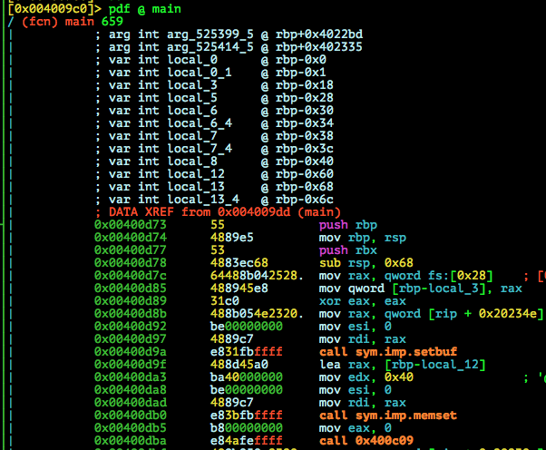
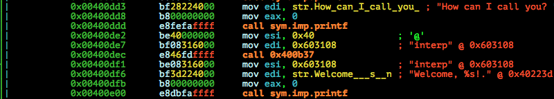
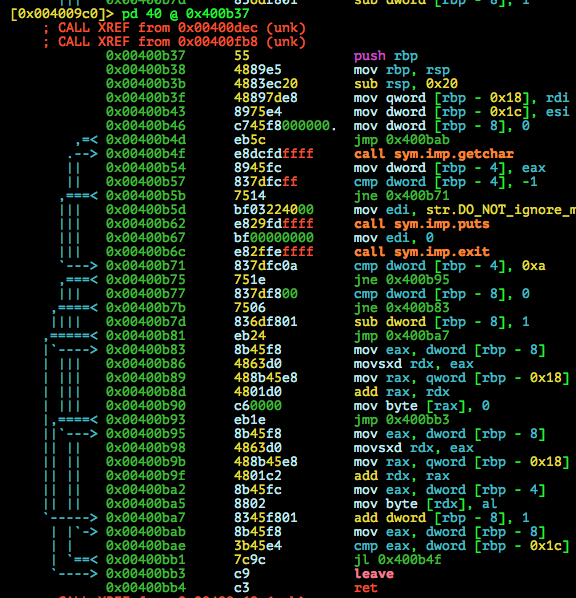
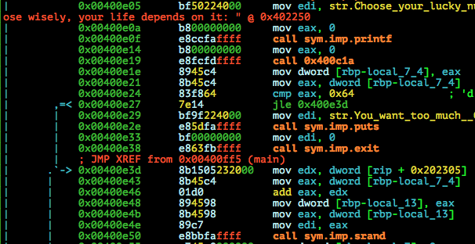
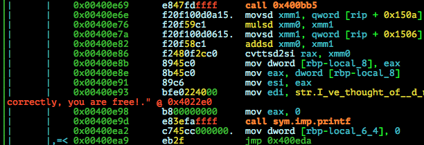
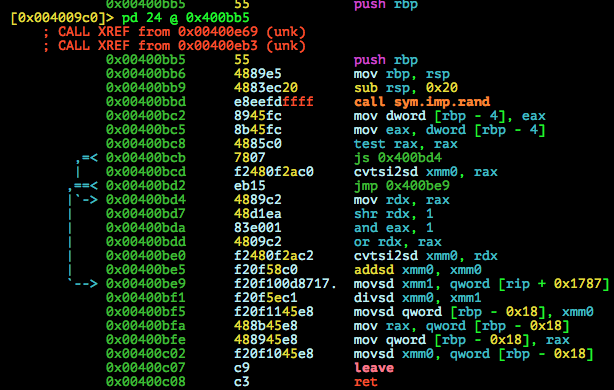
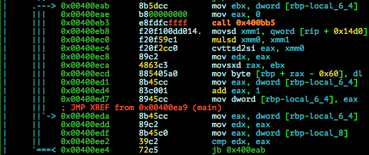

# ASIS Quals CTF 2015: Saw this -1

**Category:** pwn
**Points:** 100
**Solves:** 63
**Description:**

> Survive and get the flag!
>
> Note: This [challenge](http://tasks.asis-ctf.ir/sawthis_cdc323fa79278bcd63e91156dd83e91c) contains two flags, one of them is easier to
> fetch, the other is harder. The easier flag will be clearly indicated
> as "Flag 1", the harder flag as "Flag 2". Submit the easier (Flag 1)
> here.
> 
> Server running here:
> nc 87.107.123.3 31337

## Write-up

by [polym](https://github.com/abpolym)

This writeup is based on following writeups:

* <http://fritzfs.blogspot.com/2015/05/writeup-saw-this-1-asis-ctf-quals-2015.html> (Common understanding)
* <https://www.whitehatters.academy/asis-ctf-quals-2015-saw-this-1/> (Detailed understanding + python solution base)
* <http://blog.tinduong.pw/asis-quals-2015-saw-this-writeup/> (C-Code, IDA decompiled output)
* <http://bruce30262.logdown.com/posts/277024-asis-ctf-2015-quals-saw-this-1> (IDA decompiled output)

### Meta

Keywords:

* Off-By-One (`obo`) for username in input function starting at `0x400B37`
* Pseudo Random Number Generator (`prng`) - seed leak

We are given a xz compressed tar archive containing a x86-64bit stripped ELF for Linux:

```bash
$ unxz < sawthis_cdc323fa79278bcd63e91156dd83e91c | tar xvf -
saw/
saw/ld-linux-x86-64.so.2
saw/libc.so.6
saw/sawthis
$ cd saw/
$ file sawthis 
sawthis: ELF 64-bit LSB  executable, x86-64, version 1 (SYSV), dynamically linked (uses shared libs), for GNU/Linux 2.6.24, BuildID[sha1]=e82f3cf2a0a534a51d0ea4010061595050d4be33, stripped
```

Running it:

```bash
$ ./sawthis 
                                                                          
                           ,+,,.,.,,,.,@#                                 
                         ##.....,..,;';,###                               
                         #@:###,,..'#+:,+@##                              
                        @#::,,::,.,,,,,+;;##@                             
                        @#@+'';:;:;;,;++@@#@@                             
                        +@@@::,#++++',,,##@##                             
                          ;@@:.,,,,,,,::.;.                               
                          .++';#+'';,,.##'                                
                          `+++##+'+,.@####+#':`                           
                          '@;;.;,:'#####+++@++##;                         
                       :##@#,..:###+#####@@#####+++                       
                     `####@@#+###@@+#+##@@@@##+#++###`                    
                     @#@#+#@##@@#+####+##@@@@@########;                   
                    ;##@@############@@##@@@@ .######+#@                  
                  :@#@@@@####@#########@##@@#`   @#@#+####                
             .,,:##@@@@@@#########@#######@@#    @'':;#'#++               
        ``...,#@:;@@@@@@; @###@@#######+#@@@#   `........#                
    ,.;':.,,:;@@'+@@@+.  ,##+#@####@###@@+;:,+'+..:..:.:.`                
    ,,;.+,,              ;##@########@.;#@@@@ ;:;';;+;':                  
      `.;:              `###@@######.'#@###@#: `.                         
       ,;     `,,:     +#####@###@.'##########                            
        .,:.```;,#  .@###@@@@@#,,+@@#@@@@#####`                           
               ,,`.:#;#######@@@@########@#@@#`                           
                  .:###'@@@@@@@;##########@#@+                            
                 ######@+@@@@: '###+###@@@@;,                             
              ++####@@@@:@.   @##++#####@@+                               
             +#####@@@@##@   ,@@@####@#@+,                                
            #@##@@@@@:,'+#',` ######@@@@.                                 
           @####@@@# ;;'+#@########@#@@'                                  
          @##@###@.  ,+###`:+@@######@@@                                  
         ###+####@, #####+##+ '#@#####@                                   
        '####@###;,'@@@+,+###@@@#####@@+'                                 
       ;+######@@@+,@@#:'###'@###########+,                               
         `,@@#@@@.  ##+  ####@`@@###'. ###+#                              
         `@#@#+     ### .##@`#@@@@@'.   `@###                             
        ++@####+   ;@#+ ;##++#@@@@@`#@    @##+                            
       @+@'+##@##  ##+  ###'+###+#+``+@    @###                           
      ++@++++###,#.##+  +##@#+++#+++'#+;:.` @+##                 :@@#@@'  
     #+@+'+##### `### ':## @++++++++##+++++++@###+';,`          @#' #`'## 
 ,;+@@#@###+;   #####+### .++'++'++##@,:;+#######++++++++++##++#@+`'# ;#@ 
 @@@@@@#@+#+:`  @@######``,:@######@@@`          `,;+#######+#@@###+#' #@ 
     @@.        '+ # #        @@;`                          `,@@ ;###',## 
     @@,      '+  '#  #`     #+@                             `#@' @# ;#@  
     @@@    ;+    #.   #,   '+#                               @@' #`'#@   
     :@@` ;#`    `#     #; ##@                                 +@@#@@`    
      #@@#`      #+      ###+                                             
       '#@'      #     .##@                                               
         +@@#.  ,#  :+#@'                                                 
            ;@@@@@@@+,                                                    
                                                                          
                                                                          
 _     ___ _____ _____  _______      _____   __ ___   _____  ___ ___  ______ 
| |   |  _|_   _/  ___|| ___ | |    / _ \ \ / // _ \ |  __ \/ _ \|  \/  |  _|
| |   | |_  | | \ `--. | |_/ | |   / /_\ \ V // /_\ \| |  \/ /_\ | .  . | |_ 
| |   |  _| | |  `--. \|  __/| |   |  _  |\ / |  _  || | __|  _  | |\/| |  _|
| |___| |__ | | /\__/ /| |   | |___| | | || | | | | || |_\ | | | | |  | | |__
\_____\___/ \_/ \____/ \_|   \_____\_| |_/\_/ \_| |_/ \____\_| |_\_|  |_\___/
                                                                          
How can I call you? master
Welcome, master!
Choose your lucky number (1-100)! But choose wisely, your life depends on it: 42
I've thought of 13 numbers. If you guess them correctly, you are free!
Number #1: 1
Number #2: 2
Number #3: 3
Number #4: 4
Number #5: 5
Number #6: 6
Number #7: 7
Number #8: 8
Number #9: 9
Number #10: 10
Number #11: 11
Number #12: 12
Number #13: 13
YOU LOST THE GAME! IT'S OVER!$
```

We can provide a username as well as guess a varying amount of numbers.

Decompiling it with `radare2` to see the application flow:




PS: You can also decompile it using IDA to get a better C code representation of the binary as done in [this](http://bruce30262.logdown.com/posts/277024-asis-ctf-2015-quals-saw-this-1) or [this writeup](http://blog.tinduong.pw/asis-quals-2015-saw-this-writeup/).

We see the following:

* `main` calls a function at addr. `0x400c09`
* The function at addr. `0x400c09` stores the result of a `rand()` call into BSS at `0x603148`



* Out username input is processed with the function `0x400b37`, which gets 2 parameters. So the call looks like this: `fcn.400b37(0x603108, 0x40)`



* The function `fcn.400b37` then gets exactly `0x40`==`64` bytes from our input stream and stores it into BSS at addr. `0x603108`



* After asking us for a lucky number between `0` and `100`, `srand` is called with out lucky number plus the previous seed generated by seed, seeding future `rand()` calls




* To determine the amount of random numbers, some random numbers are then generated with a simple algorithm using rand(), an inline assembly `floor` function and some additions/multiplications



* After telling us the number of to be guessed random numbers, `main` then steps into a loop:
  * Generate a random number with a similar algorithm
  * Ask the user for the random number

Note that usually calling `rand()` without seed, it is automatically seeded with a value of 1 (see `man 3 rand`). Decompiling it per hand using `radare2` does not yield any `rad()` call before main calls `0x400c09`. However, looking at `ltrace -f ./sawthis`, we clearly can see a `srand(0xb865a929, 0, 8, 1)` call before our first `rand()` call. If you know why, please tell me!

After some thinking, you'll notice that the seed value and our username are very close to each other in BSS:

* `0x603108` username
* `0x603148` seed

We know these facts:

* We can input `0x40` bytes for our username.
* Right after our username begins the `seed` value.
* `printf` then is called on our username address with `%s` as format string for our username.
* `printf` with `%s` stops reading when it gets a null byte `\x00`

This is some sort of off-by-one vulnerability! If we provide a username of length `0x40` with bytes not `\x00`, `printf` also leaks the seed!

All that is left to do is re-implement the custom modified Pseudo Random Number Generator with the saw-this algorithms using `floor`.

I modified the python script from [this writeup](https://www.whitehatters.academy/asis-ctf-quals-2015-saw-this-1/) to make it work on my local machine, producing [this python script solution](./solve.py):

```bash
$ python solve.py 
[+] Opening connection to localhost on port 6666: Done
Flag: ASIS{109096cca8948d1cebee782a11d2472b}
[*] Closed connection to localhost port 6666
```

Note that you have to create a flag file named `freedom` with `echo "ASIS{109096cca8948d1cebee782a11d2472b}" > freedom'` to test it locally.

The flag is `ASIS{109096cca8948d1cebee782a11d2472b}`.

PS: Instead of using `ctypes`, some writeups, such as [this one](http://blog.tinduong.pw/asis-quals-2015-saw-this-writeup/) implemented the seeding and algorithm in C. [Another writeup author](http://fritzfs.blogspot.de/2015/05/writeup-saw-this-1-asis-ctf-quals-2015.html) even wrote a gdb script that emulates the algorithm!
## Other write-ups and resources

* <http://fritzfs.blogspot.com/2015/05/writeup-saw-this-1-asis-ctf-quals-2015.html>
* <https://www.whitehatters.academy/asis-ctf-quals-2015-saw-this-1/>
* <http://blog.tinduong.pw/asis-quals-2015-saw-this-writeup/>
* <https://ucs.fbi.h-da.de/writeup-asis-ctf-quals-2015-saw-this-1/>
* <http://bruce30262.logdown.com/posts/277024-asis-ctf-2015-quals-saw-this-1>
* [Indonesian](https://github.com/rentjongteam/write-ups-2015/tree/master/asis-quals-2015/saw-this-1)
* [Japanese](http://www.cnhackmy.com/hacked/CTF/2015/09/12/00001679.html)
* [Polish](http://forum.4programmers.net/Spolecznosc/252274-writeup_asis_ctf_2015)
