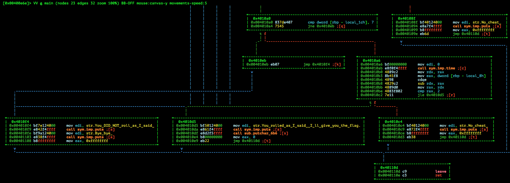
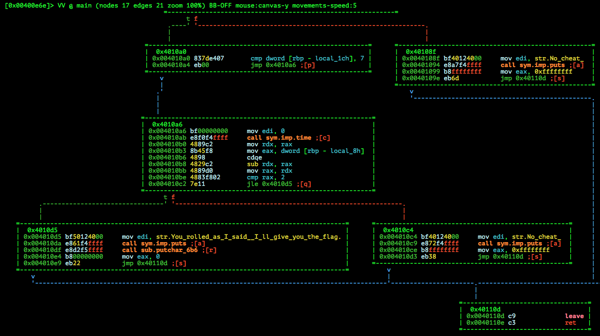

# ASIS Quals CTF 2015: KeyLead

**Category:** Reverse
**Points:** 150
**Solves:** 121
**Description:**

> Find the flag in this [file](http://tasks.asis-ctf.ir/keylead_068128f7cacc63375c9cbab8114e15da).

## Write-up

by [polym](https://github.com/abpolym)

Keywords:

* `x86-64` Linux Executable, stripped
* Patching

We are given a xz-compressed 64-bit Linux Executable for x86:

```bash
$ unxz < keylead_068128f7cacc63375c9cbab8114e15da > key
$ file key
key: ELF 64-bit LSB  executable, x86-64, version 1 (SYSV), dynamically linked (uses shared libs), for GNU/Linux 2.6.32, BuildID[sha1]=c1d5a4a7ffa57a2335f88093530dc89c1c71ec72, stripped
```

Running the binary yields a dice rolling game:

```
$ ./key
hi all ----------------------
Welcome to dice game!
You have to roll 5 dices and get 3, 1, 3, 3, 7 in order.
Press enter to roll.

You rolled 1, 1, 4, 2, 5.
You DID NOT roll as I said!
Bye bye~
```

Looks like we have to win the game to get the flag by rolling the combination `3,1,3,3,7` - so we find for the branch that is followed on success.
We open the executable with `radare2` and disassemble the main function to see a cascade of `cmp` checks and several calls of `time` on success as well as the possible final states we can be in:



The function `sub.putchar_6b6`, which prints the flag on success, is pretty massive. Reversing such a complex function would be a waste of time.

Thus, we patch the conditional jumps (as seen in address `0x004010a4` for example) to always jump to the success case to hopefully see the flag with whatever random dice roll we make.
This is done using a [radare2 script](./fix.r2s) and [calling the script](./fix) using `radare2`.

The [resulting binary](./key-patched) then looks like this:



Fortunately, running the binary yields the flag :) :

```
$ ./key-patched 
hi all ----------------------
Welcome to dice game!
You have to roll 5 dices and get 3, 1, 3, 3, 7 in order.
Press enter to roll.

You rolled 1, 2, 5, 1, 4.
You rolled as I said! I'll give you the flag.
ASIS{1fc1089e328eaf737c882ca0b10fcfe6}$ 
```

The flag is `ASIS{1fc1089e328eaf737c882ca0b10fcfe6}`!

## Other write-ups and resources

* <http://dakutenpura.hatenablog.com/entry/2015/05/11/235011>
* [b01lers](https://b01lers.net/challenges/ASIS%202015/KeyLead/51/)
* <https://neg9.org/news/2015/5/11/asis-ctf-quals-2015-keylead-reversing-150-writeup>
* <http://www.thice.nl/asis-ctf-2015-write-ups/>
