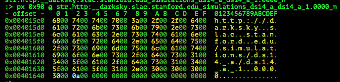
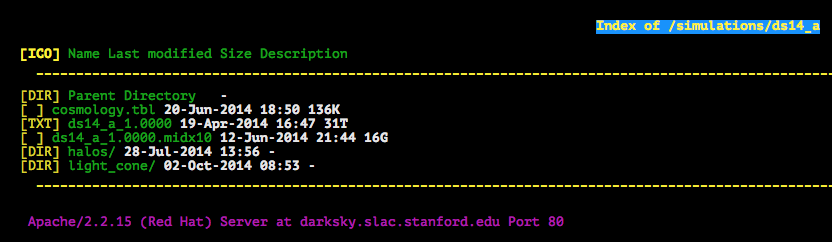
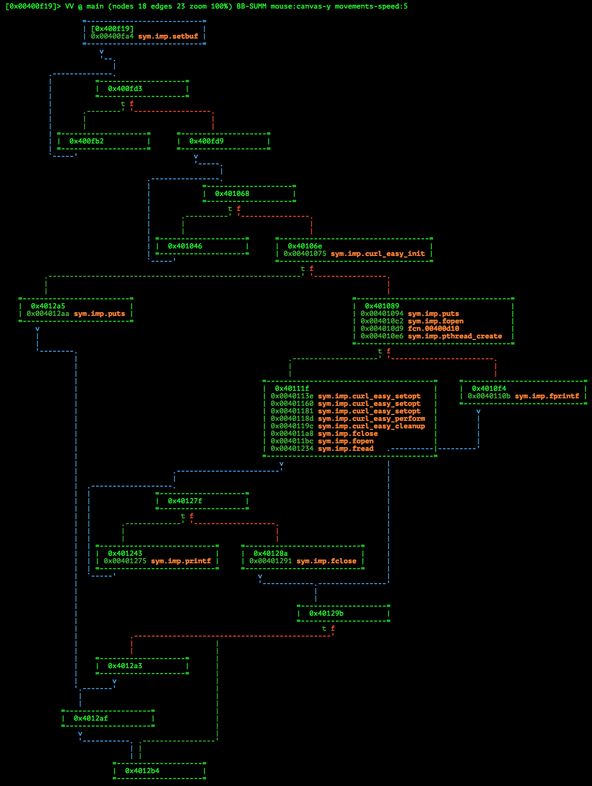
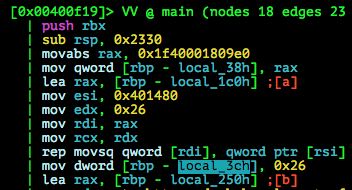
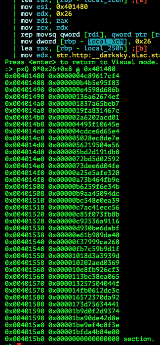
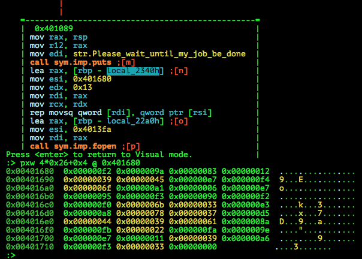

# ASIS Quals CTF 2015: Tera

**Category:** Reverse
**Points:** 100
**Solves:** 58
**Description:**

> Be patient and find the flag in this [file](http://tasks.asis-ctf.ir/tera_85021482a68d6ed21892ea99b84f13f3).

## Write-up

This writeup is based on following writeups:

* <https://github.com/smokeleeteveryday/CTF_WRITEUPS/tree/master/2015/ASISCTF/reversing/tera> (IDA Pseudocode)
* <http://blog.morganz.me/blog/2015/05/12/asis-ctf-quals-2015-re100-tera-writeup/> (`thingking` module)
* <http://uaf.io/reverse%20engineering/2015/05/11/ASIS-CTF-Tera.html> (Tables)

by [polym](https://github.com/abpolym)

Keywords:

* `x86-64` Executable for Linux
* Big File Download

We are given a xz-compressed `x86-64` Executable for Linux, which we decompress using `unxz`:

```bash
$ file tera_85021482a68d6ed21892ea99b84f13f3 
tera_85021482a68d6ed21892ea99b84f13f3: XZ compressed data
$ unxz < tera* > tera
$ file tera
tera: ELF 64-bit LSB  executable, x86-64, version 1 (SYSV), dynamically linked (uses shared libs), for GNU/Linux 2.6.32, BuildID[sha1]=3cb129969996a7a51be0a179eb61f0d02607df6b, stripped
```

Running it (after installing `libcurl4` with `sudo apt install libcurl4-nss-dev`):

```bash
$ chmod u+x ./tera 
$ ./tera 
Please wait until my job be done 
%0.0000010 [                                  ] 360 :)^C
```

The binary downloads a larger file from somewhere unknown.
If we have a look at `/tmp`, we can see that there is a hidden file `.tera`:

```bash
$ ls -al /tmp/
[...]
-rw-rw-r--  1 vbox vbox 360448 Aug 21 16:03 .tera
[...]
$ file /tmp/.tera 
/tmp/.tera: data
$ xxd -l16 /tmp/.tera 
0000000: 2320 5344 4620 312e 300a 696e 7420 6865  # SDF 1.0.int he
```

Looks like some custom file format.

If we open the file with `radare2` and have a look at the strings, we can detect a URL:

```bash
:> iz
vaddr=0x004013c2 paddr=0x000013c2 ordinal=000 sz=10 len=9 section=.rodata type=ascii string=\r%%%.7f [
vaddr=0x004013cc paddr=0x000013cc ordinal=001 sz=10 len=9 section=.rodata type=ascii string=] %lld :)
vaddr=0x004013d8 paddr=0x000013d8 ordinal=002 sz=34 len=33 section=.rodata type=ascii string=Please wait until my job be done 
vaddr=0x00401400 paddr=0x00001400 ordinal=003 sz=42 len=41 section=.rodata type=ascii string=Error - pthread_create() return code: %d\n
vaddr=0x00401430 paddr=0x00001430 ordinal=004 sz=32 len=31 section=.rodata type=ascii string=Please check your connection :)
vaddr=0x00401588 paddr=0x00001588 ordinal=005 sz=6 len=5 section=.rodata type=ascii string=ADcu=
vaddr=0x004015c0 paddr=0x000015c0 ordinal=006 sz=134 len=66 section=.rodata type=wide string=http://darksky.slac.stanford.edu/simulations/ds14_a/ds14_a_1.0000\n
```

A usual `strings` call on the binary would not reveal the URL, since the URL is UTF-8 encoded, meaning that two bytes are used for each character with nullbytes as placeholders for unused bytes:



We can print it as a `wide` string using `radare2`:

```bash
:> psw @ str.http:__darksky.slac.stanford.edu_simulations_ds14_a_ds14_a_1.0000_n 
http://darksky.slac.stanford.edu/simulations/ds14_a/ds14_a_1.0000
```

We open the parent directory URL in `lynx` and see that the file is of size 31TB:



We sure won't wait for a 31 *Tera*Byte file to download.
Since the description tells us that the flag is hidden somewhere in the file, we most likely have to download a specific part of the file that might even be in the middle of those 31TB.

Luckily, there are several ways to download specific bytes/ byte sequences from a file.

* We can use the `Range` header to perform a partial download.
  * Either with `curl`:

    ```bash
    $ curl --header 'Range: bytes=100-200' http://darksky.slac.stanford.edu/simulations/ds14_a/ds14_a_1.0000 && echo
    T = 2;
    int units_2HOT = 2;
    int64_t npart = 1073741824000;
    float particle_mass = 5.6749434;
    int iter =
    ```

  * Or with [httpie](https://github.com/jkbrzt/httpie):

    ```bash
    +bash-4.3$ http -dh http://darksky.slac.stanford.edu/simulations/ds14_a/ds14_a_1.0000 'Range: bytes=100-200'
    HTTP/1.1 206 Partial Content
    Accept-Ranges: bytes
    Connection: close
    Content-Length: 101
    Content-Range: bytes 100-200/34359739943392
    [...]
    Downloading 101.00 B to "ds14_a_1.0000"
    Done. 101.00 B in 0.00032s (312.93 kB/s)
    +bash-4.3$ cat ds14_a_1.0000 
    T = 2;
    int units_2HOT = 2;
    int64_t npart = 1073741824000;
    float particle_mass = 5.6749434;
    int iter =+bash-4.3
    ```

* As [this writeup](http://blog.morganz.me/blog/2015/05/12/asis-ctf-quals-2015-re100-tera-writeup/) suggests, we also can use the [`thingking` module](https://bitbucket.org/darkskysims/data_release#markdown-header-python-based-exploration) from the content providers to access byte ranges via python (which internally just uses the same `Range` header together with the `requests` python module as seen [here](https://bitbucket.org/zeropy/thingking/src/965cdb7c1a7cf010b2742b0b2f983d0007703501/thingking/arbitrary_page.py?at=default&fileviewer=file-view-default)).

To determine what happens after the download, we open the `main` function in `radare2` to see a pretty big CFG (Summary visual mode):



We see the following:

* In Basic Block (`bb`) `0x401089` there is a `pthread_create` call with `fcn.00400d10` as the `start_routine` parameter. Adding to that we see a `fopen` call
* In bb `0x40111f` we see several `curl_easy_*` calls and several subsequent file handling function calls `fopen`/`fread`...
* A loop from bb `0x401243` to bb `0x40127f`, with the former having a `printf` call - indicating that this might print our flag

We have a look at the loop to see the following:


We gather information about the loop and the values used within:

* First, we see a `xor` instruction of two 32bit registers with the result being converted to a signed byte and printed to stdout using `printf("%c\n",...)`
* A counter in `rax`/`rbp-local_30h` is compared to the value of `rbp-local_3ch`. We highlight (`/`) "local_3ch" and find this counter (Value: `0x26`) in the beginning of our `main` function: 
* We also see a QWORD table, which is copied using the `rep movsq` instruction to `rbp-local_1c0h`, which is used . We print it:


* A `fread` call preceding the loop reads one element of the size stored in `rbp-local_38h` (which turns out to be the value `0x1f40001809e0` - ~31TB, the size of the file - stored with `movabs` in the beginning of `main`) into `rbp-local_80h`. This address is then used together with the previous QWORD table values to read a single byte from presumably the downloaded file and stored into the `edx` register of our `xor` instruction
* We highlight "local_2340h" to find yet another table (this time containig `0x26` DWORD values) and counter (bb: `0x401089`), which are then stored into the second operand `eax` of our `xor` instruction:



All that is left to do now is download single bytes from the *Tera*byte sized binary blob using the `Range` header trick and QWORD offset table values, `XOR` these bytes with the given DWORD table values and hopefully gain the flag.

[This python script](./terasolve.py) does the job:

```bash
$ python2.7 terasolve.py
A
AS
ASI
ASIS
ASIS{
ASIS{3
ASIS{31
ASIS{314
ASIS{3149
ASIS{3149a
ASIS{3149ad
ASIS{3149ad5
ASIS{3149ad5d
ASIS{3149ad5d3
ASIS{3149ad5d36
ASIS{3149ad5d362
ASIS{3149ad5d3629
ASIS{3149ad5d36295
ASIS{3149ad5d362958
ASIS{3149ad5d3629581
ASIS{3149ad5d3629581b
ASIS{3149ad5d3629581b1
ASIS{3149ad5d3629581b17
ASIS{3149ad5d3629581b172
ASIS{3149ad5d3629581b1727
ASIS{3149ad5d3629581b17279
ASIS{3149ad5d3629581b17279c
ASIS{3149ad5d3629581b17279cc
ASIS{3149ad5d3629581b17279cc8
ASIS{3149ad5d3629581b17279cc88
ASIS{3149ad5d3629581b17279cc889
ASIS{3149ad5d3629581b17279cc8892
ASIS{3149ad5d3629581b17279cc88922
ASIS{3149ad5d3629581b17279cc889222
ASIS{3149ad5d3629581b17279cc889222b
ASIS{3149ad5d3629581b17279cc889222b9
ASIS{3149ad5d3629581b17279cc889222b93
ASIS{3149ad5d3629581b17279cc889222b93}
ASIS{3149ad5d3629581b17279cc889222b93}
```

The flag is `ASIS{3149ad5d3629581b17279cc889222b93}`.

## Other write-ups and resources

* <https://github.com/smokeleeteveryday/CTF_WRITEUPS/tree/master/2015/ASISCTF/reversing/tera>
* <http://boaster.github.io/reverse%20engineering,%20ctf/2015/05/11/ASIS-CTF-Tera.html>
* <http://blog.morganz.me/blog/2015/05/12/asis-ctf-quals-2015-re100-tera-writeup/>
* <http://uaf.io/reverse%20engineering/2015/05/11/ASIS-CTF-Tera.html>
* [Indonesian](https://github.com/rentjongteam/write-ups-2015/tree/master/asis-quals-2015/tera)
* [Japanese](http://charo-it.hatenablog.jp/entry/2015/05/12/165808)
