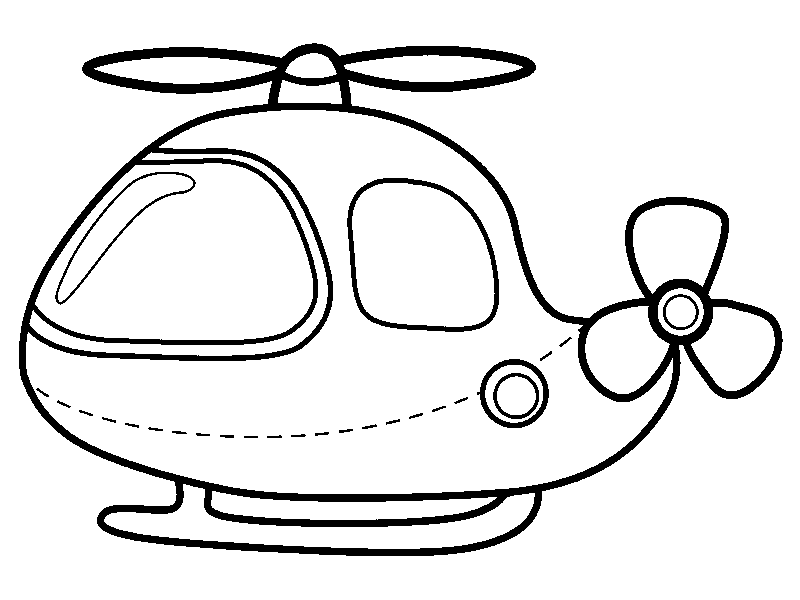
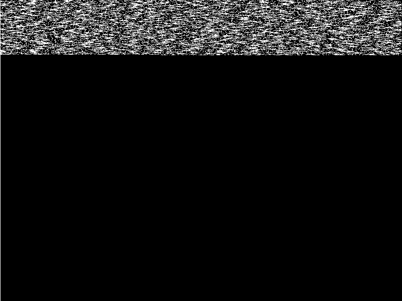

# ASIS Quals CTF 2015: Blind

**Category:** Stego
**Points:** 225
**Solves:** 2
**Description:**

> Download the [file](http://tasks.asis-ctf.ir/blind_40252205e1bb2c138442a10bd776417d) and find the flag.

## Write-up

by [polym](https://github.com/abpolym)

This write-up is based on a writeup by [khack40](http://khack40.info/asis-quals-ctf-2015-blind-write-up/).

Using `file`, we see that we are given a xz-compressed file and uncompress it using `unxz`:

```bash
+bash-4.3$ file blind_40252205e1bb2c138442a10bd776417d 
blind_40252205e1bb2c138442a10bd776417d: xz compressed data
+bash-4.3$ mv blind_40252205e1bb2c138442a10bd776417d{,.xz}
+bash-4.3$ unxz blind_40252205e1bb2c138442a10bd776417d.xz
+bash-4.3$ file blind_40252205e1bb2c138442a10bd776417d 
blind_40252205e1bb2c138442a10bd776417d: PNG image data, 800 x 600, 8-bit/color RGBA, non-interlaced
```

Using `stegsolve`, we first see an airplane at the `Alpha plane 0` values:



Adding to that, we see an anomaly at the `Blue plane 0` values:



The airplane looks like a red herring, however the blue values seem to be interesting.

Let's print all blue values by row using [pixels.py](./pixels.py):

```bash
+bash-4.3$ python2.7 pixels.py blind_40252205e1bb2c138442a10bd776417d
242 242 242 [...] 244 244 248
249 243 240 [...] 244 244 248
249 243 243 [...] 242 242 248
```

We can see that each row, except the first one, begins with `249` and ends with `248`.

The author encoded a [brainloller](https://esolangs.org/wiki/Brainloller) program into the blue values.

Here, a blue value `240` represents a brainloller pixel with RGB values `(255,0,0)`, which is `>` in a brainfuck program.
`241` represents a pixel with RGB values `(128,0,0)`, which is the braincode instruction `>` etc.

We can translate the pixels into a brainfuck program using [brainloller.py](./brainlollerpy). Note that this program assumes that at the end of each row, a brainloller's program changes its IP direction (cyan and darkcyan values).

The output of the python script is a brainfuck program, [blind.bf](blind.bf).

We interpret this brainfuck code using `bf` and get a base64 [encoded string](./answer.64) as output.

The output is a PNG containing our flag:


## Other write-ups and resources

* <http://khack40.info/asis-quals-ctf-2015-blind-write-up/>
