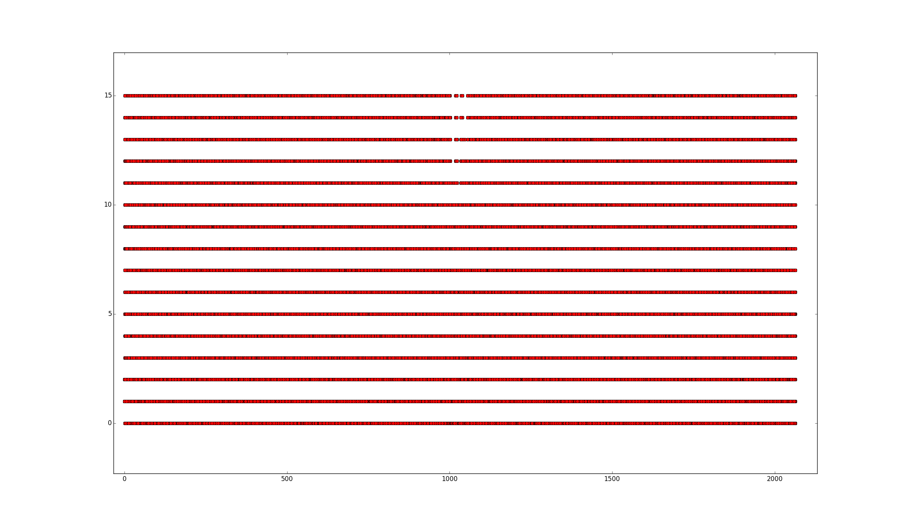
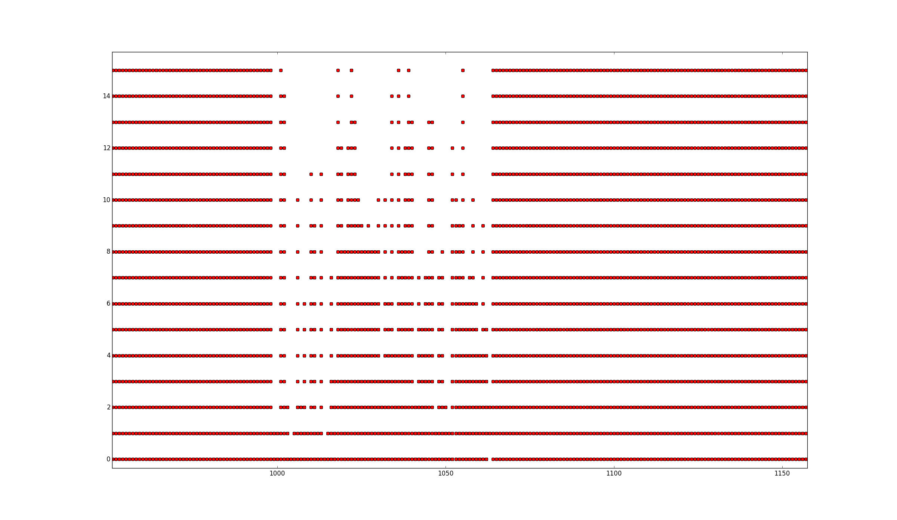

# backdoor CTF 2015: [RAND](https://backdoor.sdslabs.co/challenges/RAND)

**Category:** Crypto
**Points:** 250
**Author:** [Abhay Bir Singh Rana](https://backdoor.sdslabs.co/users/nemo)
**Difficulty:** TODO
**Solves:** 3
**Description:** 

* <https://backdoor.sdslabs.co/challenges/RAND>

> The flag is hidden in the middle of [this](http://hack.bckdr.in/RAND/) generated garbage. Make sure you open it in your browser.

## Write-up

We are given a link to a website http://hack.bckdr.in/RAND/ which seems to display some random data and a hint to access the webpage using a browser (this is important, because page uses cookies)

If we do enough requests to the webpage and store all the responses and then plot all the possible 4-bit values that occur on all the positions we get this nice looking graph

We can see that every possible value (0 - 15) is present everywhere except around middle of the stream. If we zoom in to this region we can see this

The region has exactly the same length as SHA256 digest so that's a good hint that we are on the right track. The problem now is how the data are encoded in this. The trick is to count how many possible values each offset have and convert that to 4-bit value. If we do this for every offset in in range 999-1064 we get the flag.

## Other write-ups and resources

* none yet