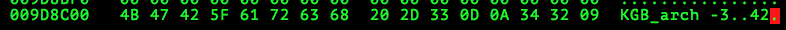
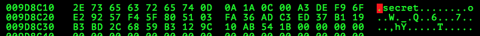

# Boston Key Party CTF 2015: Heath Street

**Category:** School-Bus
**Points:** 100
**Solves:** 167
**Description:**

> During my time at KGB I learned how to hide all the stuff from alpha-dog. But damn it, I somehow lost some of the most important files... : 100

## Write-up

Using `file`, wee see that we are given an ext4 image:

```bash
$ file secretArchive.6303dd5dbddb15ca9c4307d0291f77f4
ecretArchive.6303dd5dbddb15ca9c4307d0291f77f4: Linux rev 1.0 ext4 filesystem data (extents) (huge files) 
```

Mounting it with `mount` reveals a bunch of files containing a [transcript of Leonid Brezhnev's Telephone Conversation with Alexander Dubček](http://www2.gwu.edu/~nsarchiv/nsa/publications/DOC_readers/psread/doc81.htm):

```bash
$ sudo mount -o loop,rw secretArchive.6303dd5dbddb15ca9c4307d0291f77f4 /mnt
$ ls -a
. .. lost+found secret0 secret1 secret10 secret100 [...] secret998 secret999
$ file * | sort -k2
secret2:     ASCII text
secret8:     ASCII text
[...]
secret1980: UTF-8 Unicode text, with no line terminators
secret1337: Zip archive data, at least v1.0 to extract
$ mv secret1337 /tmp && cat * > /tmp/all
```

After trying to bruteforce the password of the `secret1337` password-protected ZIP file, we think that it is a [red herring](http://en.wikipedia.org/wiki/Red_herring).

The next step is to find deleted data using `extundelete`:

```bash
$ extundelete --restore-all secretArchive.6303dd5dbddb15ca9c4307d0291f77f4
WARNING: Extended attributes are not restored.
Loading filesystem metadata ... 2 groups loaded.
Loading journal descriptors ... 904 descriptors loaded.
Writing output to directory RECOVERED_FILES/
Searching for recoverable inodes in directory / ... 
368 recoverable inodes found.
Looking through the directory structure for deleted files ... 
Restored inode 2086 to file RECOVERED_FILES/secret5088
[...]
Restored inode 2362 to file RECOVERED_FILES/secret5364
Restored inode 2365 to file RECOVERED_FILES/.secret31337
Restored inode 2009 to file RECOVERED_FILES/secret5011
[...]
Restored inode 2296 to file RECOVERED_FILES/secret5298
0 recoverable inodes still lost.
```

We see a `.secret31337` file, which is a kgb archive:

```bash
$ file .secret31337
.secret31337: KGB Archiver file with compression level 3
$ kgb .secret31337
Extracting archive KGB_arch -3 .secret31337 ...
         0KB .secret: extracted
0KB -> 0KB w 0.00s. (142.86% czas: 12 KB/s)
$ cat .secret
flag{Komitet_gosudarstvennoy_bezopasnosti}
```

The flag is `flag{Komitet_gosudarstvennoy_bezopasnosti}`.

Another solution is to `grep` for specific strings:

```bash
$ strings -a secretArchive.6303dd5dbddb15ca9c4307d0291f77f4 | grep -i kgb
0kgb1
w<kGba
kkGbk
kgBh
     New York KGB messages of 1942 and 1943
[...]
The KGB communications between Mexico City and Moscow during 1943 to 
KGB_arch -3
aliases GNOME (GNOM in the Russian spelling) was in reality Ramon Mercader, a Spanish Communist recruited into KGB service
[...]
years, represented NSA. During the last phase of VENONA (1978 to 1980), NSA issued thirty-nine first-time translations of KGB 
KGB cipher by Cecil Phillips, Genevieve Feinstein, Lucille Campbell.
```

Then, search (First <kbd>Tab</kbd> to switch to the ASCII column, then press <kbd>/</kbd> to search for ASCII strings) in `hexedit` for the unusual string "KGB_arch":




Extract the file beginning at offset 10324992 (0x009D8C00) and ending at offset 10325051 (0x009D8C3B) - therefore of length 10325051-10324992 = 59 using `dd`:

```bash
$ dd bs=1 skip=10324992 count=59 if=secretArchive.6303dd5dbddb15ca9c4307d0291f77f4 of=output
59+0 records in
59+0 records out
59 bytes transferred in 0.000127 secs (464285 bytes/sec)
$ file output
output: KGB Archiver file with compression level 3
```

Then extract it using `kgb` and retrieve the flag.

## Other write-ups and resources

* <http://wiremask.eu/boston-key-party-2015-heath-street/>
* <http://blog.st3phn.com/2015/02/boston-key-party-ctf-2015-heath-street.html>
* <http://u.osu.edu/romig.1/2015/03/02/boston-key-party-heath-street-write-up/>
