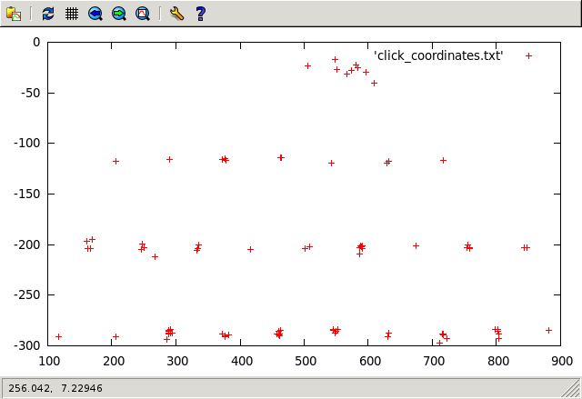
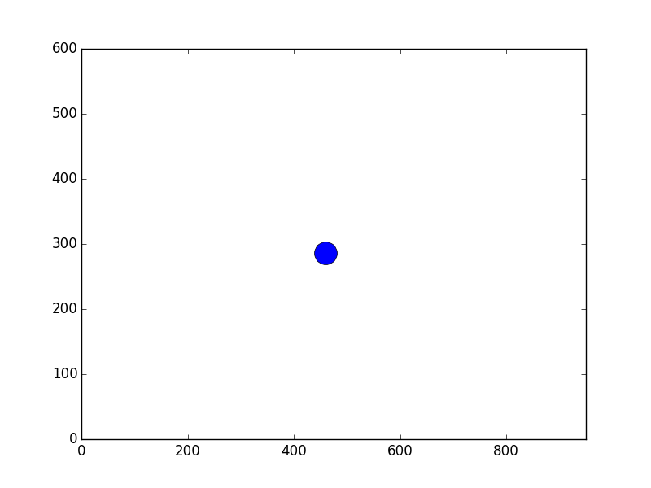

# Boston Key Party CTF 2015: Riverside

**Category:** School-Bus
**Points:** 200
**Solves:** 94
**Description:**

> omg tha NSA hacked my super secret login, I caught them exfillin this pcap, am I t3h fuxxed? : 200

## Write-up

We start with a pcap-ng capture file containing USB traffic.  Let's take a look.

```
$ ln -s challenge.pcapng.28c58da9dd07532d45aa68f9b825941e challenge.pcapng
$ tshark -r challenge.pcapng usb.bDescriptorType and usb.urb_type==67
  4 0.075077000         12.0 -> host         USB  GET DESCRIPTOR Response DEVICE
 24 0.150578000          1.0 -> host         USB  GET DESCRIPTOR Response DEVICE
 60 0.047392000          2.0 -> host         USB  GET DESCRIPTOR Response DEVICE
 75 0.074061000          1.0 -> host         USB  GET DESCRIPTOR Response DEVICE
 94 0.150211000          3.0 -> host         USB  GET DESCRIPTOR Response DEVICE
 96 0.150419000          2.0 -> host         USB  GET DESCRIPTOR Response DEVICE
 98 0.150447000          1.0 -> host         USB  GET DESCRIPTOR Response DEVICE
```
Note that USB device address 1.0 has three different descriptor packets.  This probably means we are looking at multiple busses.
```
$ tshark -r challenge.pcapng usb.bDescriptorType and usb.urb_type==67 -T fields -e usb.bus_id -e usb.device_address -e usb.idVendor -e usb.idProduct
2       12      0x046d  0xc00e
3       1       0x1d6b  0x0003
1       2       0x8087  0x8000
1       1       0x1d6b  0x0002
2       3       0x5986  0x0268
2       2       0x8087  0x07dc
2       1       0x1d6b  0x0002
```
Search Google for these vid:pid pairs to identify what we are looking at.  Based on the info above, lsusb on the target system would probably look approximately like this:
```
Bus 002 Device 012: ID 046d:c00e Logitech M-BJ58/M-BJ69 Optical Wheel Mouse
Bus 003 Device 001: ID 1d6b:0003 Linux Foundation 3.0 root hub
Bus 001 Device 002: ID 8087:8000 Intel Integrated Rate Matching Hub
Bus 001 Device 001: ID 1d6b:0002 Linux Foundation 2.0 root hub
Bus 002 Device 003: ID 5986:0268 Acer Integrated Camera
Bus 002 Device 002: ID 8087:07dc Intel 7260AC Bluetooth
Bus 002 Device 001: ID 1d6b:0002 Linux Foundation 2.0 root hub
```
What devices are actually sending data?
```
$ tshark -r challenge.pcapng 'usb.data_flag=="present (0)"' -T fields -e usb.bus_id -e usb.device_address -e usb.endpoint_number.endpoint | sort | uniq -c
     12 1       1       0
      2 1       1       1
     12 1       2       0
      1 1       2       1
      7 2       1       0
      1 2       1       1
      1 2       12      0
   7608 2       12      1
      1 2       2       0
      3 2       3       0
      9 3       1       0
      1 3       1       1
```
So other than a few packets from the hubs, it is really only bus:1 dev:12.1 that is talking.  The Logitech mouse?  Ewww.  What does mouse data look like, anyway?
```
$ tshark -r challenge.pcapng usb.capdata and usb.device_address==12 -T fields -e usb.capdata > mouse_data.txt
$ head mouse_data.txt
00:01:00:00
00:01:00:00
00:01:00:00
00:01:00:00
00:01:00:00
00:02:00:00
00:02:ff:00
00:02:00:00
00:03:ff:00
00:01:00:00
```
Hmm.  What does mouse data usually look like?  Here is some [quick usb-mouse code](http://johnroach.info/2011/02/16/getting-raw-data-from-a-usb-mouse-in-linux-using-python/) to run while wiggling around a mouse.  If I run this and move my mouse up one pixel, right, down, left then click, I get this output:
```
0x8 0 1
0x8 1 0
0x28 0 -1
0x18 -1 0
0x9 0 0
0x8 0 0
```
Looks like the status byte passes click info.  The next value is signed relative X movement, and the last is signed relative Y movement.  Look back at the captured data and see if it is similar.
```
$ sed -n 7597,7604p mouse_data.txt
00:f4:02:00
00:f4:01:00
00:f4:00:00
00:f5:00:00
00:f5:ff:00
00:f5:00:00
00:f6:ff:00
00:f7:ff:00
```
That section looks pretty good for 8-bit two's compliment X and Y values in the middle.  Do the first or last values change?
```
$ awk -F: '{print$1}' mouse_data.txt | sort | uniq -c
   7518 00
     90 01
$ awk -F: '{print$4}' mouse_data.txt | sort | uniq -c
   7608 00
```
First value has two states, but the last value is always 0x00.  So maybe we have 90 clicks?  Time to start summing relative movement and printing values on click events.
```
$ awk -F: 'function comp(v){if(v>127)v-=256;return v}{x+=comp(strtonum("0x"$2));y+=comp(strtonum("0x"$3))}$1=="01"{print x,y}' mouse_data.txt | tee click_coordinates.txt | head -5
460 -286
586 -203
289 -288
567 -31
117 -291
$ gnuplot -e "plot 'click_coordinates.txt'"
```


Sure enough, that looks like a keyboard with a spacebar up at the top.  Why is the keyboard upside down, you ask?  Couldn't tell ya.  Let's map those positions to keys!
```
$ awk 'BEGIN{split("          zxcvbnm  asdfghjkl qwertyuiop",key,//)}{r=int(($2-20)/-100);c=int(($1 - 117 + (r % 2 * 40)) / 85);k=r*10+c;printf "%s",key[k]}END{print""}' click_coordinates.txt 
the quick brown fox jumps ovver the lazy dog thekeyisiheardyoulikedsketchyetchingglastyear
```
But something isn't quite right in there.  There are repeating letters in two places that don't make sense.
```
$ grep -C2 01:ff:00:00 mouse_data.txt
00:00:ff:00
01:00:00:00
01:ff:00:00
00:00:00:00
00:01:ff:00
--
00:00:01:00
01:00:00:00
01:ff:00:00
00:00:00:00
00:02:00:00
```
Some sort of click-drag or double-click nonsense.  So just nuke those "bad click" lines and process again...
```
$ tshark -r challenge.pcapng usb.capdata and usb.device_address==12 -T fields -e usb.capdata | grep -v 01:ff:00:00 > mouse_data.txt
$ awk -F: 'function comp(v){if(v>127)v-=256;return v}{x+=comp(strtonum("0x"$2));y+=comp(strtonum("0x"$3))}$1=="01"{print x,y}' mouse_data.txt > click_coordinates.txt
$ awk 'BEGIN{split("          zxcvbnm  asdfghjkl qwertyuiop",key,//)}{r=int(($2-20)/-100);c=int(($1 - 117 + (r % 2 * 40)) / 85);k=r*10+c;printf "%s",key[k]}END{print""}' click_coordinates.txt 
the quick brown fox jumps over the lazy dog thekeyisiheardyoulikedsketchyetchinglastyear
```
If you aren't a fan of decyphering awk, there is an ugly python example for you to re-write.  [usb-mouse_osk_decode.py](usb-mouse_osk_decode.py)

# Samurai's Analog Jujitsu Method
Using a list of mouse movement delta information ([see our coords file](rel_coord_log)) and a slick [python script](plot_coords_py.py) using matplotlib from [@kavefish](https://github.com/kavefish) we get an animated gif of all the mouse clicks:



And with a quick scotch tape and marker job, you can easily decode it:


## Other write-ups and resources

* <http://blog.dragonsector.pl/2015/03/boston-key-party-2014-riverside.html>
* <https://johnsupercool.github.io/posts/2015/mars/01/boston-key-party-2015-ctf-misc200-riverside/>
* <http://u.osu.edu/romig.1/2015/03/02/boston-key-party-riverside-write-up/>
* <https://github.com/cesena/writeups/tree/master/ctfs/boston%20key%20party-2015/riverside>
* [Indonesian](http://blog.rentjong.net/2015/03/boston-key-party-2015-riverside.html)
