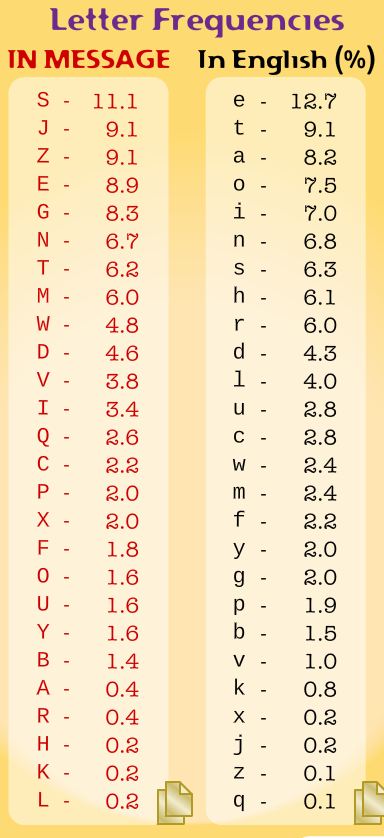
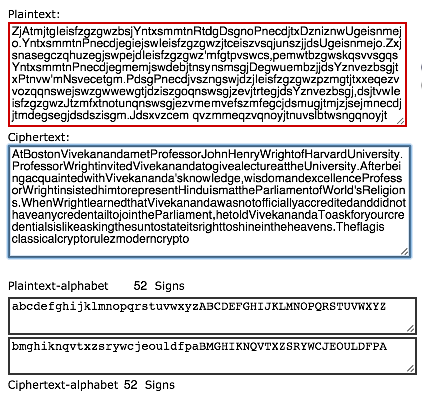

# BreakIn CTF 2015: Substitution

**Category:** Crypto
**Points:** 200
**Description:**

> Sub-sti-tut-ion
>
> ZjAtmjtgIeisfzgzgwzbsjYntxsmmtnRtdgDsgnoPnecdjtxDzniznwUgeisnmejo.YntxsmmtnPnecdjegiejswIeisfzgzgwzjtceiszvsqjunszjjdsUgeisnmejo.ZxjsnasegczqhuzegjswpejdIeisfzgzgwz'mfgtpvswcs,pemwtbzgwskqsvvsgqsYntxsmmtnPnecdjegmemjswdebjtnsynsmsgjDegwuembzjjdsYznvezbsgjtxPtnvw'mNsvecetgm.PdsgPnecdjvszngswjdzjIeisfzgzgwzpzmgtjtxxeqezvvozqqnswejswzgwwewgtjdziszgoqnswsgjzevjtrtegjdsYznvezbsgj,dsjtvwIeisfzgzgwzJtzmfxtnotunqnswsgjezvmemvefszmfegcjdsmugjtmjzjsejmnecdjjtmdegsegjdsdszisgm.Jdsxvzcem qvzmmeqzvqnoyjtnuvslbtwsngqnoyjt

## Write-up

As the description hints, we need to substitute letters with a substitute cipher.

Using these tools ([1](http://www.richkni.co.uk/php/crypta/freq.php), [2](http://crypto.interactive-maths.com/frequency-analysis-breaking-the-code.html), [3](http://www.counton.org/explorer/codebreaking/frequency-analysis.php), [4]()), we can conduct a frequency analysis:

In addition to that, we can use [n-gram analysis](http://www.cryptool-online.org/index.php?option=com_cto&view=tool&Itemid=113&lang=en) to determine the most common bigram/trigrams and [double letters](http://crypto.interactive-maths.com/frequency-analysis-breaking-the-code.html).

The rough procedure is as follows:

* The ciphertext is
>	ZjAtmjtgIeisfzgzgwzbsjYntxsmmtnRtdgDsgnoPnecdjtxDzniznwUgeisnmejo.
>	YntxsmmtnPnecdjegiejswIeisfzgzgwzjtceiszvsqjunszjjdsUgeisnmejo.
>	ZxjsnasegczqhuzegjswpejdIeisfzgzgwz'mfgtpvswcs,
>	pemwtbzgwskqsvvsgqsYntxsmmtnPnecdjegmemjswdebjtnsynsmsgjDegwuembzjjdsYznvezbsgjtxPtnvw'mNsvecetgm.
>	PdsgPnecdjvszngswjdzjIeisfzgzgwzpzmgtjtxxeqezvvozqqnswejswzgwwewgtjdziszgoqnswsgjzevjtrtegjdsYznvezbsgj,
>	dsjtvwIeisfzgzgwzJtzmfxtnotunqnswsgjezvmemvefszmfegcjdsmugjtmjzjsejmnecdjjtmdegsegjdsdszisgm.
>	Jdsxvzcem
>	qvzmmeqzvqnoyjtnuvslbtwsngqnoyjt

* Substituting the first three most common letters `S`->`E`, `J`->`T` and `Z`->`A` yields

* We know that the words trigram `the` and `and` are very common in the English language, so we try to find two trigrams in the ciphertext that do not contain letters of the other. We conclude that `jds` and `zgw` are possible candidates.

* After that, we try to have a take at the double letters. The most common letters in the English alphabet and in this ciphertext are

* We are substituting `M`->`S`, as well as `V`->`L` and `X` ->`F`:

* We now can guess possible words, e.g. `Afte.` could mean `After`, `hea.en` could mean `heaven` and `thefla..s` could definitely mean `theflagis`. So we substitute these letters:

* After repeating the previous step, we see that the resulting substitution is:

* The cleartext is:

Flag is `CLASSICALCRYPTORULEZMODERNCRYPTO`.

## Other write-ups and resources

* none yet
