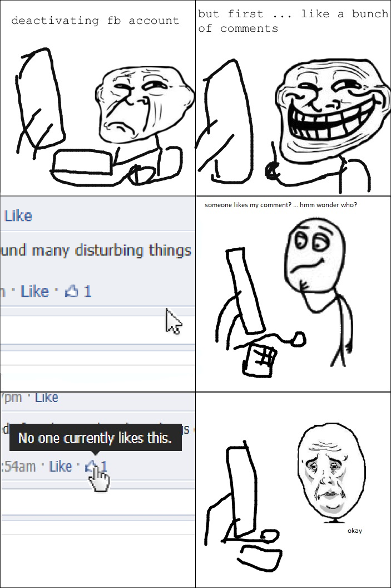
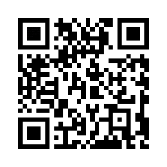

# BreakIn CTF 2015: StrangeImage

**Category:** Forensics
**Points:** 200
**Description:**

> Gotcha !! [this](stego_200.jpeg) is the image my friend told me that there was something hidden inside..He saw a very strange things in this.Could you temme what information is hidden inside so that i can prove that my friend was right about it ?

## Write-up

by [polym](https://github.com/abpolym)

We are given a JPG:



Using `binwalk`, we see that inside this JPEG someone hid a rar archive:

```bash
$ binwalk stego_200.jpeg | grep -v Zlib
DECIMAL       HEXADECIMAL     DESCRIPTION
--------------------------------------------------------------------------------
0             0x0             PNG image, 703 x 1056, 8-bit/color RGBA, non-interlaced
24644         0x6044          LZMA compressed data, properties: 0x5D, dictionary size: 2097152 bytes, missing uncompressed size
353868        0x5664C         RAR archive data
$ foremost stego_200.jpeg 
Processing: stego_200.jpeg
|*|
$ tree output
output
├── audit.txt
├── png
│   └── 00000000.png
└── rar
    └── 00000691.rar

2 directories, 3 files
$  unrar x 00000691.rar 

UNRAR 5.21 freeware      Copyright (c) 1993-2015 Alexander Roshal


Extracting from 00000691.rar

Extracting  I am useless                                              OK 
Extracting  stego_200.jpeg                                            OK 
Extracting  do_not_open_me.txt                                        OK 
Extracting  Steganography.pdf                                         OK 
Extracting  qrcode.rar                                                OK 
All OK
$ file *
00000691.rar:       RAR archive data, v1d, os: Win32
I am useless:       PNG image data, 280 x 280, 8-bit/color RGBA, non-interlaced
Steganography.pdf:  PDF document, version 1.4
do_not_open_me.txt: ASCII English text, with CRLF line terminators
qrcode.rar:         RAR archive data, v1d, os: Win32
stego_200.jpeg:     PNG image data, 703 x 1056, 8-bit/color RGBA, non-interlaced
```

The rar archive contains another rar archive, `qrcode.rar`.

We extract it to find several QR codes:

```bash
$ unrar x qrcode.rar 

UNRAR 5.21 freeware      Copyright (c) 1993-2015 Alexander Roshal


Extracting from qrcode.rar

Creating    qrcode                                                    OK
Extracting  qrcode/QR1.png                                            OK 
Extracting  qrcode/QR10.png                                           OK 
Extracting  qrcode/QR11.png                                           OK 
Extracting  qrcode/QR2.png                                            OK 
Extracting  qrcode/QR3.png                                            OK 
Extracting  qrcode/QR4.png                                            OK 
Extracting  qrcode/QR5.png                                            OK 
Extracting  qrcode/QR6.png                                            OK 
Extracting  qrcode/QR7.png                                            OK 
Extracting  qrcode/QR8.png                                            OK 
Extracting  qrcode/QR9.png                                            OK 
All OK
```

However, this - as most other files in the original archive - is a red herring (or rather hint), as can be seen by decoding the QR codes using `zbarimg`:

```bash
$ for i in {1..11}; do zbarimg "QR$i.png"; done
QR-Code:THE
scanned 1 barcode symbols from 1 images in 0 seconds

QR-Code:FLAG
scanned 1 barcode symbols from 1 images in 0 seconds

QR-Code:YOU
scanned 1 barcode symbols from 1 images in 0 seconds

QR-Code:NEED
scanned 1 barcode symbols from 1 images in 0 seconds

QR-Code:FOR
scanned 1 barcode symbols from 1 images in 0 seconds

QR-Code:THIS
scanned 1 barcode symbols from 1 images in 0 seconds

QR-Code:CHALLENGE
scanned 1 barcode symbols from 1 images in 0 seconds

QR-Code:is
scanned 1 barcode symbols from 1 images in 0 seconds

QR-Code:hidden
scanned 1 barcode symbols from 1 images in 0 seconds

QR-Code:in
scanned 1 barcode symbols from 1 images in 0 seconds

QR-Code:I am useless file
scanned 1 barcode symbols from 1 images in 0 seconds
```

It is suggested that the flag is hidden inside `I am useless`, a PNG.

We rename the file accordingly:

```bash
$ mv I\ am\ useless pic.png
```

The PNG is yet another QR code:



However, applying `zbarimg` on this QR code does not reveal a flag, but a hint:

```bash
$ zbarimg pic.png 
QR-Code:Look closer !! you are on the right pa
scanned 1 barcode symbols from 1 images in 0 seconds
```

Using `stegsolve`, we find morse-code in the alpha plane values:


    --.- .-. -- ----- .-. ... ...-- .---- ... ..-. ..- -.

Decoding this morse-code using [an online QR decoder](https://gc.de/gc/morse/), we find the flag, `qrm0rs31sfun`.

## Other write-ups and resources

* <http://0x1337seichi.wordpress.com/2015/02/15/break-in-2015-ctf-strangeimage-writeup-forensic-200/>
