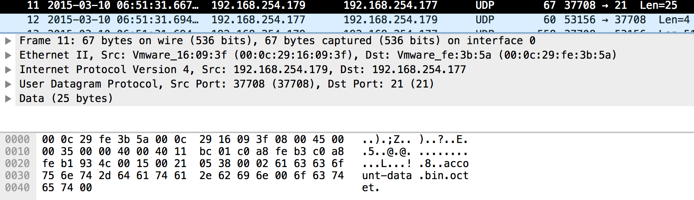
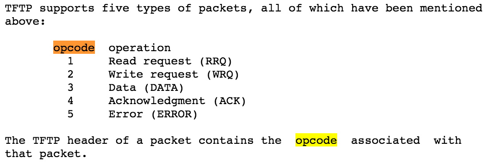
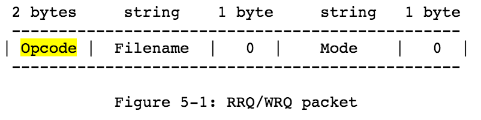
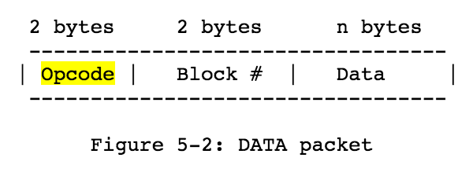
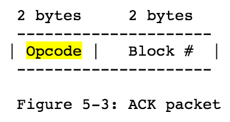
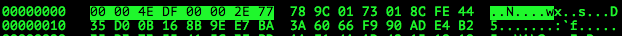
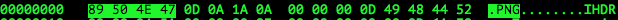
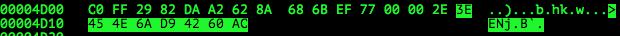

# Vancouver BSides CTF 2015: garbage file

**Category:** Forensics
**Points:** 100
**Solves:** 3
**Description:** 

> Your buddy Joey left a USB key with some data he needs your help with. He pulled it from the firewall logs at a 'secure file format'-as-a-Service provider, so he's pretty sure it might be protected or obfuscated somehow.
> 
> [garbagefile.pcapng.gz](garbagefile.pcapng.gz)

## Write-up

by [polym](https://github.com/abpolym)

This writeup is based on following writeups:

* <https://github.com/yvrctf/2015/tree/master/garbagefile>
* <http://www.sinfocol.org/2015/03/b-sides-vancouver-ctf-2015-garbage-file/>

We are given a gzip compressed pcap that we decompress using `gunzip` and open with `wireshark` to see mostly UDP packets that have been transmitted.

After having a closer look at the data sent, we notice a pattern:

```bash
$ tshark -r garbagefile.pcapng -Y "udp" -T fields -e data
00026163636f756e742d646174612e62696e006f6374657400
00040000
0003000100004edf00002e77789c0173018cfe4435d00b168b9ee7ba3a6066f990ade4b235d37355415c3fbdaaf14aad42151919786fe9db515a96a2f4a9066c18024a01ea58d454b63da36e4dafe358505d9c94970e36a2d818be7b779b4698fd46e073ad111a2f769cb0dc5b0a729390b984f7f7f5c248fcec7c31281cbe5ac4ae332c52fd8fb48c34581b7899a4650c3997b0682ed038ac9e10d69ae508334b44d89a1dc3398a9cc71c7ba08566346d3b3c67dd990623c03fd1c5dff761c1027f0ade5baf9412ef61c8e367249045a7a73aebae9c7820ddf0038eea7995660374d3308ef6e71404a491a0368013f9da57f5bebabc94c23be8faacafac38860bbf6cf910cc206d0d50177ce90eb6802c958d2aeec4b2885fbae90694a9d958dc5b2cf652bfef02dfa0a2ad93b9c5dfeb8819069290eb6dcc86aed4f84fed21af241bf19c7e098c163cc3581d3c3c4feee94514c01972db9796dae2038b95953a3e196e047063ab82bdeb25a6a997e77f05648297996a1f80510b12fb9887fa1f9412e6495641e5b9f1425a6839314159265359f58401ad0000b87fffffbfcdfb6cffcfeb6ffd7cdefffb9cd7f9e6ef1ff57bffe7febfbffbee5dfbf7b0011b3148340680d00640d01a003103401a068d000d01a00000000343401886801a34d1a64d1a68da9a7a8c4c9b5313440001a001a640003d40001a0000d001a0d1a34f4801a6
00040001
00030002803434680f53d41a3d4068007a801a1ea0341a1ea7a6a203431341820d007a26101a0d068001a681840640184d1a0034c1000d0340680c200340034000032fd43152a083e37d9a99ded2baa0b23804ea60c8b4e9175cb8249f033d222039f33b4a4a139227e9884695d5d81d4f5432b83c9695f088ea0c9ada6e4c498e114cd38a245caa728743c0fee9b94b7ead994a6f145067463a6b7462f467a50f088bd532d759161af4c812af20a47303a2a98998349f1ada6536f399608e380241507d99cbf047c8a22402baca491e54f535a26439e2f7c80389ac4e34852aa2dc880927bd6af7c029690e745958e53c2122239c9ad4055ab323a04dbaa3c3e7043a35008244fa538948069f7ed14803ca3605d07e0c76b1c24c2969951f4949f6a93e5861bdf05594eb4285481669448323410c60c2c0a34049244fb3c0d089b5cb472b2bcd074378706a21e77c6313e65d0b00653e859cb7ff0dde0b67430be75bfb7c128503c8069f987bdb2244232dfd1d4851124726920e63180ca7b094d01934da104bd7135e3fe35033060c041f14b27bfc5dc914e14243d61006b4785e0173018cfe416d03046fbcb3384271366bfb466f20d6e56a34db19b10e4dab525edc63e87b9eae201739e5f4161304a99dc5f6f5d4189bc2b7c59d683a56db43d732992939e89db17e5d26e25bbfb8bf3570d151c2f6c5631307bbdb75fad5014328
00040002
[...]
0003004c7f30425a6839314159265359faa926b30000177fffee1bf37a6bebafefd7b9e66f57f7bcfb573d77e1cae72b2b9e88fcb7ffb2f223b000d6b080d0184d346989a680321a1a184320d34d1a0626400001919188c9a340d0d190d068d18d47934693cd44068346868c832346418991a0c40d0c8d03230832066a611823013d09a0c23264d18869934c2346261c991a327a80c264d0d343469a641810346834d1821934189a3434c1191900c83136a34c80c98086098b33c52261a3268f541dfd89e6c06a50acee0af0802b13254f639c664b1c4fdce703ebf58f94ce3930b89fb620e0d59710e7a9d5369f0c1d75d4641b18a04d822041908b96614eb7a03fc3c6ad9afa7a8ee9b2cf275d792c079f345142c55afa064cb265bafd44f830821e88f22ae2ac8b1a05a9e7f0c0f755dbaf9d32183e712355027d4bd75e21070a0869641a11fe6c814c56f6f64fc478b2396cbf76d0851be61b6342dcb24c1460468bd6c3dbf4487f929288998066cc7c10d6268e20f07ffa71dd847099048991a5d0f069a8aec518005de6302c5eacb8aa9cb01c81f21ed3000bfd1f4b177245385090faa926b3425a6839314159265359afceca7f000069ffffaaffaef2b0f15ff8f0e7bbdebb1b7f56fd2f4ee263fd5ffbe7acb73dbbe0b6ebb000d22400d034000034000f53d400321a34680340f51900003d4d000643ca00f50794f51a6d43ca
0004004c
0003004d3c537a69441a341a6869a03100c4034c4c99321a00d068681a7a9e8830d4d34f440c8683d4f29a7947a8c81a3d40687a818440d0c9a68623269a0323406862683099184320321a641a34c864031310c1309826469a60026020212afdea73853d438ecee76148a2697f045b30b3c1f89d3cecc84704802da290781f5b617dc6e4c64a4c261acc0fdd096088bcb0f75886f46e6e5e7839ba90cde2b1235cb58ba200833bd461491c10c9f21daedc2d52ca3fe84c02e7f43777e3d3b76598bbcc1a6dce78d502969c43124c2f12840341225185dacc67015482291f1f223615206a57126a04dfd59eb3f3c99c726609d051a35635706f87e86c58bf16147a8278fe2681b90218e8ead68ef45d4f5a7f3266b5dfb34da54f1682882f124548a1c0b0751b2ffa4c655491fb5ea87d54e00f68f200aa9036cce11fe2ee48a70a1215f9d94fe0425a6839314159265359c0cfefe40000467fffdbb7b37357f9be7cd7b99294ffd2497ccbdfc5c7ec4d9e256d781bad163b2ffd3000d2a1c6a680c469a68c98834034c9a699182006801ea610611a343001001e9341ea1ea1ea0f44f261350e4d1a313468d36934c83468c0836a68d0c218868d34c2683d469e49b4d2320626107a83d4c8c13230100800c8d34d31308c4c8c4d1a69919181181300468d3231340c11a1918219189811800260acd90393a731b479b385676684214d0701
0004004d
0003004ed8316f472e963df892c1ee674b904c723f0e6bc15e78540a06db5cac6350bc627c5cfad469bcf7bfab4bac4f92c05f6eb56af383e837b9a9df0e44ae5838154351580fdf6f08914257c01ebf7249eb370836b618354101b198416e298b478864cf43b987798030d404c23fe895e77da785708bc2aba63cbc30928c0ae8f225519af0f3a25856191891b0c0621a36e1293f667cc25ad6ec45b0ee8d0a941c819453e22941a4d05fd2c81c959f7ca38577293143e6dbd0e82b38755fc1984a3f64a49a2825194c0058514869886e83460631bfe2ee48a70a121819fdfc80425a68393141592653591e83015d0000417fffff794876bcf1ece106de71c0c38343f13cffb275bbbbff66c3edfffba328dfeb3000d9b0720d06206269a68d00c207a81e90f53469a0031a11a0c464c47a8310641a368868627a8f534647a3c9441a6234620c9a64c2608c9a6262180830041826261320189801182321a34c02641886200d0d30023264d0c8184d184c13134d3134d019181340d1ea0c268d1a7a0d04f51ea3644d0699031f379124bc609928f3a89e26f9465664543495e539bea08c9ce0ba28a92e0d211ee2d5c086cd0e5997bb77401373e29bc08867a53fbc349636930270d5570a14bda181782fdf173470b27fc1628045bf58e2663700be253f2819ee5695d6e35809f4881d49ae11d42bebcfe17a5bdebb1e9334ebd82fdb97
0004004e
0003004fb89f12749af1a52fe1f9d9a82ce1edd6d1fa6ccae4ef8e5c3a2613f6c4a5d049aef073cd63c5165fba4340413f3f0119379ae07f4a2847529bdd0fa58df98b539bab7ff46378134038615867169224f50116818f9198d24d3030469f42966843c1792fc85a26ea0a010242c37fc5dc914e142407a0c05740789c010301fcfe5d5afd4a0ffba3abd0d90dd7775d2efb78a9c53b5b480083090eb8f7ebeebe826617fdc43783cc0215729ab725eabd65b94b4ae5b94893006179cdc357899f6f454e632f0ef4186c3577a2d61080f62b47829ea523c6443d54801ed486f4e0b1c1ce501628542793233c90b8f764894eff7030d47522504a019907a452222b9aaa3d33b6cf17c96d9d9651a71500eaabaadad87bb7efd817554fc6c29f895e5d8d3523b9c34abdf4a37cf618044cd74f208d63fbcc80d441c53adfcf6d2aec8e9d12c0dd90fc58149884f1854202ec4adc5b3d852290f18a18a6df0c27b5a017eca0048bb20172e69cec90c5e23bd9ff4d9aa5dc317f19680835e8f9c83f2b47fbdf711f84826c425a6839314159265359e0a3a8f4000075ffff9cefcbdeeffaf75cf9be4c1d6b7c78c37deff6b3575fefcb3e7dacebf11fbcf8b000d10800c134c9a69a6990d1
0004004f
```

Seems like the first 2 bytes alternate after the second packet and the following 2 bytes indicate some sort of counter.

Having a closer look at the first packet, we see the following:



After searching for RFCs and protocol specifications, you'll come across [the TFTP RFC1350](https://www.ietf.org/rfc/rfc1350.txt), which tells you the following:

* First 2 bytes are an opcode:

* The bytes following the opcode depend on the opcode. Important for this task are `RRQ/WRQ`, `ACK` and `DATA`:
  * `RRQ/WRQ`:

  

  * `DATA`:

  

  * `ACK`:

  

We extract the TFTP data using either `tshark` or `wireshark`.

For example on `tshark`:

```bash
$ tshark -r garbagefile.pcapng -Y "udp" -T fields -e data | tr -d '\n' | xxd -r -p > data
```

Then, we use [this python script](./tftp.py) to read the transmission and save files written:

```bash
$ mkdir tftp-out
$ python2.7 tftp.py data
  WRQ file: [ account-data.bin ]  mode: [ octet ]
  ACK Block# [ 0000 ]
 DATA Block# [ 0001 ]
  ACK Block# [ 0001 ]
 DATA Block# [ 0002 ]
[...]
  ACK Block# [ 004d ]
 DATA Block# [ 004e ]
  ACK Block# [ 004e ]
 DATA Block# [ 004f ]
$ ls -l tftp-out
ls -l tftp-out
total 80
-rw-r--r--  1 xxx xxx  40394 Dec 29 19:04 account-data.bin
$ cd tftp-out
$ file account-data.bin
account-data.bin: data
```

The extracted data contains a lot of zlib and bzip2 archives, according to `binwalk`:

```bash
$ binwalk account-data.bin 2>/dev/null

DECIMAL       HEXADECIMAL     DESCRIPTION
--------------------------------------------------------------------------------
8             0x8             Zlib compressed data, default compression
390           0x186           bzip2 compressed data, block size = 900k
924           0x39C           Zlib compressed data, compressed
1306          0x51A           bzip2 compressed data, block size = 900k
1843          0x733           bzip2 compressed data, block size = 900k
2103          0x837           Zlib compressed data, compressed
2380          0x94C           Zlib compressed data, compressed
3144          0xC48           bzip2 compressed data, block size = 900k
3683          0xE63           Zlib compressed data, default compression
4065          0xFE1           Zlib compressed data, best compression
4447          0x115F          Zlib compressed data, compressed
4829          0x12DD          Zlib compressed data, best compression
5211          0x145B          Zlib compressed data, compressed
5593          0x15D9          Zlib compressed data, compressed
5975          0x1757          Zlib compressed data, best compression
6357          0x18D5          Zlib compressed data, compressed
6739          0x1A53          Zlib compressed data, best compression
7121          0x1BD1          Zlib compressed data, best compression
7503          0x1D4F          Zlib compressed data, best compression
7885          0x1ECD          Zlib compressed data, default compression
8267          0x204B          bzip2 compressed data, block size = 900k
8804          0x2264          bzip2 compressed data, block size = 900k
9338          0x247A          Zlib compressed data, compressed
9720          0x25F8          Zlib compressed data, compressed
10484         0x28F4          Zlib compressed data, compressed
10866         0x2A72          Zlib compressed data, compressed
11248         0x2BF0          bzip2 compressed data, block size = 900k
11780         0x2E04          bzip2 compressed data, block size = 900k
11895         0x2E77          Zlib compressed data, default compression
24448         0x5F80          Zlib compressed data, default compression
24804         0x60E4          Zlib compressed data, compressed
32086         0x7D56          Zlib compressed data, best compression
32356         0x7E64          Zlib compressed data, compressed
32896         0x8080          Zlib compressed data, default compression
33166         0x818E          bzip2 compressed data, block size = 900k
33588         0x8334          Zlib compressed data, compressed
33858         0x8442          bzip2 compressed data, block size = 900k
34285         0x85ED          bzip2 compressed data, block size = 900k
34690         0x8782          bzip2 compressed data, block size = 900k
35111         0x8927          bzip2 compressed data, block size = 900k
35535         0x8ACF          bzip2 compressed data, block size = 900k
35952         0x8C70          Zlib compressed data, compressed
36222         0x8D7E          bzip2 compressed data, block size = 900k
36640         0x8F20          Zlib compressed data, best compression
36910         0x902E          Zlib compressed data, best compression
37180         0x913C          Zlib compressed data, best compression
37450         0x924A          Zlib compressed data, best compression
37720         0x9358          bzip2 compressed data, block size = 900k
38132         0x94F4          Zlib compressed data, default compression
38402         0x9602          bzip2 compressed data, block size = 900k
38821         0x97A5          bzip2 compressed data, block size = 900k
39235         0x9943          bzip2 compressed data, block size = 900k
39645         0x9ADD          bzip2 compressed data, block size = 900k
40056         0x9C78          Zlib compressed data, default compression
40326         0x9D86          bzip2 compressed data, block size = 900k
```

However, most of them are decoys.

We have a closer look at the file using a hexeditor (e.g. `hexedit`) to see that the first 8 bytes (right before the first Zlib archive starts) are quite interesting:



In combination with the previous binwalk output, we guess that the first 4 bytes are the `size` of an interesting file and the following 4 bytes are the `offset` to that said file. We also see in our binwalk output that a Zlib file begins at exactly that offset:

	11895         0x2E77          Zlib compressed data, default compression

We extract this zlib using `xxd`:

```bash
$ xxd -s11895 -l20191 -p tftp-out/account-data.bin | xxd -r -p > out.zlib
$ ls -l out.zlib 
-rw-r--r--  1 xxx xxx 20191 Dec 29 19:13 out.zlib
```

After decompressing the given Zlib with `zlib-flate`, we see that the decompressed content is a base64 encoded string:

```bash
$ zlib-flate -uncompress < out.zlib > deflated.bin
$ file deflated.bin 
deflated.bin: ASCII text
$ cat deflated.bin | head
iVBgMA0KNH0AAC56SUhqJQAALO0AAC4TCAIudwCpR3DoAC53AXN8MEIAgLkc6S53AAleP1lzLncL
Ey53CxMvd5qcNncAQC4+REF6DwHt83C8BWsCMPB7xwsIBH9SBQojRUGjPbH3OPolxPZlTYIDJj8T
Y3saExvhmNgfMRMLBOHERp5W2MAofwgoM9MqKqxXWL7RyXlvwZnM7FMM997V/ez88Ji+2ffuM2fg
6zlnyLuZ2TWL9reRWoYwfhegwG72gQItcgYKghAK3F5KIz/OSVBgjrdAga91AwUofZQUNqP5wCl0
BQYkexQYBkdQYPMkYFDJnL4LqXEMFDZfMFBO18BArzadDxJHUGCOt0CBr3UDBfhKBQZbye67Xh/A
QK/2AgMrcQoMOm/U+e50AwUofQwUNl8wUE6qU2B+kOu+JfAGDDpvKDB+F6DAbvZBnSFLMFBO18BA
r/YCAyuhPQUoAr7ulQdowG72gQItcgYKImMY1Ne3AwMrcQoMOm8oMH4X3VNOJ+frkHyHBiJjGCge
J2Cg7jeBQbN4PDB+F6DAbvaBAi1y1j0rcXW+wMxwaO43gYEsdAUGJHsUGPqOwAMtcgYKImMYKB4n
YN19F1DnxckLhyh7FBgGR1BgjrdAgW/qDzweJ2Cg7jeBgSx0BdYTcgZ1kJm7cEa3QIGvdQMFKH0M
FDaj+cAtdAUGJHsUGAZHUGDzJGBQyZy+C6lxDBQ2XzBQTtfAQK82nQ8SR1BgjrdAga91AwX4SgUG
```

Let's decode it using `base64` to get another binary blob:

```bash
$ cat deflated.bin | base64 --decode > blob
$ file blob
blob: data
```

By looking at the header and footer of this file, we notice that they are similar to the header and footer of a PNG:







This indicates that the blob is a PNG, xored with an unknown xor key.

However, we can quickly determine the key per hand using [this python script](./xor-strings.py), which just xors two bytearrays given in hexadecimal:

```bash
$ python2.7 xor-strings.py 89504E47 89506030
0000002e77
```

The key is the `offset` from earlier on - `00002e77`!

We can now use [this python script](./xor.py) to xor a binary file with a given key:

```bash
$ python2.7 xor.py blob > blob.png
$ file blob.png
blob.png: PNG image data, 666 x 100, 8-bit/color RGB, non-interlaced
```

Lastly, the PNG contains our flag, `key{03087-08351-27H}`:


PS: The flag as well as the challenge name are a reference to the movie [Hackers](https://www.youtube.com/watch?v=8wXBe2jTdx4):

The key is the bank account number of Plague's overseas account.

## Other write-ups and resources

* <https://github.com/yvrctf/2015/tree/master/garbagefile>
* <http://www.sinfocol.org/2015/03/b-sides-vancouver-ctf-2015-garbage-file/>