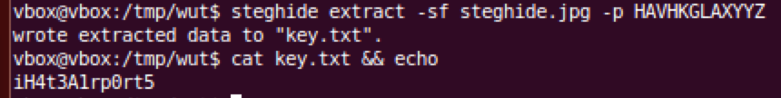

# CSAW QUALS 2015: airport-200

**Category:** Forensics
**Points:** 200
**Solves:** 196
**Description:**

> [airport_26321e6eac7a7490e527cbe27ceb68c1.zip](airport_26321e6eac7a7490e527cbe27ceb68c1.zip)

## Write-up

by [polym](https://github.com/abpolym)

This writeup is based on these writeups: [1](http://fadec0d3.blogspot.de/2015/09/csaw-2015-forensics-keep-calm-ctf-flash.html) [2](https://github.com/Alpackers/CTF-Writeups/tree/master/2015/CSAW-CTF/Forensics/airport) and [3](http://toh.necst.it/csaw2015/forensics/Airport/).

We are given four PNG pictures named `1.png` to `4.png` and one JPG named `steghide.jpg`.

The PNGs each show an airport from around the world, the JPG shows us the logo of a steganography tool named `steghide`.

The author used the steghide tool with a password that has to be found.

The password consists of the abbreviation of each airport seen in the PNGs.

To find each airport, we can use image reverse search tools like [tineye](https://www.tineye.com/), [image raider](https://www.imageraider.com/) or [Google images](https://images.google.de/).

The airports are:

* HAV - José Martí International Airport
* HKG - Hong Kong International Airport
* LAX - Los Angeles International Airport
* YYZ - Toronto Pearson International Airport

Concating all abbreviations together, we get the passphrase `HAVHKGLAXYYZ`, which we can use to extract data hidden with `steghide`:

The flag is `flag{iH4t3A1rp0rt5}`.

## Other write-ups and resources

* <http://fadec0d3.blogspot.com/2015/09/csaw-2015-forensics-keep-calm-ctf-flash.html>
* <https://github.com/Alpackers/CTF-Writeups/tree/master/2015/CSAW-CTF/Forensics/airport>
* <http://toh.necst.it/csaw2015/forensics/Airport/>
* <http://blog.bitsforeveryone.com/2015/09/writeup-csaw-2015-forensics-airports.html>
* <http://blog.isis.poly.edu/2015/09/21/csaw-ctf-airport.html>
* <https://www.youtube.com/watch?v=rmtJHX-f920>
