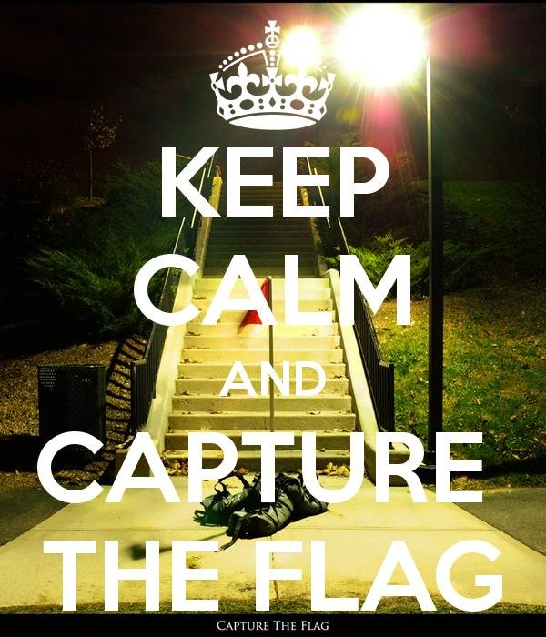

# CSAW QUALS 2015: keep-calm-and-ctf-100

**Category:** Forensics
**Points:** 100
**Solves:** 1064
**Description:**

> My friend sends me pictures before every ctf. He told me this one was special.
>
> Note: this flag doesn't follow the "flag{}" format
>
> [img.jpg](img.jpg)


## Write-up

by [polym](https://github.com/abpolym)

We are given a `jpg`:



Applying `exiftool` (or `strings`), we see the flag `h1d1ng_in_4lm0st_pla1n_sigh7` in the `Copyright` exif field:

```bash
$ exiftool img.jpg
ExifTool Version Number         : 9.99
File Name                       : img.jpg
Directory                       : .
File Size                       : 92 kB
File Modification Date/Time     : 2015:12:21 19:54:04+01:00
File Access Date/Time           : 2015:12:21 19:55:06+01:00
File Inode Change Date/Time     : 2015:12:21 19:54:04+01:00
File Permissions                : rw-r--r--
File Type                       : JPEG
File Type Extension             : jpg
MIME Type                       : image/jpeg
JFIF Version                    : 1.01
X Resolution                    : 72
Y Resolution                    : 72
Exif Byte Order                 : Big-endian (Motorola, MM)
Resolution Unit                 : inches
Y Cb Cr Positioning             : Centered
Copyright                       : h1d1ng_in_4lm0st_pla1n_sigh7
Image Width                     : 600
Image Height                    : 700
Encoding Process                : Baseline DCT, Huffman coding
Bits Per Sample                 : 8
Color Components                : 3
Y Cb Cr Sub Sampling            : YCbCr4:2:0 (2 2)
Image Size                      : 600x700
Megapixels                      : 0.420
```

## Other write-ups and resources

* <https://ctf-team.vulnhub.com/csaw-quals-2015-keep-calm-and-ctf/>
* <http://fadec0d3.blogspot.com/2015/09/csaw-2015-forensics-keep-calm-ctf-flash.html>
* <https://github.com/ViviTurtle/Programming/tree/master/Competitions/CSAW_2015/Keep%20Calm%20and%20CTF>
* <https://www.youtube.com/watch?v=69NL0LOzj98>
