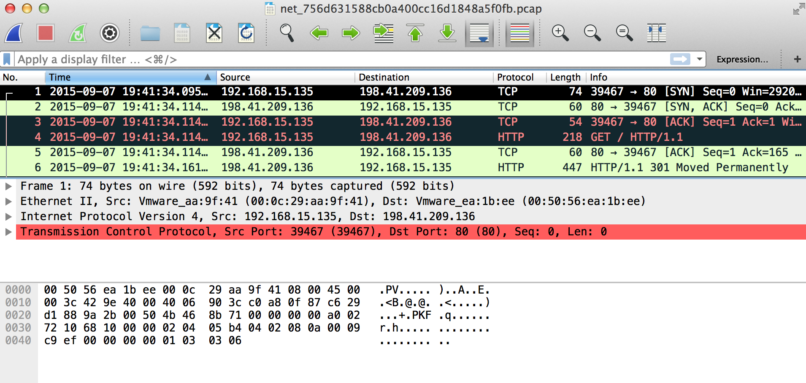
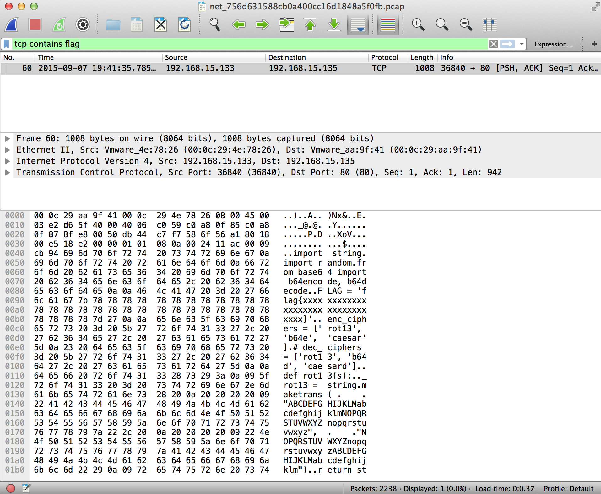
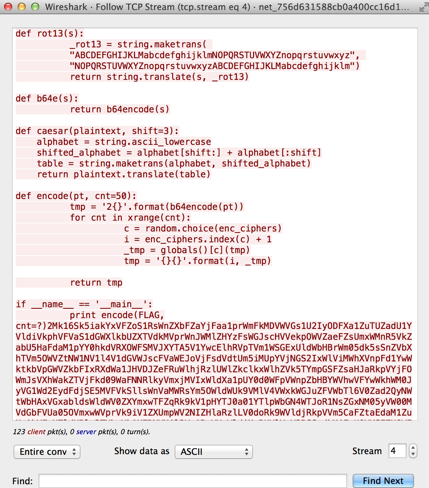

# CSAW QUALS 2015: transfer-100

**Category:** Forensics
**Points:** 100
**Solves:** 541
**Description:**

> I was sniffing some web traffic for a while, I think i finally got something interesting. Help me find flag through all these packets.
>
> [net_756d631588cb0a400cc16d1848a5f0fb.pcap](net_756d631588cb0a400cc16d1848a5f0fb.pcap)

## Write-up

by [polym](https://github.com/abpolym)

We are given a pcap that we open with `wireshark`:



We see a bunch of TCP, TLSv1.2, HTTP and SSL packets:

```bash
$ tshark -r net_756d631588cb0a400cc16d1848a5f0fb.pcap  | awk '{print $7}' | sort | uniq -c | sort -n
  56 SSL
  89 HTTP
 508 TLSv1.2
1585 TCP
```

Searching for the string `flag`, we see something interesting:

```bash
$ strings net_756d631588cb0a400cc16d1848a5f0fb.pcap | grep -i flag
FLAG = 'flag{xxxxxxxxxxxxxxxxxxxxxxxxxxxxxxxx}'
print encode(FLAG, cnt=?)o
```

Let's find that string using wireshark:



Looks like some sort of python script was transferred.
We can extract that python script using the `TCP follow` feature of wireshark.

`Analyze -> Follow -> TCP Stream`:



Save it as [transfer.py](./transfer.py), fix some intendation issues and comment out the base64 encoded rest of the TCP stream conversation.

The last steps are writing a decode function (look at some other writeups) to receive the flag: `flag{li0ns_and_tig3rs_4nd_b34rs_0h_mi}`.

## Other write-ups and resources

* <https://p4f.github.io/csaw-online-qual-forensics100/>
* <https://github.com/hypnosec/writeups/blob/master/2015/csaw-ctf/forensics/transfer.md>
* <https://github.com/ViviTurtle/Programming/tree/master/Competitions/CSAW_2015/Transfer>
* <https://djekmani.github.io/posts/CSAW2015-writeup-transfer-forensics/>
* <https://ctftime.org/writeup/1675>
* <http://kikisctf.blogspot.hr/2015/09/csaw-2015-quals-forensic-100-transfer.html>
* <http://blog.isis.poly.edu/2015/10/03/csaw-ctf-transfer.html>
* <https://github.com/ByteBandits/writeups/blob/master/csaw-quals-2015/forensics/transfer/sudhackar/README.md>
