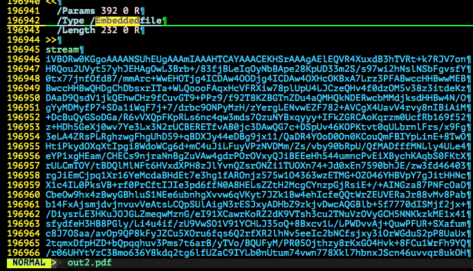

# CSAW FINALS CTF 2015: Mandiant

**Category:** Forensic
**Points:** 300
**Solves:** 15
**Description:**

> We found this file. Help Mandiant figure out what APT1 is trying to send.
> 
> hint check out free_file_camouflage
> 
> -Trail of Bits (quend)
> 
> [Mandiant_c920fc463eaf996489749457abc9b2eb.pdf](./Mandiant_c920fc463eaf996489749457abc9b2eb.pdf)

## Write-up

by [polym](https://github.com/abpolym)

This writeup is based on a writeup by [krx](https://github.com/krx/CTF-Writeups/tree/master/CSAW%2015%20Finals/for300%20-%20Mandiant).

We are given a PDF that contains an EmbeddedFile object stream, see [7.11.4 of the official PDF specification by Adobe](http://www.adobe.com/content/dam/Adobe/en/devnet/acrobat/pdfs/PDF32000_2008.pdf).

Using `qpdf` and a common text editor, we can extract the embedded file (base64 encoded) in a simple manner:

```bash
$ qpdf --qdf --object-streams=disable Mandiant_c920fc463eaf996489749457abc9b2eb.pdf out.pdf
```



We decode it using `base64 --decode` to find a PNG:

```bash
$ cat out.b64 | tr -d '\n' | b64d > pic.png 
$ file pic.png
pic.png: PNG image data, 610 x 467, 8-bit/color RGBA, non-interlaced
```

The PNG contains a 7-zip archive, which we extract using `scalpel` using a modified version of [this config](https://asecuritysite.com/scalpel.conf.txt):

```bash
$ binwalk pic.png | grep -v Zlib
DECIMAL       HEXADECIMAL     DESCRIPTION
--------------------------------------------------------------------------------
0             0x0             PNG image, 610 x 467, 8-bit/color RGBA, non-interlaced
160173        0x271AD         7-zip archive data, version 0.4
$ scalpel -vc scalpel.conf pic.png
$ tree scalpel-output/
scalpel-output/
├── 7z-10-0
│   └── 00000000.7z
└── audit.txt

1 directory, 2 files
```

Inside the 7z there is a JPG (also base64 encoded), which we extract using `7z`:

```bash
+bash-4.3$ cd 7z-10-0/
+bash-4.3$ ls
00000000.7z
+bash-4.3$ 7z x 00000000.7z -oout

7-Zip [64] 9.20  Copyright (c) 1999-2010 Igor Pavlov  2010-11-18
p7zip Version 9.20 (locale=utf8,Utf16=on,HugeFiles=on,8 CPUs)

Processing archive: 00000000.7z

Extracting  secret.txt

Everything is Ok

Size:       58375
Compressed: 43850
+bash-4.3$ tree out/
out/
└── secret.txt

0 directories, 1 file
+bash-4.3$ file out/secret.txt 
out/secret.txt: ASCII text
+bash-4.3$ cd out/
+bash-4.3$ cat secret.txt | tr -d '\n' | base64 --decode > pic.jpg
+bash-4.3$ file pic.jpg 
pic.jpg: JPEG image data
```

Using any hexeditor or `strings`, we find that the JPG contains two base64 encoded blobs:

```bash
$ strings -a pic.jpg 
b#o]
Y2EB
 V~D
[...]
"aKxw
S#UH
VVGEC8uGDQuNhhk6FKg0ICF9jVAUS54zurveSzXcwE9MsIHIZPuvP6vrSDgwULy5Kvm/wPe3zxddM4SSPgvWIg==
XQN6Y6QIpfofWw857i5DK[...]
$ strings -a pic.jpg | tail -n2 > strings.b64
```

However, both blobs do not seem to be anything obvious at first:

```bash
$ sed '1q;d' strings.b64 | b64d | xxd
0000000: 5551 840b cb86 0d0b 8d86 193a 14a8 3420  UQ.........:..4 
0000010: 217d 8d50 144b 9e33 babb de4b 35dc c04f  !}.P.K.3...K5..O
0000020: 4cb0 81c8 64fb af3f abeb 4838 3050 bcb9  L...d..?..H80P..
0000030: 2af9 bfc0 f7b7 cf17 5d33 8492 3e0b d622  *.......]3..>.."
$ sed '2q;d' strings.b64 | b64d | xxd
0000000: 5d03 7a63 a408 a5fa 1f5b 0f39 ee2e 432b  ].zc.....[.9..C+
0000010: bd55 57e0 0cc3 7aa4 9797 c906 abc4 4e82  .UW...z.......N.
[...]
0003450: c273 cfa0 b5ca 8535 64b4 40a6 501e f7de  .s.....5d.@.P...
0003460: b749 d99b 18ea 3dd7 af98 e685 295f 312e  .I....=.....)_1.
0003470: 7a35 2b36 ca13 86a0 9265 6802 f0f8 4e3d  z5+6.....eh...N=
```

As [this writeup](https://github.com/krx/CTF-Writeups/tree/master/CSAW%2015%20Finals/for300%20-%20Mandiant) suggests, we have to use a program called `Free File Camouflage` to extract a hdden file from the blob(s) - an ELF.

The final step is to run the ELF to receive the flag `flag{s3v3r4l_l4y3r5_d33p_&_2m4ny_l4yers_w1d3}`.

## Other write-ups and resources

* <https://github.com/kareemroks101/CTF-Writeups/tree/master/CSAW%2015%20Finals/for300%20-%20Mandiant>
