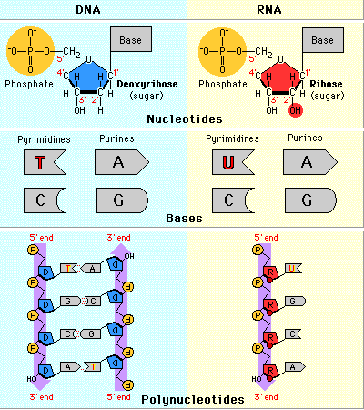
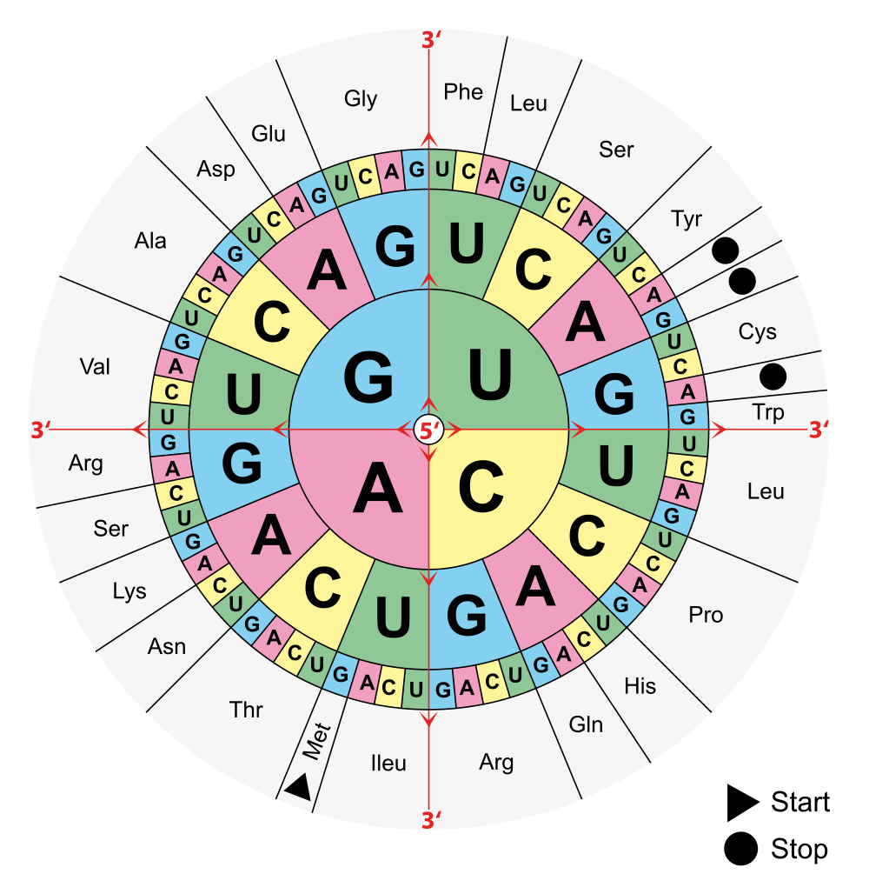

# Cyber Security Challenge 2015: Data Extraction

**Category:** Digital Forensics
**Points:** 80
**Description:**

> We messed up and contacted the wrong forensic department. They say they found data, but we can’t really make anything out of it. Can you?

## Write-up

For once, it payed off if you were paying attention in your highschool biology classes. When you learned about the birds and the bees, you also learned about DNA and RNA. That's exactly what this is.


( Taken from http://www.sophia.org/tutorials/video-material-10-dna-rna )

So let's convert the image to the corresponding DNA (or RNA) characters:

```python
from PIL import Image
 
im = Image.open("output2.jpg")
print im.format, im.size, im.mode

width = im.size[0]
height = im.size[1]

startX = 9
startY = 14

spacingX = 19
spacingY = 28

""""
# blue = 224 = C
# red = 228 = T
# yellow = 103 = G
# green = 2 = A
"""

# T
def blue(r, g, b):
	return abs(r-5) < 15 and abs(g-161) < 15 and abs(b-225) < 15 

# T
def red(r, g, b):
	return abs(r-237) < 15 and abs(g-28) < 15 and abs(b-34) < 15 
	
# A
def green(r, g, b):
	return abs(r-35) < 15 and abs(g-178) < 15 and abs(b-73) < 15
# C	 
def yellow(r, g, b):
	return abs(r-254) < 15 and abs(g-240) < 15 and abs(b-11) < 15 
 
sol = ""
y = startY
while y < height:
	x = startX
	while x < width:
		r, g, b = im.getpixel((x, y))
		print r, g, b
	
		if blue(r, g, b):
			sol += "C"
		if red(r, g, b):
			sol += "U"
		if green(r, g, b):
			sol += "A"
		if yellow(r, g, b):
			sol += "G"
           
		
		x += spacingX
	y += spacingY
	
print sol
```
Which gives us:
```
GACAUUUAAUGGGGUCAAUCUAUGUUCUCGGGAAUAGAAGAGCACUUCAGCGGGACUCUUUUAGACCCACGAGUAGCCGGCAAGCAGCUAGAUAAGCUAGUAGAUGGAGACCGCACCGCACUAUAGCAUAUGCUAGCUUAUAGGUCACACCUAUGAGGCAAGGAGCUAGUAGUAUAUCACCUCACUUCGCUGGGGGUGGUUUUAGUAUUGCCAUUUCCCAUACCGUAUGUGAAGACGUCGAGACAUUCCAUGGGCGUUUUAAGGCGCGGCGUUCUCUCCGCCCUGGUUCACGGGAUUCUGUCGAGAUUGCCGUUUAAAAAGAUUGUCUUGCUCACUUUGGCUCUUUCAGUCCGGCGCUUAAGCGCCUUGCAUAAACUUCGUAGCGCAGGUUUUGCGGCGAUGGCCAACCCAGGAUACCGCUGUUCAACAUUUGUCAGAUCCUCAUGUGACGGGACACCCAAAGCAGGAUGGCGCGCUGUCUCUCAGUAUAUAGAUUUAGUUUUAGUGUGAAGUGCACGCGGCCUAGAGCGGUCACGUCAUGUAUUAGAUCGUAUUGUAGUAACAUCUACCAGCUGCGACUUUUGAACCCGGAGGAGUCCAGGCAACGUAAAAGUAUGGCGUACCACGCGACCAAAUCCCUCAUCUUACGUGUACGAAGGAAGAUACCGCAUUUUAUCGCUUAUCACUAACGCGAGCGUCUAAGCGAACAUUACUAUCCUCUAUAAAAGUUAUACGUGGCUGCUACGGUGACGUAAAGCUUUCUGUUUAAAUGCGCGCCUAAUUCCUUACUGCUAUAACAUACAUCCACCCUACCUGCCACAGUUUCCUACGACCUGGAGAAAAAUUUAAAUGGCCGAUGAUGUGUCGCCACAUACGUGAGCUGAUAGCGGAAGUGUAAA
```
When your cells process the DNA strip, triplets are converted to Amino Acids. This is done using the following chart:


( Taken from http://biobook.nerinxhs.org/bb/genetics/dna.htm )

We can do this ourselves (which I did the first time), but we can also use the power of the internet:
http://web.expasy.org/translate/

Which gives the following output:
```
5'3' Frame 1
DI-WGQSMFSGIEEHFSGTLLDPRVAGKQLDKLVDGDRTAL-HMLAYRSHL-GKELVVYH
LTSLGVVLVLPFPIPYVKTSRHSMGVLRRGVLSALVHGILSRLPFKKIVLLTLALSVRRL
SALHKLRSAGFAAMANPGYRCSTFVRSSCDGTPKAGWRAVSQYIDLVLV-SARGLERSRH
VLDRIVVTSTSCDF-TRRSPGNVKVWRTTRPNPSSYVYEGRYRILSLITNASV-ANITIL
YKSYTWLLR-RKAFCLNARLIPYCYNIHPPYLPQFPTTWRKI-MADDVSPHT-ADSGSV
5'3' Frame 2
TFNGVNLCSRE-KSTSAGLF-THE-PASS-IS--METAPHYSIC-LIGHTYEARS--YIT
SLRWGWF-YCHFPYRM-RRRDIPWAF-GAAFSPPWFTGFCRDCRLKRLSCSLWLFQSGA-
APCINFVAQVLRRWPTQDTAVQHLSDPHVTGHPKQDGALSLSI-I-F-CEVHAA-SGHVM
Y-IVL--HLPAATFEPGGVQAT-KYGVPRDQIPHLTCTKEDTAFYRLSLTRASKRTLLSS
IKVIRGCYGDVKLSV-MRA-FLTAITYIHPTCHSFLRPGEKFKWPMMCRHIRELIAEV-
5'3' Frame 3
HLMGSIYVLGNRRALQRDSFRPTSSRQAAR-ASRWRPHRTIAYASL-VTPMRQGASSISP
HFAGGGFSIAISHTVCEDVETFHGRFKARRSLRPGSRDSVEIAV-KDCLAHFGSFSPALK
RLA-TS-RRFCGDGQPRIPLFNICQILM-RDTQSRMARCLSVYRFSFSVKCTRPRAVTSC
IRSYCSNIYQLRLLNPEESRQRKSMAYHATKSLILRVRRKIPHFIAYH-RERLSEHYYPL
-KLYVAATVT-SFLFKCAPNSLLL-HTSTLPATVSYDLEKNLNGR-CVATYVS--RKCK
```
If you look clearly, you can see the password, which is "METAPHYSIC LIGHTYEARS". This website also solved the final hurdle: You don't have to start decoding at the first character, but at the second.

Pass: `METAPHYSIC LIGHTYEARS`

## Other write-ups and resources

* none yet
