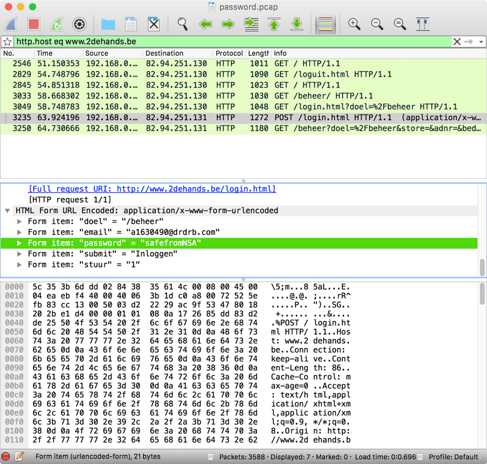

# Cyber Security Challenge 2015: Four Eyes

**Category:** Digital Forensics
**Points:** 15
**Description:**

> You are a member of a covert agency that is spying on one of their intelligence targets. They have managed to MiTM (Man-in-The-Middle) one of the target employees and are monitoring his HTTP traffic. It is of vital importance that you extract the correct password he submitted to www.2dehands.be.
>
> [`password.pcap`](password.pcap)

## Write-up

Let’s open up [`password.pcap`](password.pcap) in Wireshark, and look for `www.2dehands.be` traffic by entering the filter `http.host eq www.2dehands.be`. This reveals a few HTTP requests including a single POST request containing the login credentials:

The password is `safefromNSA`.

## Other write-ups and resources

* none yet
