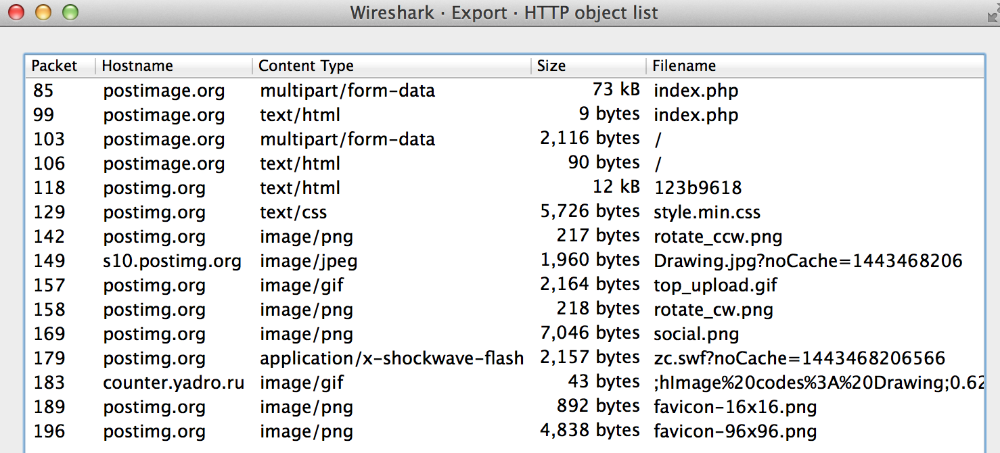

# EasyCTF 2015: iSpy (120)

**Category:** Forensics
**Points:** 120
**Solves:** 
**Description:**

> We intercepted some suspicious network activity. We think that the enemy has been exchanging important data. Can you help us figure out what it is? You can find a copy of the file [here](https://github.com/EasyCTF/easyctf-2015-writeups/blob/master/files/ispy.pcapng).
> 
> 
> Hint: You're going to need to be able to open that file. Something like [Wireshark](https://www.wireshark.org) might help.

## Write-up

by [polym](https://github.com/abpolym)

We get a pcap traffic dump that we analyze using `wireshark` to see several HTTP and TCP packets.

First, we have a look at the TCP stream `Analyze->Follow->TCP Stream`:

Looks like some pictures (see the `.PNG` in the content and `Content-Type` in the request headers) have been uploaded.

Therefore, we then export all objects transmitted (`File->Export Objects->HTTP->Save all`):

One of these pictures yields the flag, `{pcap_fun!??}`:

## Other write-ups and resources

* <https://github.com/EasyCTF/easyctf-2015-writeups/blob/master/ispy_120.md>
