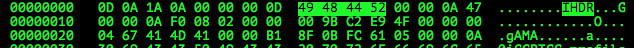

# EasyCTF 2015: Liar (50)

**Category:** Forensics
**Points:** 
**Solves:** 
**Description:**

> I may or may not have illegally bought this [file](https://github.com/EasyCTF/easyctf-2015-writeups/blob/master/files/secret) from someone who claims that it contains secret pictures of my friend and her fiancé. Unfortunately, I can't open it, and I already paid $4096 for it. Can you help me find out if the seller was lying?
> 
> 
> Hint: I feel like something is missing ...


## Write-up

by [polym](https://github.com/abpolym)

This writeup is based on following writeups:

* <https://github.com/EasyCTF/easyctf-2015-writeups/blob/master/liar_50.md>

First, we determine what the given file named `secret` is all about:

```bash
$ file secret
secret: Zip archive data, at least v2.0 to extract
```

`secret` is a zip archive, which we extract using `7z` to get a file named `secret.png`:

```bash
$ 7z x secret -oout

7-Zip [64] 9.20  Copyright (c) 1999-2010 Igor Pavlov  2010-11-18
p7zip Version 9.20 (locale=utf8,Utf16=on,HugeFiles=on,8 CPUs)

Processing archive: secret

Extracting  secret.png
Extracting  __MACOSX
Extracting  __MACOSX/._secret.png

Everything is Ok

Folders: 1
Files: 2
Size:       22141902
Compressed: 2223574
$ cd out
$ file secret.png
secret.png: data
```

Though the file name implies a PNG, `file` tells otherwise.

Therefore, we open `secret.png` using a hexedit, e.g. `hexedit`:



We can see the PNG typical CHUNK named `IHDR`, which implies that this file is indeed a PNG.

Why does `file` tells us otherwise? Well `file` works by looking at [file signatures](http://www.garykessler.net/library/file_sigs.html), which mostly consist of the start of a file, namely the `header`, and the end of a file - the `footer`.

PNGs always begin with the hexadecimal characters `89 50 4E 47 0D 0A 1A 0A` and if `file` sees these bytes in this order, it assumes a PNG.

In our case, however, the first 4 bytes are missing: `89 50 4E 47`.

We can fix that using `xxd`:

```bash
$ echo '89504e47' > secret.xxd 
$ xxd -p secret.png >> secret.xxd
$ xxd -r -p secret.xxd > fixed.png
$ md5 fixed.png 
71cfff64865db14a0868a5b48a2e23c8  fixed.png
$ file fixed.png
fixed.png: PNG image data, 2631 x 2800, 8-bit/color RGB, non-interlaced
$ pngcrush -ow fixed.png # to make the resulting png smaller - just for this repo 21 MB vs 1.7MB
```

`file` now tells us that `fixed.png` is indeed a PNG.

The fixed PNG now displays the flag, `easyctf{troll3d}`:


## Other write-ups and resources

* <https://github.com/EasyCTF/easyctf-2015-writeups/blob/master/liar_50.md>
