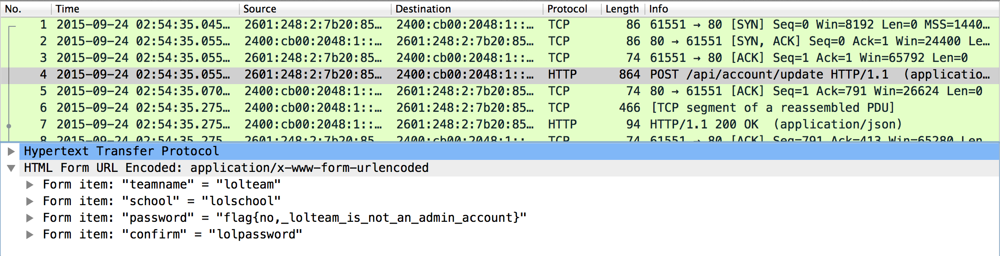

# EasyCTF 2015: lolteam (65)

**Category:** Forensics
**Points:** 65
**Solves:** 
**Description:**

> There's a suspicious team out there called **lolteam**, I got my eyes on them for a while and I managed to [wiretap](https://github.com/EasyCTF/easyctf-2015-writeups/blob/master/files/lolteam.pcapng) their browser as they were changing their password. What did they change their password to?
> 
> 
> Hint: Don't know how to open [.pcapng](http://fileinfo.com/extension/pcapng) files?

## Write-up

by [polym](https://github.com/abpolym)

We are given a pcap traffic dump that we open with `wireshark` to see some HTTP and TCP packets.

By following the TCP stream (`Analyze->Follow->TCP Stream`), we see that the traffic captured a HTTP POST request to `2014.easyctf.com/api/account/update`.

It contains teamname, school name, password and password confirmation entries - the password contains the flag, `flag{no,_lolteam_is_not_an_admin_account}`:

## Other write-ups and resources

* <https://github.com/EasyCTF/easyctf-2015-writeups/blob/master/lolteam_65.md>
