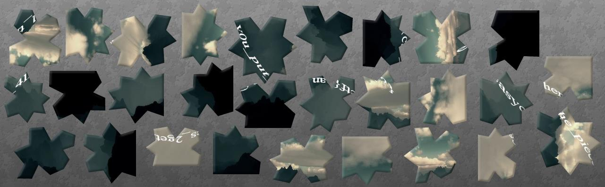

# EasyCTF 2015: Rest in Pepperoni-Pizzas (100)

**Category:** Forensics
**Points:** 100
**Solves:** 
**Description:**

> I gave my little sister a flag, but she cut it up and hid the pieces! Retrieve it here: [ripinpizzas.pdf](https://github.com/EasyCTF/easyctf-2015-writeups/blob/master/files/ripinpizzas.pdf).
> 
> 
> Hint: Have fun! If you do it by the paper-and-scissors method, share it to [@easyctf](http://twitter.com/easyctf) !


## Write-up

by [polym](https://github.com/abpolym)

This write-up is based on following write-ups:

* <https://github.com/ztaylor54/CTF/blob/master/EasyCTF%202015/pepperoni_pizza.md>
* <https://github.com/Cholle13/CTF/blob/master/rest_in_pepperoni-pizzas.md>

We are given a PDF:


We see a picture hidden behind the "Nothing to see here" layer and use `foremost` to extract the picture:

```bash
$ foremost ripinpizzas.pdf
Processing: ripinpizzas.pdf
|*|
$ tree output
output/
├── audit.txt
├── jpg
│   └── 00000001.jpg
└── pdf
    └── 00000000.pdf

2 directories, 3 files
```

The picture is a puzzle that we have to solve to get the flag:



The solved puzzle spells the flag, `easyctf{can_y0u_put_411_the_pieces_2gether?}`:


## Other write-ups and resources

* <https://github.com/EasyCTF/easyctf-2015-writeups/blob/master/rest_in_pepperoni-pizzas_100.md>
