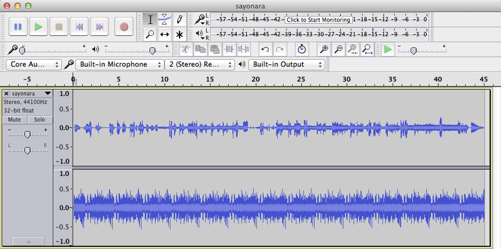
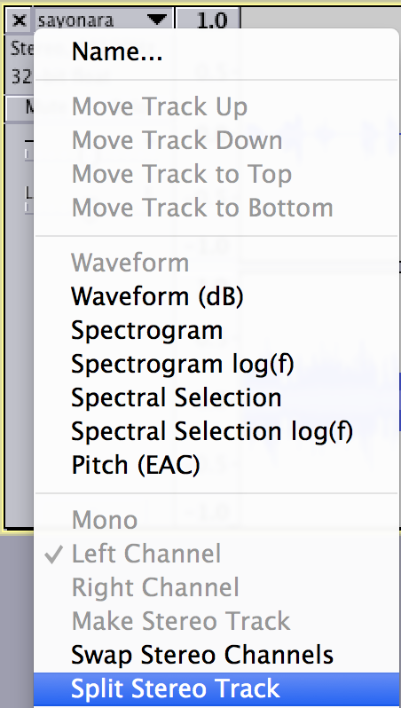
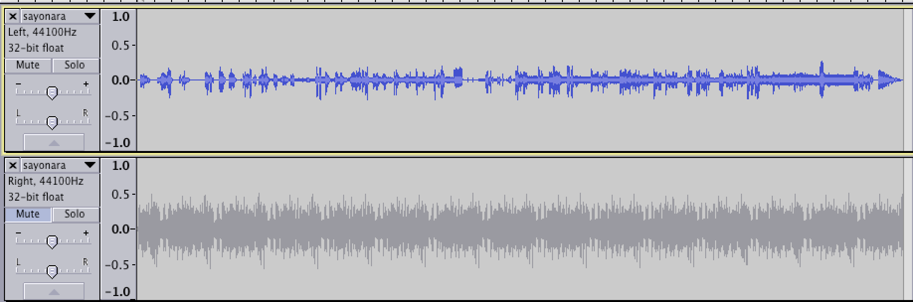
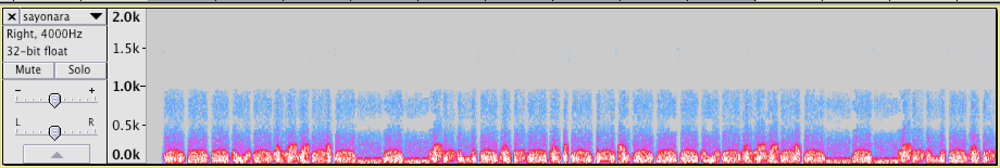

# EasyCTF 2015: sayonara (325)

**Category:** Forensics
**Points:** 325
**Solves:** 
**Description:**

> Found some interesting words of advice left by `sayonara-bye`... help me understand it!
> 
> 
> [sayonara.mp3](https://github.com/EasyCTF/easyctf-2015-writeups/blob/master/files/sayonara.mp3)
> 
> 
> MD5: 9f44501f0ac360c3255548c96b70aecb
> 
> 
> Hint: Why does that right channel sound strange?

## Write-up

by [polym](https://github.com/abpolym)

This writeup is loosely based on following write-ups:

* <https://github.com/C2TF/writeups/tree/master/2015/easyctf/sayonara>
* <https://github.com/1lastBr3ath/EasyCTF-2015-Writeup/blob/master/forensics.md>

Listening closely to the given mp3, we hear a voice talking.

However, as the hint suggests, the voice is not hearable since the right channel produces a loud and disturbing/strange sound.

We open the mp3 in `audacity` (`File->Import->Audio`) and see the two channels of this mp3:

We can split the channels (`Black Triange -> Split Stereo Track`) and mute the right channel to hear a voice talking:

However, the voice is a red herring and does not give us the flag.

The flag actually is hidden in the spectrogram of the right channel!

We can see that easily by switching from the Waveform View to the Spectrogram View in Audacity (`Black Triangle -> Spectrogram`) and setting the sample rate to a smaller/slower number `4000` (`Black Triangle -> Set Rate -> Other`) to see the flag, `easyctf{do_a_frustration}`:

## Other write-ups and resources

* <https://github.com/EasyCTF/easyctf-2015-writeups/blob/master/sayonara_325.md>
