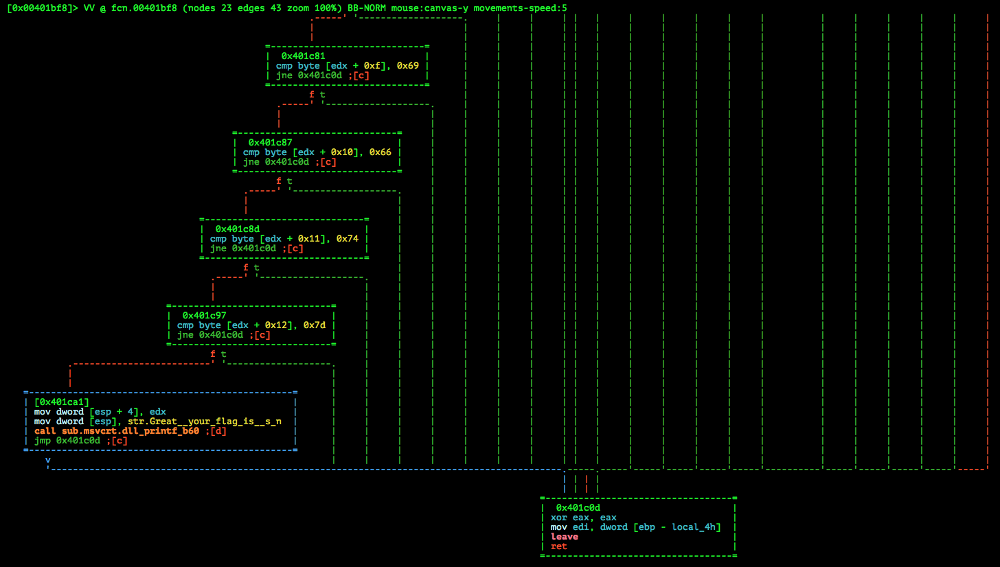

# EKOPARTY PRE-CTF 2015: EKOGIFT

**Category:** Reversing
**Points:** 25
**Solves:** 159
**Description:**

> The easiest reversing challenge! 

> [reversing25.zip](reversing25.zip)

## Write-up

by [polym](https://github.com/abpolym)

Keywords:

* Windows PE32

We are given a PE 32bit Executable for Windows:

```
$ file GIFT.exe
GIFT.exe: PE32 executable (console) Intel 80386 (stripped to external PDB), for MS Windows
```

We open it in `radare2` and find an interesting String:

```
[0x00401280]> iz
vaddr=0x00403000 paddr=0x00001400 ordinal=000 sz=14 len=13 section=.rdata type=ascii string=libgcj-13.dll
vaddr=0x0040300e paddr=0x0000140e ordinal=001 sz=20 len=19 section=.rdata type=ascii string=_Jv_RegisterClasses
vaddr=0x00403024 paddr=0x00001424 ordinal=002 sz=24 len=23 section=.rdata type=ascii string=Great! your flag is %s\n
[...]
```

Jumping to it and going to its `x`ref, we land at the `fcn.00401bf8` function, in which we see a cascade of `cmp`:



Since the immediate values of each of these `cmp`s are in the range of readable ASCII symbols, we write these hexadecimal bytes down, convert them back to readable ASCII characters and finally receive the flag:

```
$ echo "454b4f7b746869735f69735f615f676966747d" | sed 's/\\x//g' | xxd -r -p && echo
EKO{this_is_a_gift}
```

The flag is `EKO{this_is_a_gift}`.

## Other write-ups and resources

* <https://ctf-team.vulnhub.com/eko-party-pre-ctf-2015-ekogift/>
* <https://github.com/ByteBandits/writeups/blob/master/ekoparty-pre-ctf-2015/rev/ekogift/sudhackar/README.md>
