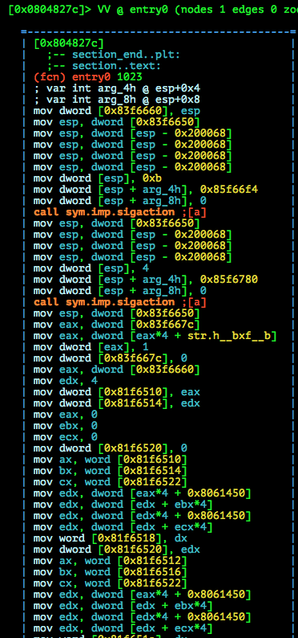
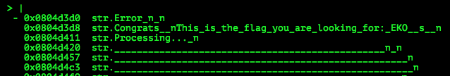
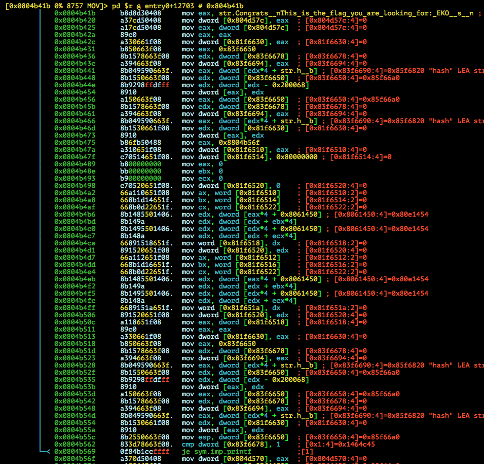
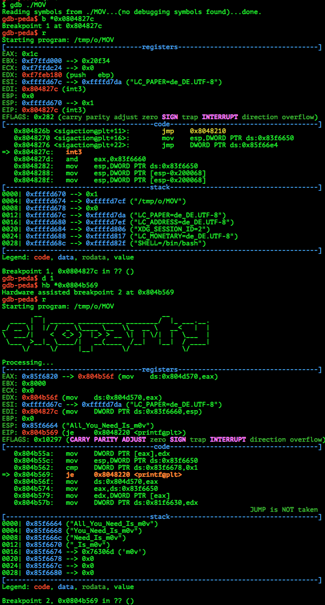

# EKOPARTY PRE-CTF 2015: MOV

**Category:** Reversing
**Points:** 100
**Solves:** 66
**Description:**

> Find the flag through the obscure code 

> [reversing100.zip](reversing100.zip)

## Write-up

by [polym](https://github.com/abpolym)

Keywords:

* `i386` 32 Bit Linux Executable
* Obfuscation [movfuscator](https://github.com/xoreaxeaxeax/movfuscator)

We are given a zip that contains a 32 Bit Linux Executable:

```bash
$ file reversing100.zip 
reversing100.zip: Zip archive data, at least v2.0 to extract
$ 7z x reversing100.zip 

7-Zip [64] 9.20  Copyright (c) 1999-2010 Igor Pavlov  2010-11-18
p7zip Version 9.20 (locale=en_US.UTF-8,Utf16=on,HugeFiles=on,1 CPU)

Processing archive: reversing100.zip

Extracting  MOV

Everything is Ok

Size:       5954312
Compressed: 1154919
$ file MOV 
MOV: ELF 32-bit LSB  executable, Intel 80386, version 1 (SYSV), dynamically linked (uses shared libs), stripped
```

```bash
$ chmod u+x MOV 
$ ./MOV 
        __                              __          
  ____ |  | ______ ___________ ________/  |_ ___.__.
_/ __ \|  |/ /  _ \\____ \__  \\_  __ \   __<   |  |
\  ___/|    <  <_> )  |_> > __ \|  | \/|  |  \___  |
 \___  >__|_ \____/|   __(____  /__|   |__|  / ____|
     \/     \/     |__|       \/             \/     

Processing...
Error
```

If we open the binary in `radare2` and have a look at the entry function, we see something weird:



We pretty much only see `mov` instructions. Upon further research, we find out that this executable has been compiled with an obfuscator called the [movfuscator](https://github.com/xoreaxeaxeax/movfuscator), which results in the executable consisting only of `mov` instructions.

If we open the `radare2` Strings HUD, we can see some interesting strings, though:



We jump to the Xref of the string `str.Congrats__nThis_is_the_flag_you_are_looking_for:_EKO__s__n` and see the following:



We can see a `printf` call, so we set a hardware breakpoint (To avoid Anti-Debugging techniques) to it:



Note that in order to set a hardware breakpoint, I've set a software breakpoint right at the entry point at first, run the executable, deleted the software breakpoint and then set the hardware breakpoint at the desired location.

We can see an interesting string at the beginning of our stack, so we guess that the parameters are pushed to the stack.
This means that the `printf` call looks like this:

```c
printf("Congrats\nThis is the flag you are looking for: EKO{%s}\n", $esp);
```

Thus our flag is `EKO{All_You_Need_Is_m0v}`.


## Other write-ups and resources

* <https://ctf-team.vulnhub.com/eko-party-pre-ctf-2015-mov/>
* <https://0x90r00t.com/2015/09/20/ekoparty-pre-ctf-2015-rev100-mov-write-up/>
