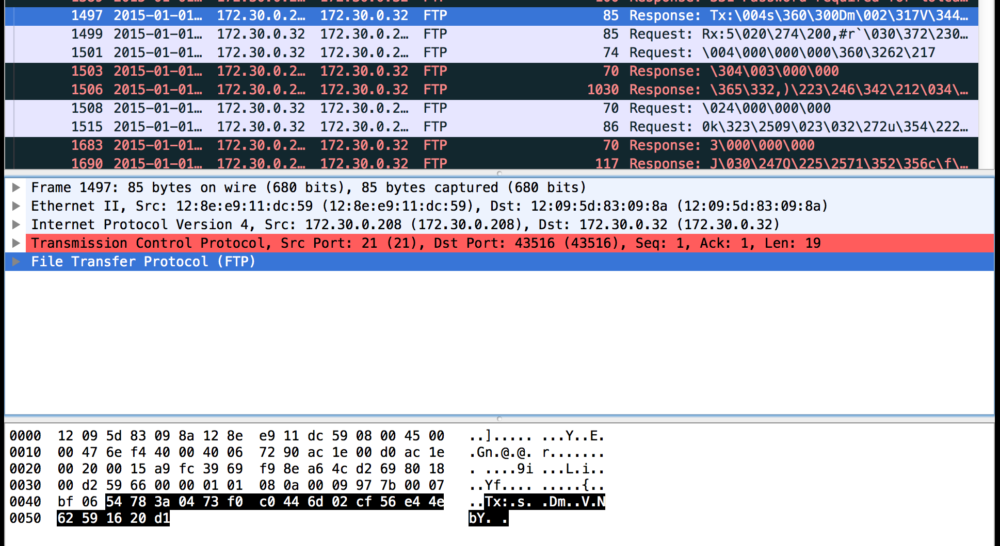
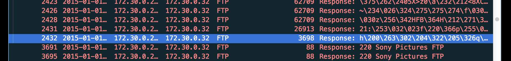
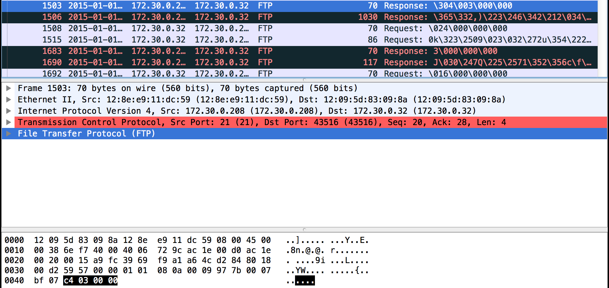
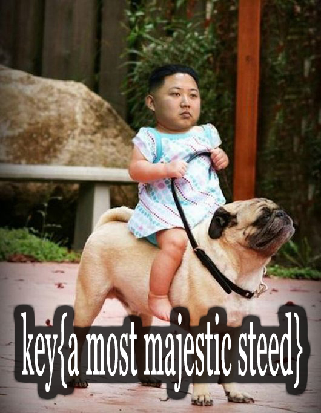

# Ghost in the Shellcode 2015: Rubicon

**Category:** Forensics
**Points:** 400
**Description:**

> You're a special agent, find the culprit! ([File](https://2015.ghostintheshellcode.com/rubicon-fb6dec9f517e171a15c4b3a63cc7c9ce1cc1141fdf0e23b5b377ebd305f7c8d6))

## Write-up

Exracting the given xz compressed file, we receive one file, `rubicon`:
```
$ file rubicon
rubicon: tcpdump capture file (little-endian) - version 2.4 (Ethernet, capture length 65535)
```

After opening this capture file into `wireshark` and applying the ftp filter to it, we see this exchange:



We notice that an ftp server requires a password for the USER "lolcats" and after exchanging a 16 byte RC4 key, specified after `Tx:`, the following packets between `172.32.0.208` and `172.30.0.32` seem to be encrypted.

We are exporting these packet bytes via `wireshark` as `tx.bin` and remove the preceding `Tx:` with `tail -c+4 tx.bin > tx` to get the RC4 key to decrypt data coming from `172.32.0.208`.

After that, we are extracting the ftp stream up until the last encrypted response packet:



Now we are converting the `stream` to a postscript continous hexdump with `xxd -p stream > stream.xxd` and remove the ftp layer bytes of those packets, which are specifying either the RC4 key (first one) or the sizes of the following response packets (notice the packets with size `70`):



After we've stripped these bytes from `stream.xxd`, we convert the hexdump again to binary using `xxd -r -p stream.xxd > sstream`.

We are decrypting this binary with `openssl rc4 -in sstream -out decrypt -K "$(xxd -p ./tx)"` and open `decrypt` with `vim` in binary mode:

    ..
    .
    04c.jpg
    102123_story__Kim-Jong-Un-Meme-1.jpg
    102123_story__kim-jong-un-strikes-againc1135735.jpg
    56989-3bpblogspotcom-yEGK.jpeg
    851ddb44a6149fab434818d8c4749e5a9c92f3bcef00c412b7d8d7a1680205fe.jpg
    DPRK.jpg
    DdXFIBF.jpg
    Kim Jong Un.jpg
    Rodman-Obama.jpg
    Screen-Shot-2013-04-07-at-7.52.56-AM.png
    U7DyCGI.jpg
    YdrNUe2.gif
    Z64DiyY.jpg
    barack-obama-kim-jong-un-north-korea-Favim.com-676362.jpg
    creepy.gif
    enhanced-buzz-17889-1365786077-4.jpg
    enhanced-buzz-3756-1365173359-18.jpg
    funny-picture-kim-jong-un-playing-with-star-wars-toys.jpg
    h35F2F219.jpg
    ibjVDu095O1f0T.gif
    kim-jong-un-1-million-likes.jpg
    kim-jong-un-eats-a-snickers_zpsafe724b0.jpg
    kim-jong-un-needs-his-nuclear-bomb-badge_o_1135698.jpg
    kim-jong-un-really-likes-cake.gif
    kim-jong-un-snickers.jpeg
    kim-jong.jpg
    kim_jong_un_fat_meme_i11.jpg
    kim_jong_un_learns_the_computer_540.jpg
    maxresdefault.jpg
    post-4263-I-expect-nothing-and-still-Im-OPyw.gif
    tfcORkb.jpg
    thumb.jpg
    tumblr_mduho91ART1qz97cwo1_500.gif
    
    real    0m5.010s
    user    0m0.001s
    sys     0m0.003s^_<8b>^H^@ɞ<a5>T^@^C<[more non-ascii characters...]
    
We see that not everything is legible, so we are running `binwalk -B decrypt | grep -v 'Zlib'`:

    DECIMAL       HEXADECIMAL     DESCRIPTION
    --------------------------------------------------------------------------------
    1015          0x3F7           gzip compressed data, from Unix, last modified: Thu Jan  1 20:23:53 2015

So there is gzip compressed data beginning at the 1015th byte. Let's extract it:

```
$ dd if=decrypt of=out.gz bs=1 skip=1015                                                                                 
15727025+0 records in
15727025+0 records out
15727025 bytes transferred in 22.621910 secs (695212 bytes/sec)
```

After that, just decompress the gzipped file with `mkdir out && tar xzvf out.gz -C out`.

We get a bunch of pictures (whose names are seen above), including the flag:



## Other write-ups and resources

* none yet
