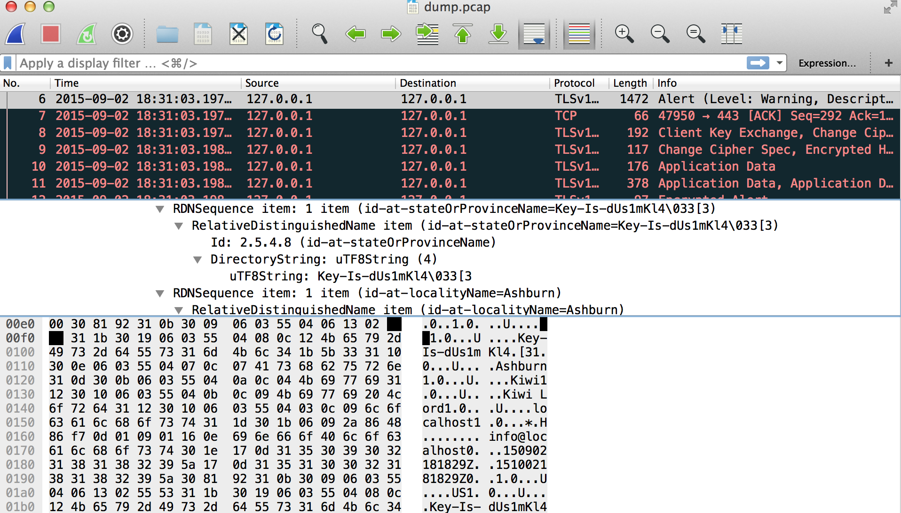

# Hack Dat Kiwi CTF 2015: SSL Sniff

**Category:** Forensics
**Points:** 50
**Solves:** 210
**Description:**

> We received a network capture file of an HTTPS request that was MITMd. Try to find the culprit.
> 
> Download [dump.pcap](./dump.pcap)

## Write-up

by [polym](https://github.com/abpolym)

We are given a tcpdump capture that contains an SSL encrypted conversation.

Fortunately, the key is hidden inside the certificate's stateOrProvinceName field:

The flag is `flag{Key-Is-dUs1mKl4}`.

PS: According to [this writeup](http://justpentest.blogspot.in/2015/11/CTF-hack-dat-kiwi-writeups.html), we can also grep the tcp stream using `tcpdump -qns 0 -A -r dump.pcap | grep <string>`!

## Other write-ups and resources

* <http://justpentest.blogspot.in/2015/11/CTF-hack-dat-kiwi-writeups.html>
* <https://ctftime.org/writeup/2144>
* <http://hack.dat.kiwi/writeup#SSL_Sniff>
