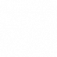
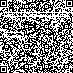

# Hackover CTF 2015: invisible1337

**Category:** Forensics
**Points:** 200
**Solves:** 26
**Description:**

> Just an empty image, we cant see any flag here... where might it be?
> 
> /web.hackover.h4q.it/[invisible1337-3ad7a81b0f4dbd6c42cf71312031502c.tgz](./invisible1337-3ad7a81b0f4dbd6c42cf71312031502c.tgz)
> 
> Hint: You are probably not blind.
> 
> Hint2: BLIND TOUCH.
> 
> Hint3: cat flag | wc --bytes
> 
> 39

## Write-up

by [polym](https://github.com/abpolym)

This writeup is based on following writeups:

* [Japanese](http://encry1024.hatenablog.com/entry/2015/10/19/092015)
* <http://pastebin.com/PzPh3iEV>

We are given a gziped compressed tar archived, which we decompress using `tar xvf invisible1337-3ad7a81b0f4dbd6c42cf71312031502c.tgz` to get a PNG named `invisible1337.png`.

The picture is of size 1337 bytes and at first glance appears to be a blank picture:

Using `stegsolve`, we see a hidden QR code in the Colour inversion mode:

We submit the QR code to an [online qr code decoder](https://zxing.org/w/decode.jspx) to receive following text and morsecode:

    murrrmurrrmurrr :3 touch me! touch me! touch me! - .... .. ... / .. ... / -. --- - / - .... . / ..-. .-.. .- --. --..-- / -... ..- - / -.-. --- --- .-.. / --- ..-. / -.-- --- ..- / .- -. -.-- .-- .- -.-- / -.- . . .--. / ... . .- .-. -.-. .... .. -. --.

If we submit the morsecode to an online [morse code decoder](https://gc.de/gc/morse/), we get `this_is_not_the_flag,_but_cool_of_you_anyway_keep_searching` - Seems like a dead-end.

However, the text `touch me! touch me! touch me!` is a hint that the flag is encoded as [Braille ASCII](https://en.wikipedia.org/wiki/Braille_ASCII).

[This python script](./invisible1337.py) attempts to decode the hidden Braille code into ASCII to get the following:

    w#^azjjrfxjsfm'x#^^wwx#^!qv.^rqt.jrnzqpwjcu!'m''.cbehih,de,fehd,aga,gjbchebhackover#ae?iamahiddenflagaskmey?-.!'^--,,,svt!l!^u,ud.-#fsetl.plaryyuw-zqaxrmgw^i'mwxxv,y!km-nkacgtxhgtr.qdtbrfnxjw,ku^ku^?qdt.ytswkq'bijfcaichce^dtmgcrizrwesc?zhezba?r!.#aq'jnlvqwh#kmvnxguuwvn.eprnncjafjh.jmniz.#w'pg.vp#jv#dvw#f-okow#npimw#s^khfp^#?!-p'vpkocrkbqavkwsscn#qp#i#meemv!oijgppo.gerlmqmu.pfy-fphcps'!y#s,bf^rc^qb?hxqfgoegqxvm^aq-zbs-dc-dhhx-fayiujrxp.tgnvnn!jx#xi?-s.jvfroh.x

We see the strings `hackover` and `iamahiddenflag`.

Since this writeup is based on other writeups and I cannot confirm the correct flag, except its size (see the last hint in the task description), I assume that the flag is `hackover#ae?iamahiddenflagaskmey?-.!'^`.

Maybe the decoding is still wrong or other parts of the flag are encoded in other values except the red values (`pix[x,y][0]`) of the given picture.

## Other write-ups and resources

* [Japanese](http://encry1024.hatenablog.com/entry/2015/10/19/092015)
* <http://pastebin.com/PzPh3iEV>
