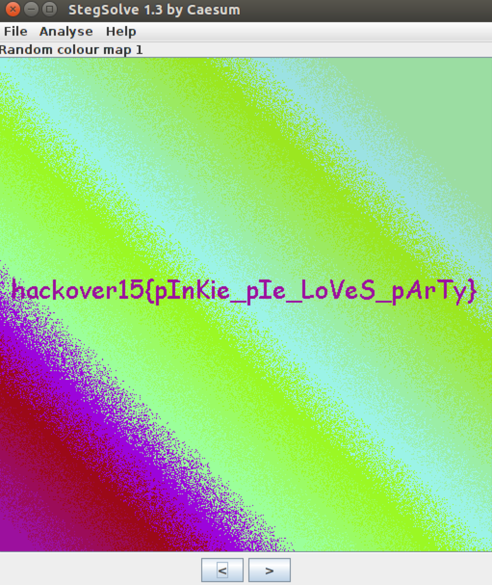

# Hackover CTF 2015: pinkie-pie

**Category:** Forensics
**Points:** 50
**Solves:** 
**Description:**

> Cause cheering up my friends is just what Pinkie's here to do
> 
> Duo to a error, the following link got updated: 
> 
> /web.hackover.h4q.it/[pinkie-pie-f005c9e9e585a3968c82c7f0df821802.tgz](./pinkie-pie-f005c9e9e585a3968c82c7f0df821802.tgz)

## Write-up

by [polym](https://github.com/abpolym)

We are given a gzip compressed tar archive that we uncompress with `tar xvf pinkie-pie-f005c9e9e585a3968c82c7f0df821802.tgz` to find a png that only shows pink.

Applying `stegsolve` with a random colour map yields a hidden flag:

The flag is `hackover15{pInKie_pIe_LoVeS_pArTy}`.

## Other write-ups and resources

* <https://614ckc0de.wordpress.com/2015/10/23/writeup-hackover-ctf-2015/>
* [Indonesian](http://osslovers.blogspot.de/2015/10/write-up-hack-over-2015-pinkie-pie.html)
