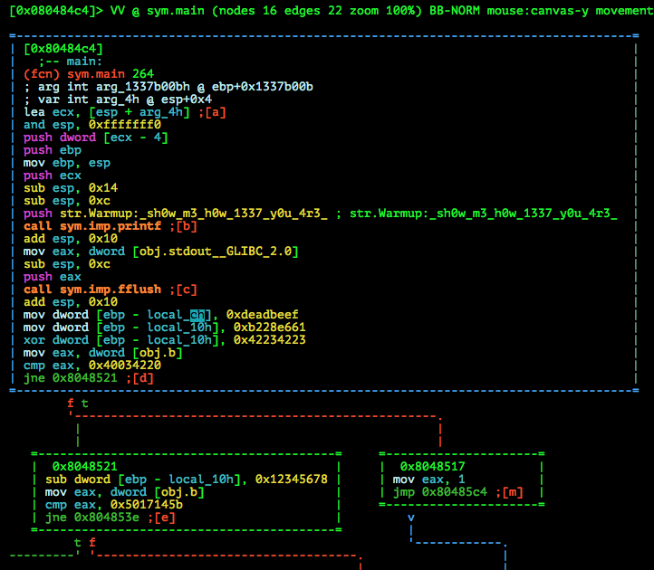
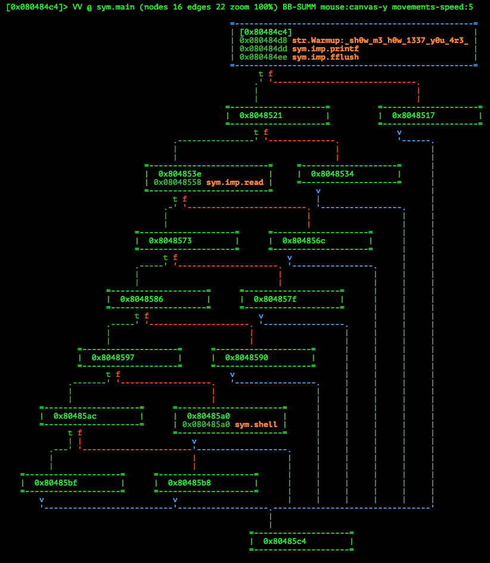
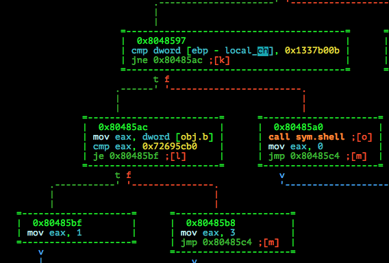
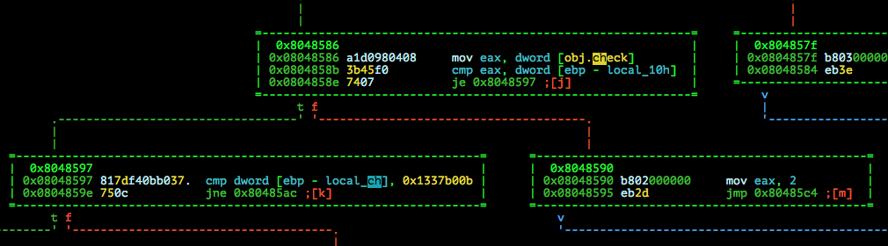
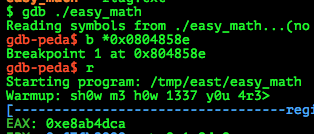

# Hackover CTF 2015: easy-math

**Category:** Reversing
**Points:** 50
**Solves:** 100
**Description:**

> A small warmup, show me that you know basic arithmetic
> 
> nc easymath.hackover.h4q.it 1337 
> 
> 
> /web.hackover.h4q.it/[easy_math-3389b83370c30874e25f2f7029938f07.tgz](./easy_math-3389b83370c30874e25f2f7029938f07.tgz)


## Write-up

by [polym](https://github.com/abpolym)

Keywords:

* 32bit Linux Executable
* Simple Stack Smashing

This writeup is based on following writeups:

* <https://f00l.de/blog/hackover-ctf-2015-easy-math/>

We are given a gzipped tar archive, which we extract using `tar` to get a 32bit Linux Executable for Intel 80386:

```bash
$ tar xvf easy_math-3389b83370c30874e25f2f7029938f07.tgz 
easy_math
$ file easy_math
easy_math: ELF 32-bit LSB  executable, Intel 80386, version 1 (SYSV), dynamically linked (uses shared libs), for GNU/Linux 2.6.32, BuildID[sha1]=ee2dccecb81b8d0e4e2efbe46606f867138ad73f, not stripped
```

Running the binary:

```bash
$ ./easy_math 
Warmup: sh0w m3 h0w 1337 y0u 4r3> 0123456789abcdef
$ abcdef
No command 'abcdef' found, did you mean:
 Command 'abcde' from package 'abcde' (universe)
abcdef: command not found
```

As we can see, the bianry requests user input that is at maximum 10 (`0xa`) Bytes of size (including newline).
Opening the binary in `radare2`, we can display the main function as a CFG:



Another `V`isual Mode of `radare2` is very helpful in this case, which quickly shows you calls to other functions and static strings:



Down at the bottom, we can see a `sym.shell` call, which just executes `/bin/sh`:


Now we know that our goal is to direct the control flow of our Executable to pass over node `0x80485a0`, which contains our beloved `system(/bin/sh)` call :).

If you follow the nodes and branches bottom-up or top-down, you can easily see that most conditional jumps are always taken by default and that the final Stack layout should look like that:

```bash
----------------------
ebp-0x14 |  |  |  |  |
ebp-0x10 |CA|4D|AB|E8|
ebp-0x0c |0B|B0|37|13|
ebp-0x08 |  |  |  |  |
ebp-0x04 |  |  |  |  |
ebp-0x00 |  |  |  |  |
----------------------
```

Explanation:

* The last conditional branch (node `0x8048597`) compares the value of `ebp-0xc` with `0x1337b00b`. This byte sequence is stored in reverse byte for byte, since we are dealing with a system that is Little Endian (see `lscpu` if you host the binary on your own with `socat TCP-LISTEN:6666,fork,reuseaddr EXEC:./easy_math`). See here:

* Another conditional branch (node `0x8048586`) tests if the value of `ebp-0x10` is equal to the current state of `obj.check`. To get the correct value, we just set a breakpoint at the conditional jump's address (`0x0804858e`) in `gdb` as seen here:





If we look at the `read` call that requests our input, we can see that our input lands in a buffer at `ebp - local_12h`, meaning `ebp-0x12h`. Thus, we have to preceed our two desired byte sequences with two additional trash bytes.

[This `python` script](./solve.py) solves the challenge:

```bash
$ p solve.py 
[+] Opening connection to localhost on port 6666: Done
Warmup: sh0w m3 h0w 1337 y0u 4r3> 
[*] Switching to interactive mode
$ ls
easy_math
flag.txt
$ cat flag.txt
hackover15{YaY_SiMpLe_diSasM_aNd_mAtH_iS_sImpLe}
```

The flag is `hackover15{YaY_SiMpLe_diSasM_aNd_mAtH_iS_sImpLe}`.

## Other write-ups and resources

* <https://f00l.de/blog/hackover-ctf-2015-easy-math/>
