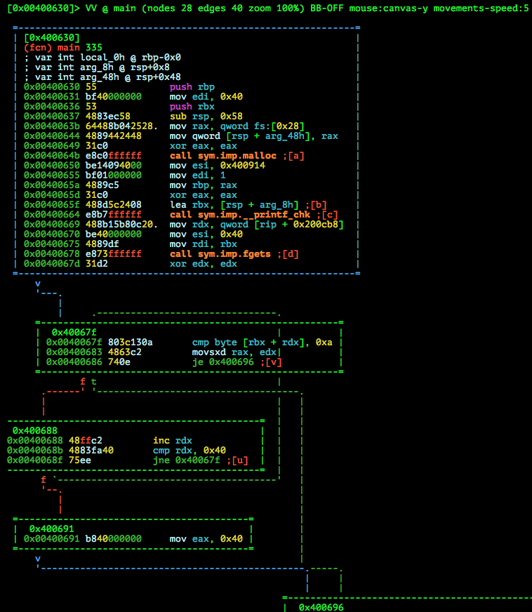
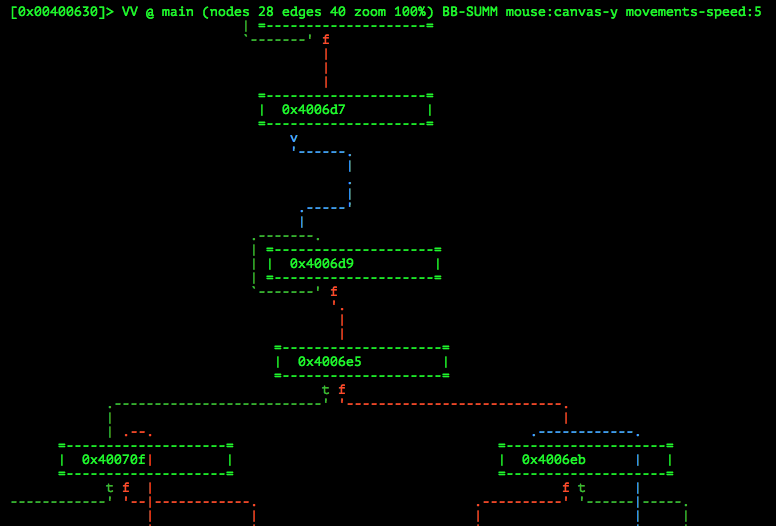
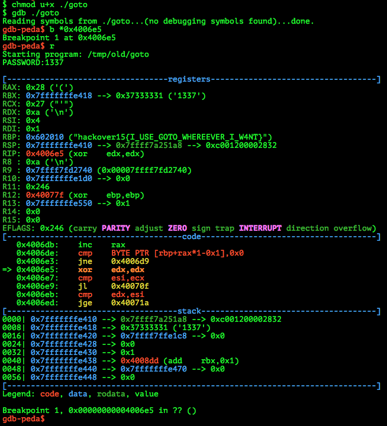

# Hackover CTF 2015: goto

**Category:** Reversing
**Points:** 150
**Solves:** 83
**Description:**

> GOTO considered harmful. How much harm did it do? Can you retrieve the password?
> 
> /web.hackover.h4q.it/[goto-03661d1a42ad20065ef6bfbe5a06287c.tgz](./goto-03661d1a42ad20065ef6bfbe5a06287c.tgz)


## Write-up

by [polym](https://github.com/abpolym)

Keywords:

* x86-64 ELF Linux Executable
* Obfuscation

We are given a gzipped tar Archive, which we extract using `tar`:

```bash
$ file goto-03661d1a42ad20065ef6bfbe5a06287c.tgz
goto-03661d1a42ad20065ef6bfbe5a06287c.tgz: gzip compressed data, from Unix, last modified: Thu Oct 15 18:23:16 2015
$ tar xvf goto-03661d1a42ad20065ef6bfbe5a06287c.tgz
goto.bin
$ file goto.bin
goto.bin: data
$ ls -l goto.bin
-rwxr-xr-x 1 vbox vbox 2097 Okt 15  2015 goto.bin
```

We get an executable binary blob that we view using any Hexeditor of our choice (here: `xxd`) to see the following:

```bash
$ xxd goto.bin 
0000000: 543d 743b 6361 7420 2430 207c 2074 6169  T=t;cat $0 | tai
0000010: 6c20 2d63 202b 3735 207c 2067 756e 7a69  l -c +75 | gunzi
0000020: 7020 2d20 3e20 2454 3b63 686d 6f64 202b  p - > $T;chmod +
0000030: 7820 2454 3b2e 2f24 543b 726d 202e 2f24  x $T;./$T;rm ./$
0000040: 543b 6578 6974 2030 3b0a 1f8b 0808 efae  T;exit 0;.......
[...]
```

Looks like the executable reads itself (`$0` here is the program name itself), extracts a gzipped binary starting from the 74th Byte, runs the resulting executable and deletes itself afterwards.
We can confirm that using `binwalk`:

```bash
$ binwalk goto.bin 
DECIMAL         HEX             DESCRIPTION
-------------------------------------------------------------------------------------------------------
74              0x4A            gzip compressed data, was "rvs", from Unix, last modified: Thu Oct 15 15:49:35 2015, max compression
```

Since we want the resulting executable without it being deleted, we can reproduce the bash command to do so:

```bash
$ cat goto.bin | tail -c+75 | gunzip - > goto
$ file goto
goto: ELF 64-bit LSB  executable, x86-64, version 1 (SYSV), for GNU/Linux 2.6.24, dynamically linked (uses shared libs), stripped
```

Running it:

```bash
$ ./goto.bin 
PASSWORD:what

ACCESS DENIED
```

Looks like we have to provide a password, most likely the flag. We open it with `radare2`:



We can see a call to [`__printf_chk`](http://refspecs.linuxbase.org/LSB_4.1.0/LSB-Core-generic/LSB-Core-generic/libc---printf-chk-1.html), which prints the `PASSWORD:` (`0x400914`) to stdout. The following `fgets` call seems to read our provided password and stores it into `rbx` (First parameter == `rdi`). Afterwards we see a loop that calculates the length of our input string until a newline `0xa` is hit.

Since we can't find the String `ACCESS DENIED` nor any `strcmp` calls that compare our input password with the correct password, we guess that this is done using a loop and several `cmp` or `xor` instructions. 

We look for loops with following conditional branch nodes in the CFG and see:



We see that the node `0x4006e5` is a conditonal branch that is preceded by several loop nodes. Lets set a breakpoint at this node in `gdb-peda`:



Fortunately, if we take a look at the registers, we see the flag in the `rbp` register: `hackover15{I_USE_GOTO_WHEREEVER_I_W4NT}` :)


## Other write-ups and resources

* <https://github.com/ByteBandits/writeups/blob/master/hackover-ctf-2015/reverse/goto/sudhackar/README.md>
* <http://capturetheswag.blogspot.de/2015/10/hackover15-goto-150pt-reverse.html>
