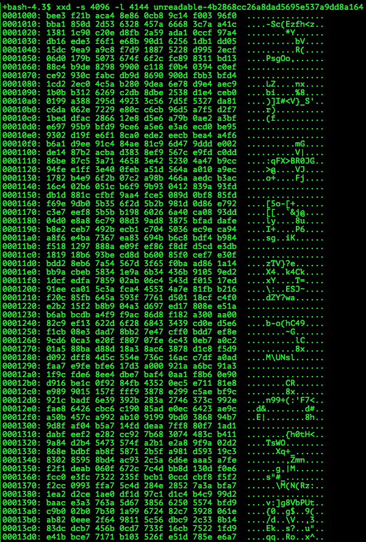

# HITCON QUALS CTF 2015: unreadable

**Category:** Stego
**Points:** 100
**Solves:** 
**Description:**

> Can you read me?
> 
> [unreadable-4b2868cc26a8dad5695e537a9dd8a164](unreadable-4b2868cc26a8dad5695e537a9dd8a164)

## Write-up

by [polym](https://github.com/abpolym)

We are given random data. Opening the data with any hexeditor of our choice that shows the content both in hexadecimal and ASCII, we see a hidden flag in the ASCII section:

The final flag is: `hitcon{WE USE XXD INSTEAD OF IDA PRO}`

## Other write-ups and resources

* <https://github.com/pwning/public-writeup/blob/master/hitcon2015/stego100-unreadable/writeup.md>
