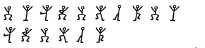
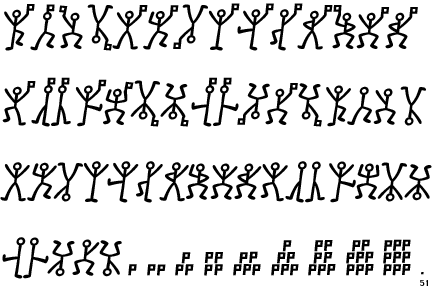

# IBTeam Blackvalentine CTF 2015: Crypto4 200

**Category:** Crypto
**Points:** 200
**Author:** abdilahrf
**Description:**

> * [dancing.png](dancing.png)

## Write-up

We are given a sequence of dancing figures as ciphertext:

These dancing men originate from Arthur Conan Doyle's short story "The Adventure of the Dancing Men" [[1](http://people.csail.mit.edu/hasinoff/pubs/hasinoff-quipster-2003.pdf)], which gives us this key:

A flag in the hand of a stick figure means a word ends. However, we don't have these kind of stick figures.

Beginning at the first stick figure without a flag as `A`, we can translate the ciphertext.

The flag is `chincopachincopa`.

## Other write-ups and resources

* none yet
