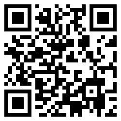

# IBTeam Blackvalentine CTF 2015: Forensic4 200

**Category:** Forensic
**Points:** 200
**Author:** mirfansulaiman
**Description:**

> basisSixtyFour , Password: `*7sdj@L[a/xc<Xms02-z=203dl;`
>
> http://ctf.web-attack.info/misssion/9

## Write-up

by [polym](https://github.com/abpolym)

First, we extract the content of the password protected zip:

```bash
$ 7z x Forensic-4.zip -p'*7sdj@L[a/xc<Xms02-z=203dl;' -oout
$ cd out/FORENSIC\ SOAL\ 1\ LEVEL\ 2/
```

`Wh4Tis1t.png` actually is the base64 encoded representation of a PNG, which we first have to decode and save:

```bash
$ file Wh4Tis1t.png 
Wh4Tis1t.png: ASCII text, with very long lines, with no line terminators
$ cat Wh4Tis1t.png && echo
iVBORw0KGgoAAAANSUhEUgAAAPoAAAD6CAIAAAAHjs1qAAAABmJLR0QA/wD/AP+gvaeTAAAE5klEQVR4nO3dQa7qOBRAwdDq/W/59QqCZNrGDqdq+hHk8Y88uDHO6+/v74KGf3ZfAHyP3AmROyFyJ0TuhMidELkTIndC/n3zb6/X62vX8X/c3Sm7u/7Vd9Zmfe7q6x99/6f3cFndSZE7IXInRO6EyJ0QuRMid0Lezd3v7PpFyOjcd9ace/T9Z90HeMr8+yk9XFZ3UuROiNwJkTshcidE7oTInZBP5u53Zs2DT9uPPvp3rX7/WXP91fP7A3uwuhMid0LkTojcCZE7IXInRO6EzJy7n2bWvHyWp5978wOs7oTInRC5EyJ3QuROiNwJkTshvzx3P+2cltXnsq/+3B9gdSdE7oTInRC5EyJ3QuROiNwJmTl3f8p8d9a577POdVn9+l373Q/swepOiNwJkTshcidE7oTInRC5E/LJ3P2053re2TXnPs2sv/fOU76Hy+pOitwJkTshcidE7oTInRC5E/I6cFPyaqfNiXfNxYP/9VZ3QuROiNwJkTshcidE7oTInZCZc/dd+8VXz61Hrd5nP8uuc+I33k+wuhMid0LkTojcCZE7IXInRO6EfOO5qqvnyrvmuKedY3PaeTgHnmNjdSdE7oTInRC5EyJ3QuROiNwJebfffdfcdPUcetRp59Lc2fW7glm+cJ1Wd0LkTojcCZE7IXInRO6EyJ2QT86Z2TX/HrX6OlfP4087D+e09/+A1Z0QuRMid0LkTojcCZE7IXIn5N05M7Pmyk85L2XXnP4p5+HcOe2+iv3ucF1yJ0XuhMidELkTIndC5E7Iu7n7aefJnHaOymn3Ae7smouf9hzZy+pOitwJkTshcidE7oTInRC5EzLzuaqr5+JP2Y/+lP3fs17/lP3xl9WdFLkTIndC5E6I3AmROyFyJ+ST891v32vx3HeWXeeyH3je+RQPOife6k6I3AmROyFyJ0TuhMidELkTMvO5qqvPCz9tTn/auTer7foeRjnfHa5L7qTInRC5EyJ3QuROiNwJ+cbcffR97pw23x21677E6PuM2vU7B89VhXfkTojcCZE7IXInRO6EyJ2Qd+e7P32+fto563dWX+dp++ad7w7fIHdC5E6I3AmROyFyJ0TuhJx4zsyd0+b9tb93tS/M463uhMidELkTIndC5E6I3AmROyEz97uvnk8/6PmdQ3bt73/K+Tx3nDMD78idELkTIndC5E6I3AmROyHv5u6jc9zVr1/tKfvLd13nqF33Md6wuhMid0LkTojcCZE7IXInRO6EfLLf/TR3c9zROfeu82FW/x5gll2/N5jI6k6I3AmROyFyJ0TuhMidELkT8m7ufucpzyvdtY9813k7d057Tu3GffBWd0LkTojcCZE7IXInRO6EyJ2QT+bud3btF59l1xx61OrPPe13DhP/X6zuhMidELkTIndC5E6I3AmROyEz5+6nmbV//bTnla6+v7F6v/6oifcZrO6EyJ0QuRMid0LkTojcCZE7Ib88d991zsysefbo5446bV/7qA++T6s7IXInRO6EyJ0QuRMid0LkTsjMufuuc1fu7DqPfOP55UOefp/hg+/T6k6I3AmROyFyJ0TuhMidELkT8snc/Vf3Sd857Xmoo69/yrn7s75P+93huuROitwJkTshcidE7oTInZDXaZuwYR2rOyFyJ0TuhMidELkTIndC5E6I3An5DzfRISTqGHbgAAAAAElFTkSuQmCC
$ cat Wh4Tis1t.png | base64 --decode > pic.png
```

The final PNG is a QR code, which we have to decode using [an online QR decoder](https://zxing.org/w/decode.jspx) to get the flag, `1bT3aMj4b0Det4b3K`:




## Other write-ups and resources

* none yet
