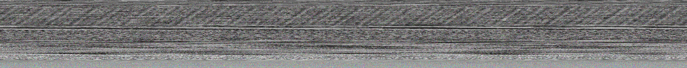
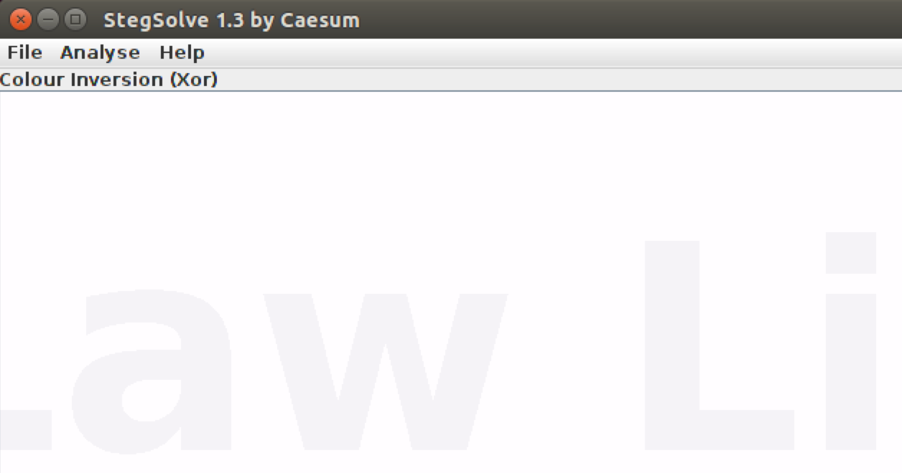
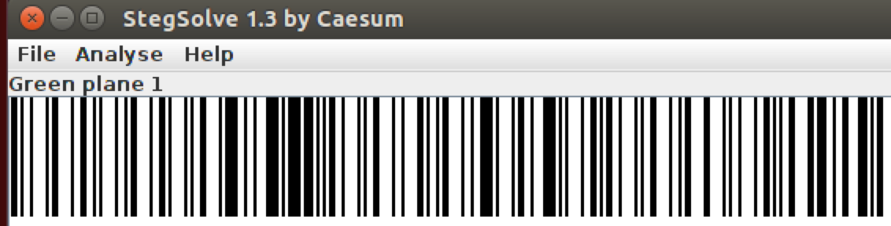
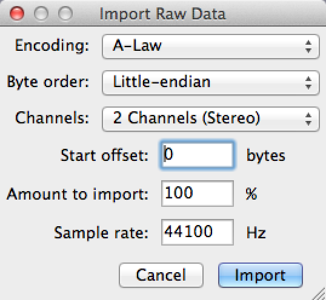
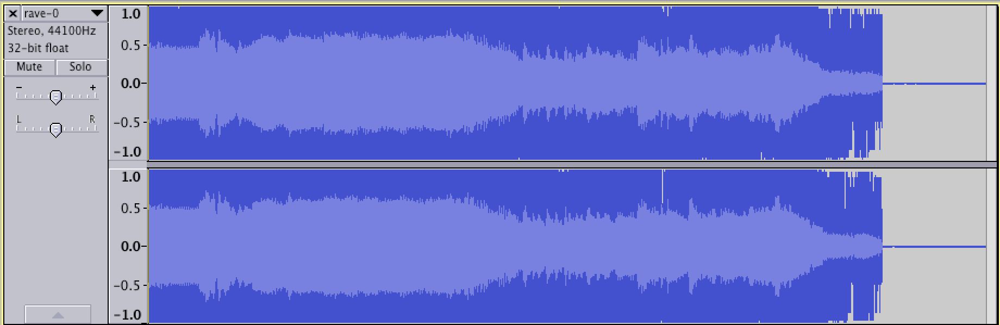
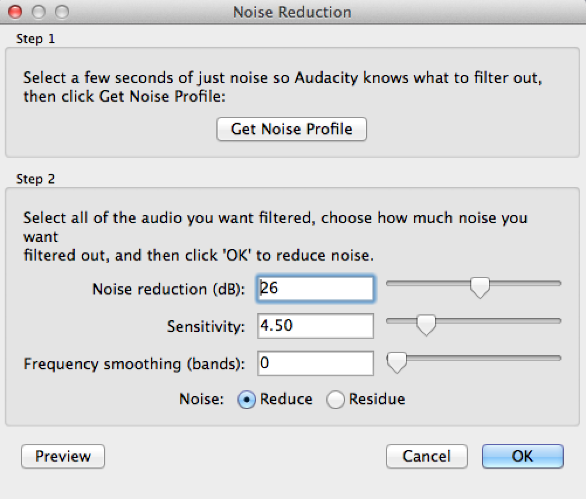
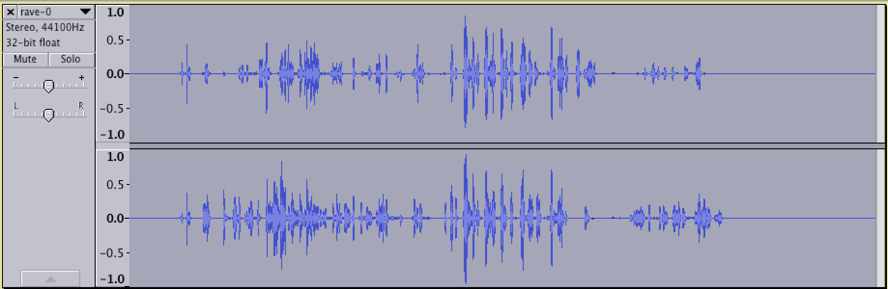

# IceCTF 2015: Epilepsy Warning

**Category:** Forensics
**Points:** 110
**Description:** 

> It hurts my head to look at this [GIF](./rave.gif), just get it away from me...

**Hint:**

> All your senses need to be on alert for this one, keep your eyes peered and listen

## Write-up

by [polym](https://github.com/abpolym)

This writeup is based on following writeups:

* <https://github.com/IceCTF/Problems-2015/blob/master/stage3/forensics/epilepsy_warning/solution.md>
* [Wrap-up in Icelandic](https://www.youtube.com/watch?v=gqAoCpUfXaI&feature=youtu.be&t=22m5s)

We are given a gif that really makes our heads hurt:

First, we extract all three individual frames using `convert rave.gif rave.png`:

* `rave-0.png`, which looks like a TV static stream
* `rave-1.png` and `rave-2.png`, which are pitch black and seem to contain nothing but black pixels

To show hidden data in `rave-1.png` and `rave-2.png`, we apply `stegsolve` to both of them:

* `rave-1.png` shows the text `A-Law Little 44100` in `Colour Inversion (Xor)` mode:

* `rave-2.png` shows a barcode in `Green plane 1` mode:

Scanning the barcode gives us `flag_some_barcode_and_`.

The second part of the flag can be solved by converting the TV static png to RGB values using `convert rave-0.png rave-0.rgb`.

Then, we can import `rave-0.rgb` as `Raw Data` (`File->Import->Raw Data...`) and use `A-Law` encoding with `Little-endian` Byte Order and Sample rate `44100` Hz:

We get a weird sounding file with a noisy waveform and a voice talking in the middle of the audio file:

To hear the voice more clear, we apply a Noise Reduction Effect (`Effect->Noise Reduction...` - First with Get Noise Profile, then with Parameters) with Parameters Noise Reduction `26`dB, Sensitivity `4.50` and Frequency `0`:

We then get this waveform:

Unfortunately, I cannot speak Icelandic, but if you do the [wrap-up](https://www.youtube.com/watch?v=gqAoCpUfXaI&feature=youtu.be&t=22m5s) should explain that this robotic voice tells you to append the last part of the flag, `hidden_audio` (or maybe even says `hidden audio` in Icelandic, I don't know this :().

The complete flag is `flag_some_barcode_and_hidden_audio`

## Other write-ups and resources

* <https://github.com/IceCTF/Problems-2015/blob/master/stage3/forensics/epilepsy_warning/solution.md>
