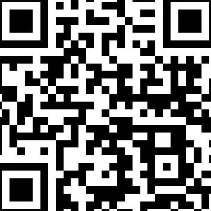
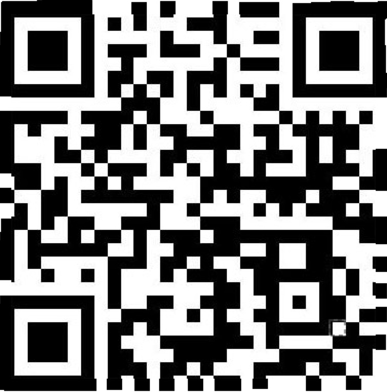

# IceCTF 2015: Scan Me

**Category:** Forensics
**Points:** 55
**Description:** 

> I found this [QR Code](./qr.jpg) but I'm having some troubles scanning it. Be a dear and help me, won't you?

**Hint:**

> There's something off about that code... maybe it can be fixed though.

## Write-up

by [polym](https://github.com/abpolym)

We are given a snipped QR code:

Fortunately, we can see what the cut parts look like - so we open `gimp`, open a new image with white background and bigger resolution (`400`x`400` instead of `355`x`355`) and fix the broken QR code:

Then we submit this fixed QR code to [an online QR decoder](https://zxing.org/w/decode.jspx) to obtain the flag, `who_spilled_their_coffee_on_my_qr_code`.

## Other write-ups and resources

* <http://blog.oleaass.com/ctf-icectf-scan-me-55-forensics/>
