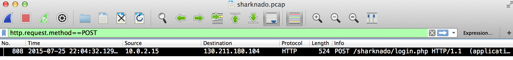
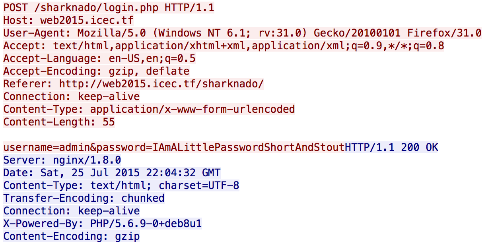

# IceCTF 2015: SHARKNADO!

**Category:** Forensics
**Points:** 60
**Description:** 

> We managed to intercept [this web traffic](./sharknado.pcap), the target was logging on to <a target='_blank' href='http://web2015.icec.tf/sharknado'>web2015.icec.tf</a>. can you look into it?

**Hint:**

> If only you could filter the packets to make things easier...

## Write-up

by [polym](https://github.com/abpolym)

We are given a pcap traffic dump.
The description hints that we should login into <http://web2015.icec.tf/sharknado> using credentials that we have to search for in the given pcap.

We open it with `wireshark` and filter the traffic by HTTP POST only requests (`http.request.method==POST`) to find this request:

We follow the conversation (`Analyze->Follow->TCP Stream`) to find a username/password combination:

Using these credentials, we login to the website to find the flag, `flag_damn_that_movie_was_bad`.

## Other write-ups and resources

* <http://blog.oleaass.com/ctf-icectf-trivials-writeup/>
* <http://73696e65.github.io/blog/2015/08/24/icec-dot-tf-writeup/>
* <https://github.com/james9909/PracticeCTF/blob/master/IceCTF-2015/SHARKNADO!/Solution.txt>
