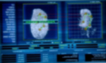

# Insomni'hack CTF 2015: Zoom In

**Category:** Forensic
**Solves:** 43
**Description:**

> Corneal imaging... Horatio sees the flag, thumbs up for him !
> Author : SaD - Difficulty : easy

## Write-up

by [fbonzon](https://github.com/fbonzon)

We are given this image:


[ExifTool](http://www.sno.phy.queensu.ca/~phil/exiftool/) reveals it contains a 47487 bytes thumbnail image. Let's extract it:

```
exiftool -binary -ThumbnailImage zoomIn_3a3f6e35934021eca75b0abde70333a6.jpg > thumbnail_0.jpg
```



A further metadata inspection with ExifTool reveals the thumbnail file itself contains a 26822 bytes thumbnail image. Extract it again:

```
exiftool -binary -ThumbnailImage thumbnail_0.jpg > thumbnail_1.jpg
```


The flag is now visible but mirrored. Undo this effect with [ImageMagick](http://www.imagemagick.org/):

```
convert thumbnail_1.jpg -flop thumbnail_1_mirrored.jpg
```


Finally, the flag reads `INS{MAGNIFICATION_X100_FOR_STARTERS}`.

## Other write-ups and resources

* <http://insomnihack.ch/wp-content/uploads/2016/01/Hacking_like_in_the_movies.pdf>
