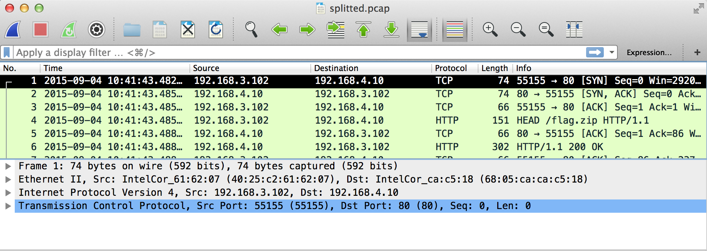

# MMA-CTF-2015: Splitted

**Category:** Forensics
**Points:** 30
**Solves:** 286
**Description:**

> [splitted.7z](splitted.7z-68ad844f2aab26d3d358ae9fa6c598a2727b0c0056567a288ffcd9414229121c)

## Write-up

by [polym](https://github.com/abpolym)

We are given a 7z zip archive that we first extract using `7z x splitted*.7z -oout`.
After extraction, we find a tcpdump capture file inside it:

```bash
$ cd splitted
$ ls
splitted.pcap
$ file splitted.pcap
splitted.pcap: tcpdump capture file (little-endian) - version 2.4 (Ethernet, capture length 65535)
```

We can open it using `wireshark` to immediately see that a file named `flag.zip` was transmitted:



However, the zip was downloaded partially and in a non-consecutive order:

```bash
$ tshark -r splitted.pcap -V -Y 'http.request' | grep Range
    Range: bytes=2345-2813\r\n
    Range: bytes=0-468\r\n
    Range: bytes=1407-1875\r\n
    Range: bytes=2814-3282\r\n
    Range: bytes=3283-3744\r\n
    Range: bytes=469-937\r\n
    Range: bytes=938-1406\r\n
    Range: bytes=1876-2344\r\n
```

We can extract the parts using wiresharks Extract Objects Feature (unfortunately, I don't know how to do this programmatically - please tell me if you do - whether by scapy, tshark or otherwise): `File -> Export Objects -> HTTP -> Save all`:

```bash
$ ls -1
flag(1).zip
flag(2).zip
flag(3).zip
flag(4).zip
flag(5).zip
flag(6).zip
flag(7).zip
flag.zip
splitted.pcap
```

Now everything that is left to do is to generate the correct zip in order:

```bash
$ tshark -r splitted.pcap -V -Y 'http.request' | grep Range > downloads
$ mv flag.zip 'flag(0).zip'
$ tshark -r splitted.pcap -V -Y 'http.request' | grep Range | tr '=\-' ' ' | awk '{print $3}' | sort -n | while read line; do awk "/$line/{print NR-1; exit}" downloads; done | while read number; do cat "flag($number).zip" >> flag.zip; done
$ file flag.zip 
flag.zip: Zip archive data, at least v2.0 to extract
$ 7z x flag.zip -oout

7-Zip [64] 9.20  Copyright (c) 1999-2010 Igor Pavlov  2010-11-18
p7zip Version 9.20 (locale=utf8,Utf16=on,HugeFiles=on,8 CPUs)

Processing archive: flag.zip

Extracting  flag.psd

Everything is Ok

Size:       54061
Compressed: 3745
$ cd out
$ ls
flag.psd
```

We can convert this file, [flag.psd](./flag.psd),  using ImageMagick's `convert` command to get three images (three layers in one image):

```bash
$ convert flag.psd flag.png
$ ls -1
flag-0.png
flag-1.png
flag-2.png
flag.psd
```

The layer in the middle contains our flag:


## Other write-ups and resources

* <https://shankaraman.wordpress.com/2015/09/07/mma-ctf-2015-splitted-writeup-forensics/>
* <http://fadec0d3.blogspot.com/2015/09/mma-ctf-2015-splitted-30.html>
* <http://ctf-for-beginners.blogspot.com/2015/09/write-up-mma-ctf-2015-splitted-30.html>
* <https://0x90r00t.com/2015/09/10/mma-2015-forensics-warmup-splitted-write-up/>
* <https://github.com/ByteBandits/writeups/blob/master/mma-ctf-2015/forensics/splitted/chaitan94/README.md>
