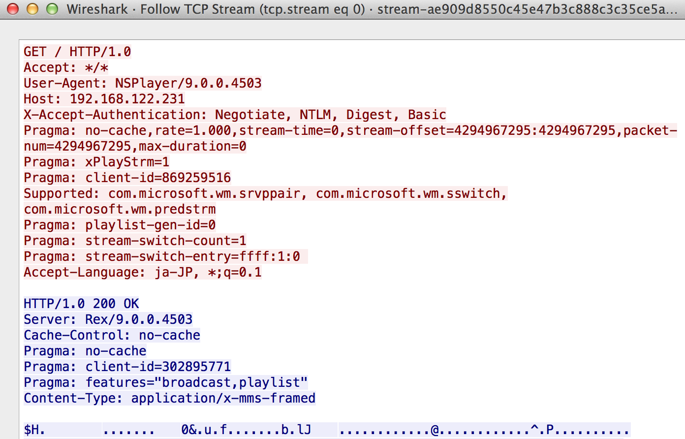
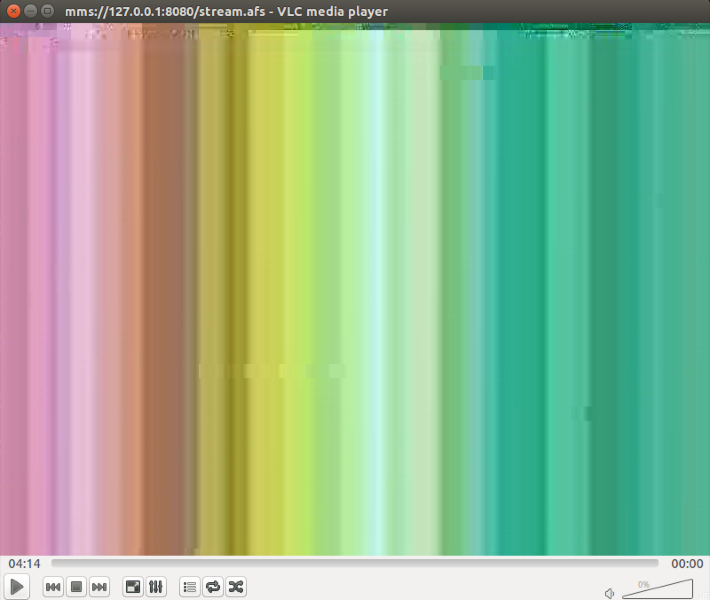
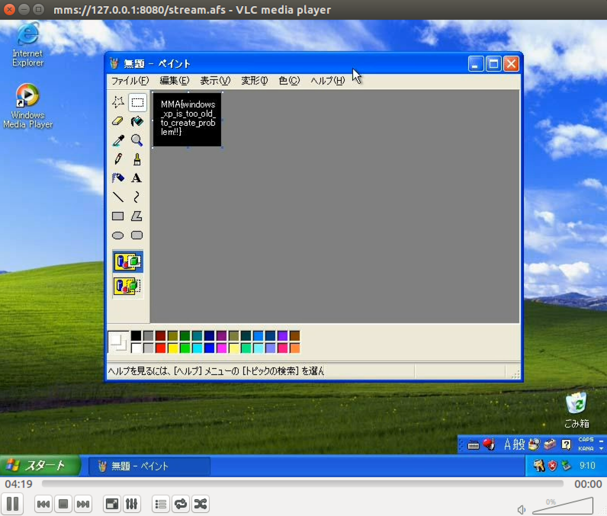

# MMA-CTF-2015: stream

**Category:** Forensics
**Points:** 100
**Solves:** 54
**Description:**

> [stream](stream-ae909d8550c45e47b3c888c3c35ce5a6699de5390968e91b53a718d73c237718)

## Write-up

by [polym](https://github.com/abpolym)

This writeup is based on following writeups:

* <https://0x90r00t.com/2015/09/07/mma-2015-forensics-stream-write-up/>
* <http://fadec0d3.blogspot.de/2015/09/mma-ctf-2015-stream-100.html>
* <https://shankaraman.wordpress.com/tag/mma-ctf-stream-writeup/>

We are given a pcap-ng file that contains several TCP requests, as well as HTTP and others:

```bash
$ tshark -r stream-ae909d8550c45e47b3c888c3c35ce5a6699de5390968e91b53a718d73c237718 | awk '{print $7}' | sort | uniq -c | sort -n
   2 HTTP
   3 NBNS
  33 STP
 516 TCP
```

Looking at the TCP Stream in wireshark (`Analyze -> Follow -> TCP Stream`), we see that someone watched a mms stream (Content-Type `application/x-mms-framed`) via a Media Player (User-Agent `NSPlayer` - [NetShow Media Player](http://www.user-agents.org/cgi-bin/csv2html.pl%3Fdata%3Dallagents.csv%26template%3Ddetail.html%26match%3D%255Cbid_n_s_1055%255Cb)):



We can extract this stream using wireshark - `File -> Export Objects -> HTTP` and e.g. save it as `stream.afs`.

Afterwards, we can watch the stream using `vlc` by doing following steps:

* Move the stream `stream.afs` to a new folder, e.g. `streamcontent`. `cd` to it.
* Host the content locally using `php -S 127.0.0.1:8080 -t .`
* Start `vlc`, open a network stream (`Media -> Open Network Stream`) and input the url `mms://127.0.0.1:8080/stream.afs`

Afterwards, you'll see the following:





The flag is `MMA{windows_xp_is_too_old_to_create_problem!!}`.

## Other write-ups and resources

* <https://shankaraman.wordpress.com/2015/09/07/mma-ctf-2015-forensics-stream-writeup/>
* <http://fadec0d3.blogspot.com/2015/09/mma-ctf-2015-stream-100.html>
* <https://0x90r00t.com/2015/09/07/mma-2015-forensics-stream-write-up/>
