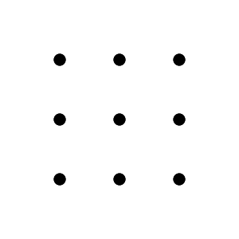
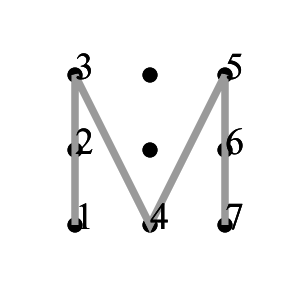
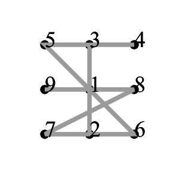

# MMA-CTF-2015: pattern-lock-60

**Category:** PPC
**Points:** 20,40
**Solves:** 385,32
**Description:**

> In android smartphone, you can use "pattern lock".
>
> Pattern lock use 9 dots(3x3) on the screen in the figure below.

> 

> The following figures are examples of lock pattern.

>  

> Lock pattern must satisfy following three conditions.
>
> Use at most once each dot.
> Use at least 4 dots.
> Cannot skip the dot on the segment.

> `(Flag 1) Flag is the number of lock patterns in decimal without MMA{...}.`
>
> `(Flag 2) Flag is the maximum length of lock patterns on 4x4 dots. Assume the length of two neighbor dot is 1. Please answer rounded to four decimal places without MMA{...}. (XX.XXXX)`
>

## Write-up

(TODO)

## Other write-ups and resources

* <http://dakutenpura.hatenablog.com/entry/2015/09/07/172118>
* <http://ctf-for-beginners.blogspot.com/2015/09/write-up-mma-ctf-2015-pattern-lock-20.html>
